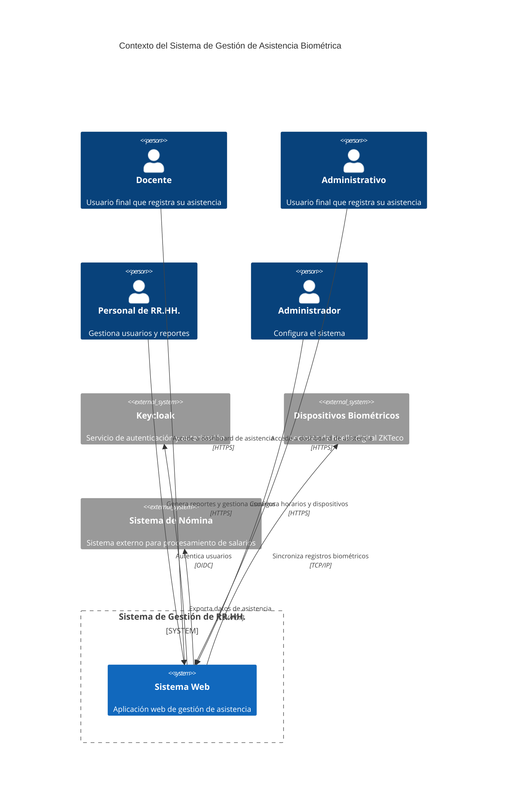
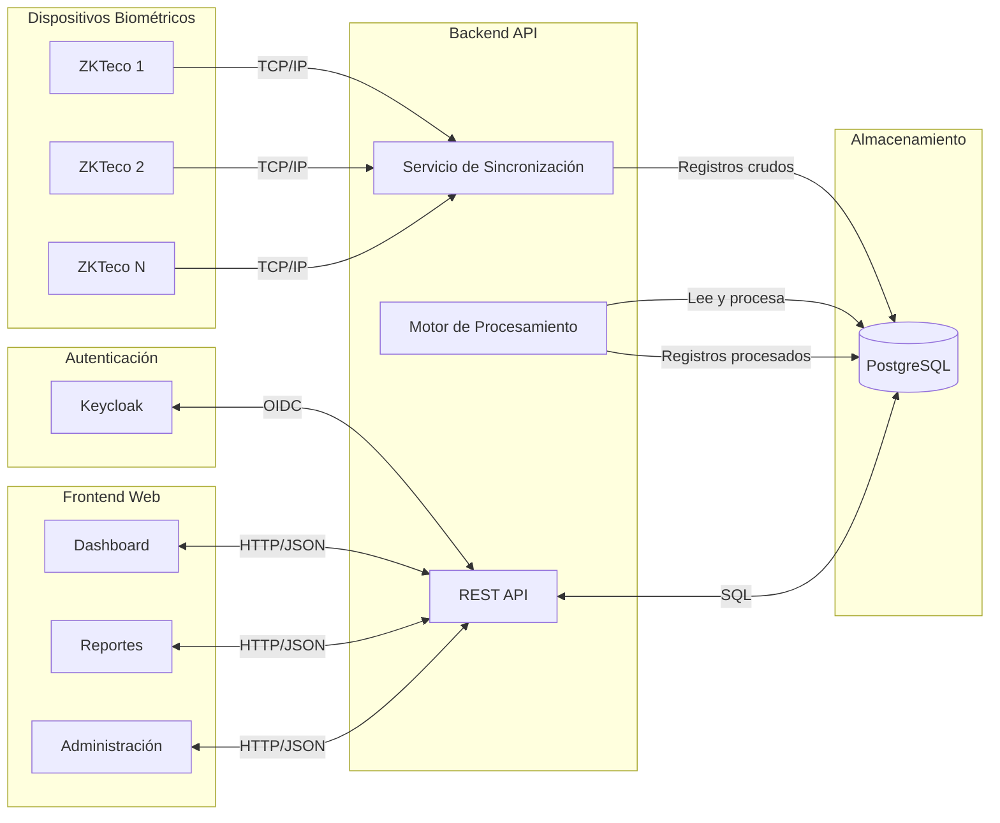
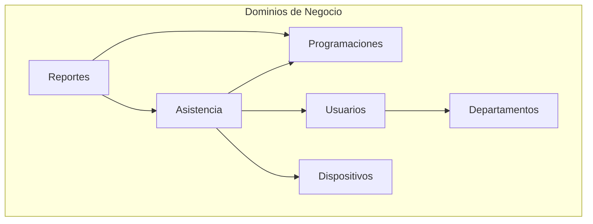

# 2.1 Visión General del Sistema

Esta sección presenta la arquitectura del Sistema de Gestión de Recursos Humanos con Integración Biométrica utilizando el modelo C4, que proporciona una vista jerárquica del sistema en diferentes niveles de abstracción.

---

## 2.1.1 Contexto del Sistema (C4 Level 1)

El sistema se integró con diversos actores y sistemas externos para su operación:

### Descripción de Actores y Sistemas

| Actor/Sistema | Descripción | Rol Principal |
|--------------|-------------|---------------|
| **Docente** | Personal docente de la institución | Registra asistencia mediante biométricos y consulta su estado |
| **Administrativo** | Personal administrativo | Registra asistencia y consulta su estado |
| **Personal de RR.HH.** | Gestores de recursos humanos | Genera reportes, gestiona usuarios y justificaciones |
| **Administrador** | Responsable de configuración | Configura horarios, dispositivos y parámetros del sistema |
| **Keycloak** | Servidor de identidad | Gestiona autenticación y autorización |
| **Dispositivos Biométricos** | Lectores ZKTeco | Capturan marcaciones de huella digital |
| **Sistema de Nómina** | Sistema externo | Procesa salarios basados en datos de asistencia |

---

## 2.1.2 Flujo de Datos de Alto Nivel

El siguiente diagrama muestra el flujo de información a través del sistema:

---

## 2.1.3 Principios Arquitectónicos

El sistema se diseñó siguiendo los siguientes principios arquitectónicos:

### 1. 100% Basado en Datos

Todos los cálculos se basaron en configuraciones explícitas de `ScheduleAssignment`. El sistema no asumió semanas de 5 días ni jornadas de 8 horas; todo fue parametrizable.

### 2. Única Fuente de Verdad (Single Source of Truth)

Todos los cálculos de asistencia se centralizaron en `/src/utils/reports/` del backend, garantizando consistencia en todo el sistema.

### 3. Arquitectura Normalizada

Cada sesión de asistencia mantuvo tres estados independientes (ortogonales):
- **Estado de asistencia:** COMPLETE, INCOMPLETE, ABSENCE, etc.
- **Estado de entrada:** ON_TIME, LATE, EARLY, NO_ENTRY
- **Estado de salida:** ON_TIME, EARLY_EXIT, OVERTIME, NO_EXIT

### 4. Trazabilidad Completa

Todas las entidades heredaron de `AuditEntity`, proporcionando campos de auditoría:
- Fecha de creación y actualización
- Usuario que creó/modificó
- Estado del registro (ACTIVE, INACTIVE, DELETED)
- Tipo de transacción (INSERT, UPDATE, UPSERT)

---

## 2.1.4 Patrones Arquitectónicos Implementados

### Domain-Driven Design (DDD)

El sistema se organizó por dominios de negocio con límites claros:

### Repository Pattern

El acceso a datos se abstrajo mediante repositorios TypeORM, permitiendo cambiar la implementación de persistencia sin afectar la lógica de negocio.

### Service Layer Pattern

La lógica de negocio se aisló en servicios, mientras que los controladores solo manejaron concerns HTTP (rutas, validación de entrada, respuestas).

### Interceptor Pattern

Los aspectos transversales (transacciones, formateo de respuestas, logging) se manejaron mediante interceptores globales.

---

[Siguiente: Arquitectura Backend](./02-arquitectura-backend.md) | [Anterior: Introducción](/documentacion/01-introduccion.md)
