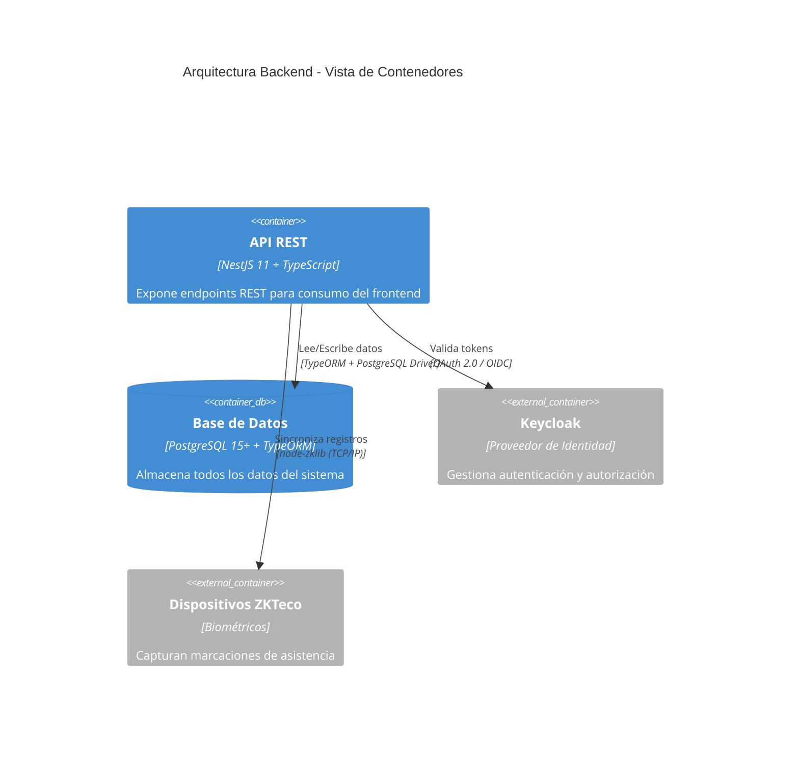
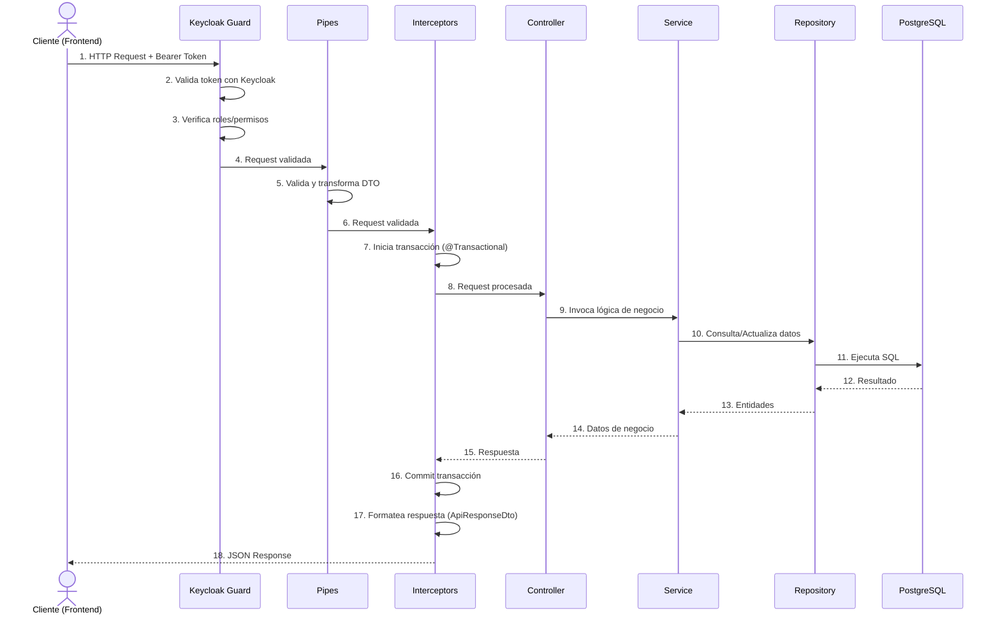
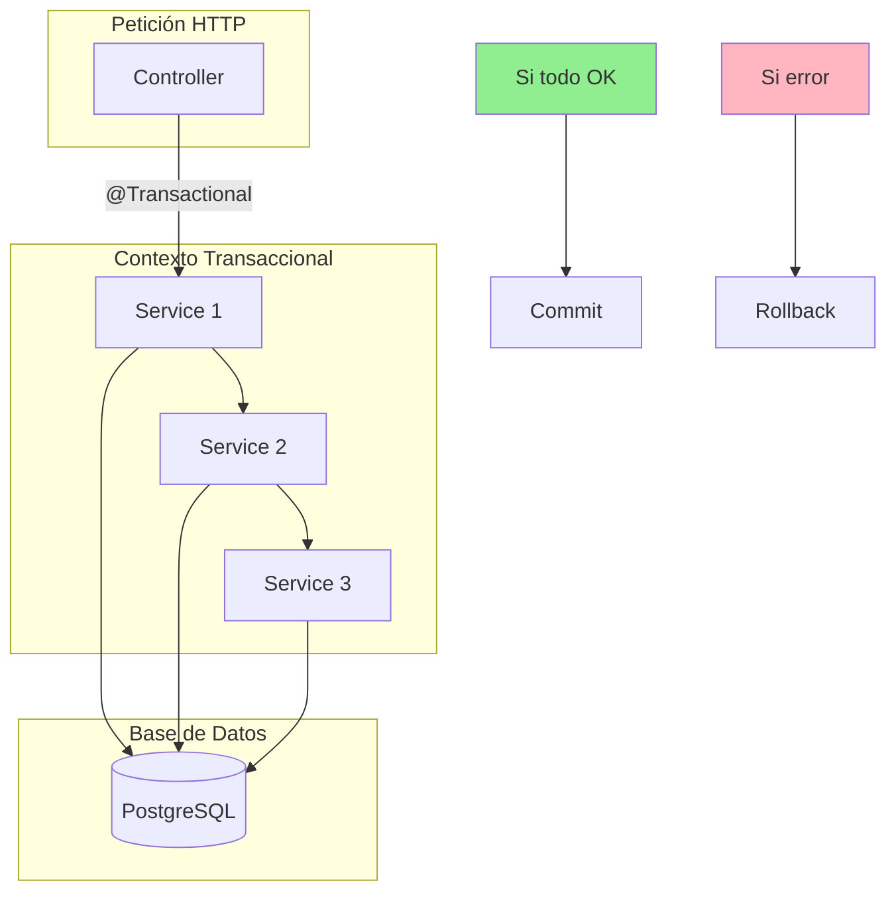
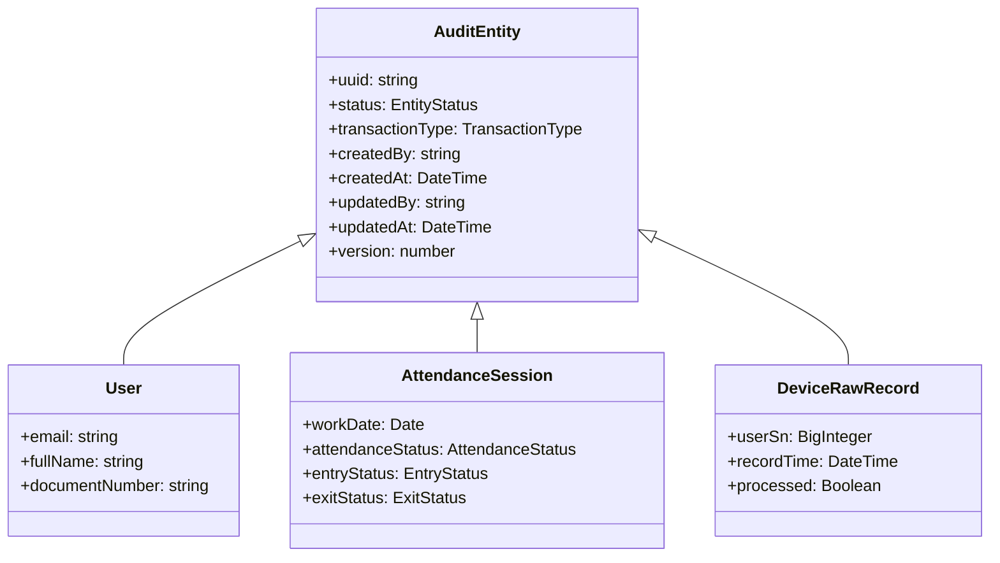

# 2.2 Arquitectura del Backend

El backend se implementó utilizando **NestJS 11** con **TypeScript 5.7**, siguiendo una arquitectura modular basada en Domain-Driven Design (DDD).

---

## 2.2.1 Vista de Contenedores (C4 Level 2)



---

## 2.2.2 Vista de Componentes (C4 Level 3)

```mermaid
C4Component
    title Arquitectura Backend - Vista de Componentes

    Container_Boundary(api, "API REST") {
        Component(guards, "Guards", "Validación de autenticación y autorización", "KeycloakGuard, RolesGuard")
        Component(interceptors, "Interceptors", "Aspectos transversales", "TransactionInterceptor, ResponseInterceptor")
        Component(controllers, "Controllers", "Manejadores de peticiones HTTP", "AttendanceController, ReportsController, etc.")
        Component(services, "Services", "Lógica de negocio", "AttendanceEngineService, ReportService, etc.")
        Component(repositories, "Repositories", "Acceso a datos", "TypeORM Repositories")
        Component(engine, "Motor de Asistencia", "Procesamiento de registros biométricos", "AttendanceEngineService")
        Component(utils, "Utilidades de Cálculo", "Funciones puras de cálculo", "attendance-calculations.ts")
    }

    Container_Boundary(db, "Base de Datos") {
        ComponentDb(tables, "Tablas", "Entidades persistidas", "User, AttendanceSession, AttendanceEvent, etc.")
    }

    Rel(guards, controllers, "Protege rutas")
    Rel(controllers, interceptors, "Pre/Post-procesa")
    Rel(interceptors, services, "Invoca con transacción")
    Rel(services, repositories, "Consulta/Actualiza")
    Rel(services, engine, "Procesa biométricos")
    Rel(engine, utils, "Calcula métricas")
    Rel(repositories, tables, "Lee/Escribe")
    Rel(guards, keycloak, "Valida tokens")
```

---

## 2.2.3 Estructura de Módulos

El backend se organizó en módulos por dominio de negocio:

```
hr-backend/src/
├── auth/                    # Autenticación con Keycloak
├── attendance/              # Control de asistencia y reportes
│   ├── controller/          # Controladores REST
│   ├── service/             # Servicios de negocio
│   │   └── engine/          # Motor de procesamiento biométrico
│   ├── entity/              # Entidades de base de datos
│   ├── dto/                 # Data Transfer Objects
│   └── jobs/                # Tareas programadas
├── users/                   # Gestión de usuarios
├── department/              # Estructura organizacional
├── schedule/                # Horarios de trabajo
├── device/                  # Gestión de dispositivos biométricos
├── holiday/                 # Calendario y días festivos
├── reports/                 # Generación de reportes
├── payroll/                 # Integración con nómina
├── common/                  # Componentes compartidos
│   ├── controllers/         # BaseController
│   ├── service/             # BaseService
│   ├── entity/              # AuditEntity
│   ├── interceptors/        # Interceptors globales
│   └── dto/                 # DTOs comunes
└── utils/                   # Utilidades
    └── reports/             # Cálculos centralizados
```

---

## 2.2.4 Ciclo de Vida de una Petición

El siguiente diagrama muestra el flujo completo de una petición HTTP a través del backend:



### Descripción de Componentes

| Componente | Responsabilidad |
|-----------|-----------------|
| **Guards** | Validan que el cliente esté autenticado y tenga los permisos necesarios |
| **Pipes** | Validan y transforman los datos de entrada según los DTOs |
| **Interceptors** | Manejan transacciones, formatean respuestas y registran logs |
| **Controllers** | Exponen endpoints REST y coordinan la respuesta |
| **Services** | Contienen la lógica de negocio del dominio |
| **Repositories** | Abstraen el acceso a datos mediante TypeORM |
| **PostgreSQL** | Almacena persistentemente todos los datos |

---

## 2.2.5 Transaccionalidad

El sistema utilizó `@nestjs-cls/transactional` para garantizar la integridad de los datos:



**Características:**

- Todas las operaciones dentro de un contexto transaccional se ejecutan en una sola transacción de base de datos.
- Si cualquier operación falla, todas las cambios se revierten automáticamente (rollback).
- El commit solo se realiza al finalizar exitosamente todo el flujo.

---

## 2.2.6 Modelo de Auditoría

Todas las entidades del sistema heredaron de `AuditEntity`:



**Campos de Auditoría:**

| Campo | Descripción |
|-------|-------------|
| `status` | Estado del registro (ACTIVE, INACTIVE, DELETED) |
| `transactionType` | Tipo de operación (INSERT, UPDATE, UPSERT) |
| `createdBy` | Usuario que creó el registro |
| `createdAt` | Fecha y hora de creación |
| `updatedBy` | Último usuario que modificó el registro |
| `updatedAt` | Fecha y hora de última actualización |
| `version` | Versión para control de concurrencia optimista |

---

[Siguiente: Arquitectura Frontend](./03-arquitectura-frontend.md) | [Anterior: Visión General](./01-vision-general.md)
