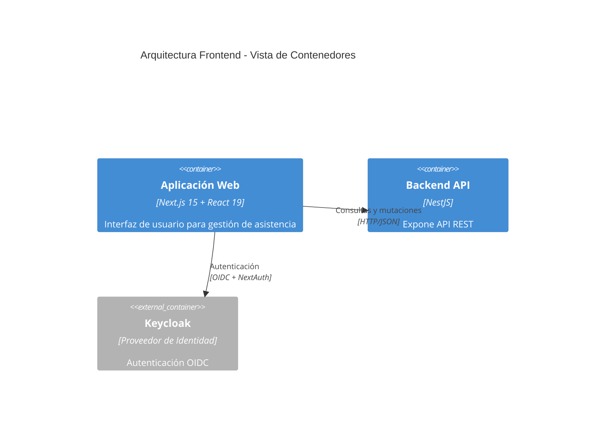
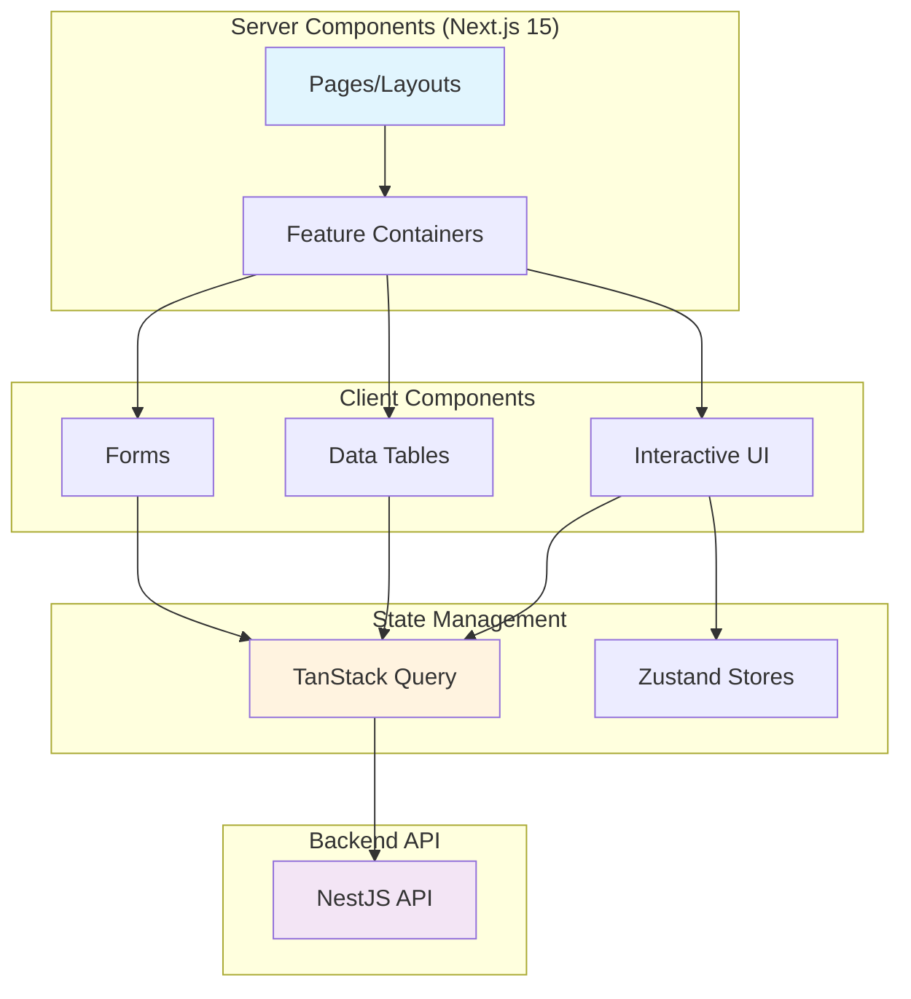
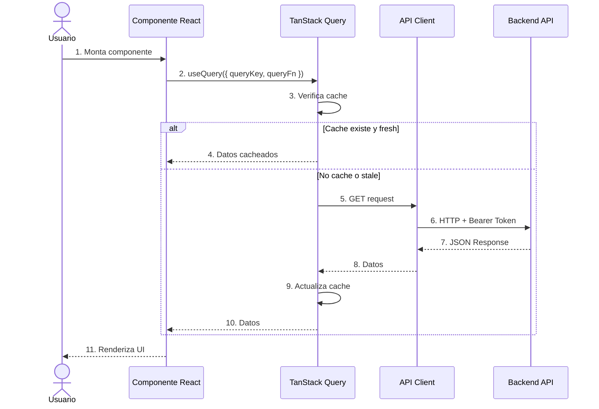
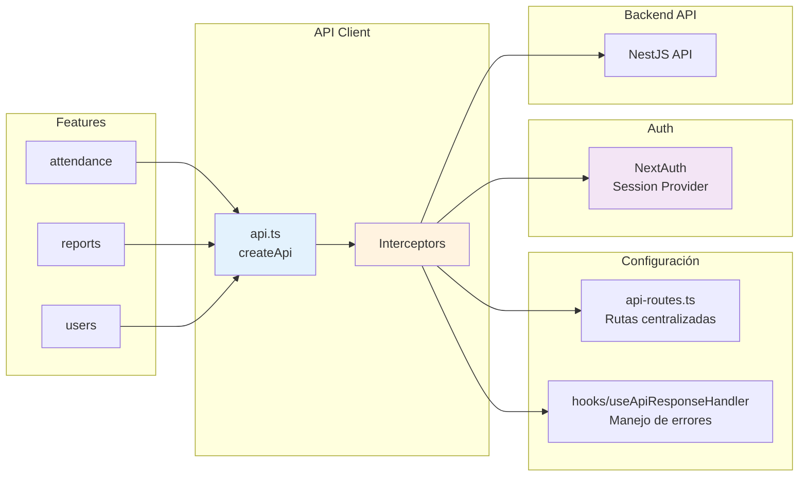
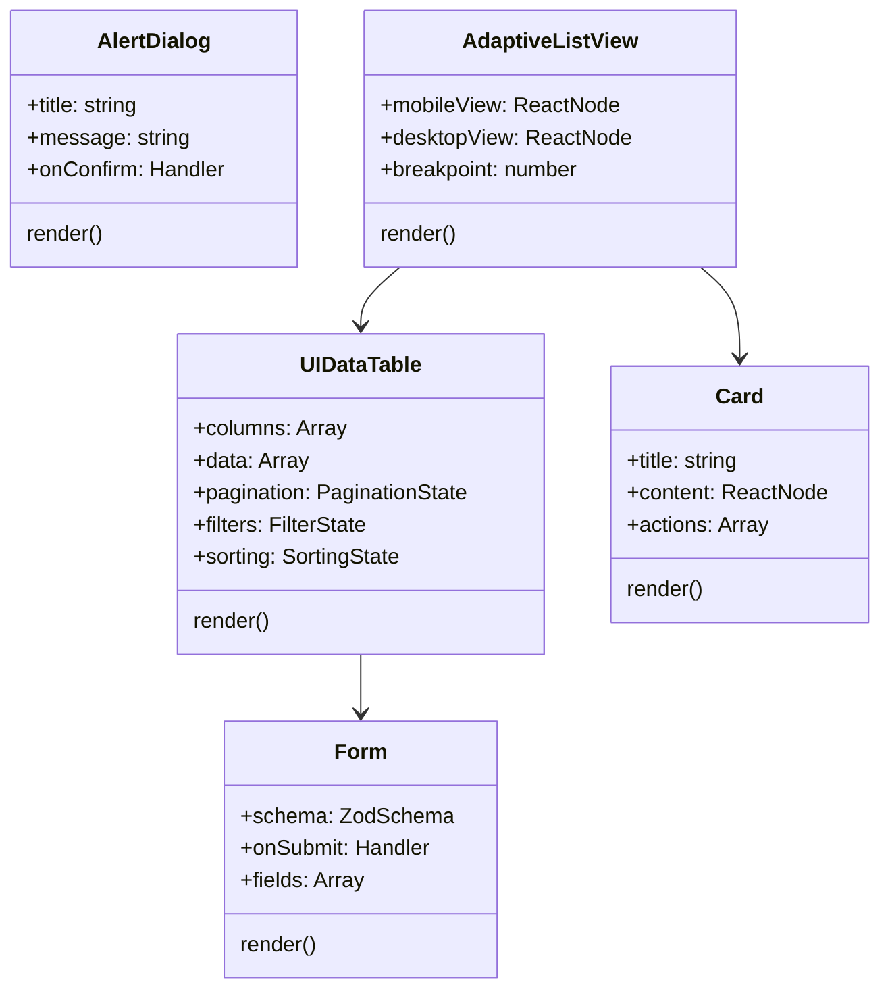

# 2.3 Arquitectura del Frontend

El frontend se implementó utilizando **Next.js 15** con **React 19**, siguiendo el patrón de App Router y Server Components para optimizar el rendimiento y la experiencia del usuario.

---

## 2.3.1 Vista de Contenedores (C4 Level 2)



---

## 2.3.2 Vista de Componentes (C4 Level 3)

```mermaid
C4Component
    title Arquitectura Frontend - Vista de Componentes

    Container_Boundary(web, "Aplicación Web") {
        Component(pages, "Pages", "Rutas de la aplicación", "App Router (Server Components)")
        Component(layouts, "Layouts", "Plantillas compartidas", "DashboardLayout, AuthLayout")
        Component(features, "Features", "Módulos de negocio", "attendance, reports, users, devices")
        Component(components, "UI Components", "Componentes reutilizables", "DataTables, Cards, Forms")
        Component(hooks, "Custom Hooks", "Lógica personalizada", "useApiResponse, useNotifications")
        Component(state, "State Management", "Estado del servidor", "TanStack Query")
        Component(api, "API Client", "Cliente HTTP", "Axios + Interceptors")
        Component(auth, "Auth Provider", "Autenticación", "NextAuth v5")
    }

    Rel(pages, layouts, "Envuelve")
    Rel(pages, features, "Renderiza")
    Rel(features, components, "Usa")
    Rel(features, hooks, "Invoca")
    Rel(hooks, state, "Gestiona")
    Rel(state, api, "Consulta")
    Rel(api, auth, "Inyecta tokens")
    Rel(pages, auth, "Protege")
    Rel(api, backend_api, "HTTP/JSON")
    Rel(auth, keycloak, "OIDC")
```

---

## 2.3.3 Estructura de Módulos

El frontend se organizó siguiendo el patrón feature-based:

```
hr-frontend/src/
├── app/                     # App Router (Next.js 15)
│   ├── login/               # Página de autenticación
│   ├── dashboard/           # Dashboard principal
│   │   ├── overview/        # Resumen general
│   │   ├── attendance/      # Asistencia en tiempo real
│   │   ├── attendance-reports/ # Reportes de asistencia
│   │   ├── users/           # Gestión de usuarios
│   │   ├── devices/         # Gestión de dispositivos
│   │   ├── schedule/        # Programaciones
│   │   └── configurations/  # Configuraciones
│   └── hr/                  # Sección para RR.HH.
├── features/                # Módulos de negocio
│   ├── dashboard/           # Dashboard components
│   ├── attendance/          # Asistencia components
│   ├── attendance-reports/  # Reportes components
│   ├── users/               # Usuarios components
│   └── devices/             # Dispositivos components
├── components/              # Componentes reutilizables
│   ├── ui/                  # Componentes Shadcn/ui
│   ├── data-tables/         # Tablas de datos
│   └── forms/               # Componentes de formulario
├── lib/                     # Utilidades y configuración
│   ├── api.ts               # Cliente HTTP
│   └── auth.ts              # Configuración NextAuth
├── hooks/                   # Custom hooks
├── config/                  # Configuraciones
└── types/                   # Definiciones TypeScript
```

---

## 2.3.4 Arquitectura de Componentes React

El sistema utilizó una combinación de Server Components y Client Components para optimizar el rendimiento:



### Server vs Client Components

| Tipo | Uso | Ventajas |
|------|-----|----------|
| **Server Components** | Páginas, layouts, contenedores | Reduce JavaScript enviado al cliente, carga de datos directa del servidor |
| **Client Components** | Componentes interactivos, tablas, formularios | Interactividad completa, estado local, actualizaciones en tiempo real |

---

## 2.3.5 Gestión del Estado del Servidor

El sistema utilizó **TanStack Query** (React Query) para gestionar el estado del servidor:



**Características de TanStack Query:**

- **Caching inteligente:** `staleTime: 5min` por defecto
- **Revalidación automática:** Refresca datos cuando la ventana gana foco
- **Invalidación manual:** `queryClient.invalidateQueries()` para actualizaciones
- **Optimistic updates:** Actualiza la UI antes de confirmación del servidor
- **Paginación:** Soporte nativo con `useInfiniteQuery`

---

## 2.3.6 Cliente API Centralizado

El sistema implementó un cliente HTTP centralizado con Axios:



**Características del Cliente API:**

- **Inyección automática de tokens:** Obtiene el token de NextAuth y lo agrega a cada request
- **Manejo de idiomas:** Header `Accept-Language` configurado automáticamente
- **Manejo centralizado de errores:** Transforma errores HTTP en notificaciones usuario-amigables
- **Logout automático en 401:** Cierra la sesión si el token expira

---

## 2.3.7 Componentes UI Principales

El sistema utilizó **Shadcn/ui** como base para los componentes de interfaz:



**Componentes Implementados:**

| Componente | Descripción |
|-----------|-------------|
| `UIDataTable` | Tabla de datos con paginación, filtros y ordenamiento |
| `AdaptiveListView` | Vista adaptativa (móvil/escritorio) |
| `TodayStatusCard` | Tarjeta de estado del día con progreso |
| `ExportPDFButton` | Botón para exportar reportes a PDF |
| `ConfirmationDialog` | Diálogo de confirmación para acciones destructivas |

---

[Siguiente: Modelo de Datos](./04-modelo-de-datos.md) | [Anterior: Arquitectura Backend](./02-arquitectura-backend.md)
