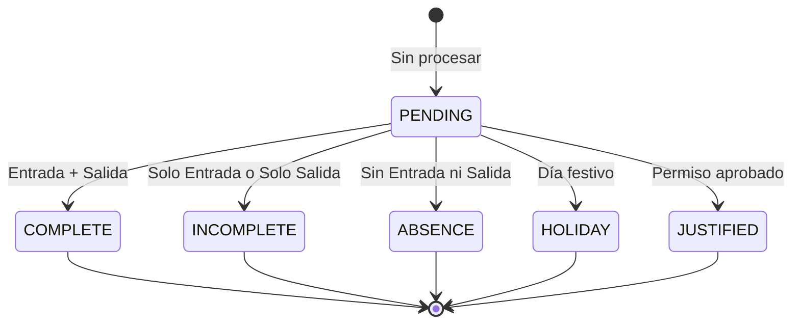
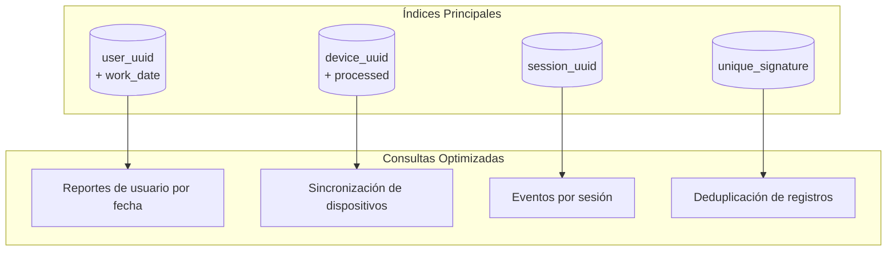

# 2.4 Modelo de Datos

El sistema utilizó **PostgreSQL** como base de datos relacional, con **TypeORM** como ORM para el mapeo objeto-relacional. Todas las entidades heredaron de `AuditEntity` para mantener trazabilidad completa.

---

## 2.4.1 Diagrama Entidad-Relación

```mermaid
erDiagram
    User ||--o{ AttendanceSession : "registra"
    User ||--o{ AttendanceEvent : "genera"
    User ||--o{ DeviceRawRecord : "origina"
    User ||--|| ScheduleAssignment : "tiene asignado"
    User }o--|| Department : "pertenece a"

    ScheduleAssignment ||--o{ AttendanceSession : "define"
    ScheduleAssignment }o--|| ScheduleVersion : "utiliza"
    ScheduleVersion ||--o{ SchedulePeriod : "contiene"

    AttendanceSession ||--o{ AttendanceEvent : "agrupa"
    AttendanceSession }o--|| SchedulePeriod : "corresponde a"
    AttendanceSession }o--o| Holiday : "puede ser"
    AttendanceSession }o--o| LeaveRequest : "puede ser justificada por"

    DeviceRawRecord }o--|| Device : "proviene de"

    User {
        uuid PK
        email string
        full_name string
        document_number string
        device_user_sn bigint
        status EntityStatus
        created_at timestamp
        updated_at timestamp
    }

    Department {
        uuid PK
        name string
        code string
        parent_uuid FK
        status EntityStatus
    }

    ScheduleAssignment {
        uuid PK
        user_uuid FK
        schedule_version_uuid FK
        start_date date
        end_date date
        is_active boolean
        status EntityStatus
    }

    ScheduleVersion {
        uuid PK
        name string
        effective_from date
        status EntityStatus
    }

    SchedulePeriod {
        uuid PK
        schedule_version_uuid FK
        day_of_week DayOfWeek
        start_time time
        end_time time
        min_entry time
        max_entry time
        min_exit time
        max_exit time
        tolerance_minutes int
    }

    AttendanceSession {
        uuid PK
        user_uuid FK
        work_date date
        schedule_period_uuid FK
        attendance_status AttendanceStatus
        entry_status EntryStatus
        exit_status ExitStatus
        worked_minutes int
        late_minutes int
        early_exit_minutes int
        overtime_minutes int
        status EntityStatus
    }

    AttendanceEvent {
        uuid PK
        session_uuid FK
        event_timestamp timestamp
        event_type EventType
        event_source EventSource
        confidence_score decimal
    }

    DeviceRawRecord {
        uuid PK
        device_uuid FK
        user_sn bigint
        device_user_id string
        record_time timestamp
        unique_signature string
        processed boolean
        processed_at timestamp
        processing_error string
    }

    Device {
        uuid PK
        name string
        ip_address string
        port int
        device_type string
        status DeviceStatus
    }

    Holiday {
        uuid PK
        name string
        date date
        recurring boolean
    }

    LeaveRequest {
        uuid PK
        user_uuid FK
        start_date date
        end_date date
        status LeaveStatus
    }
```

---

## 2.4.2 Entidades Principales

### User (Usuario)

Representó a cada usuario del sistema (docente o administrativo).

| Campo | Tipo | Descripción |
|-------|------|-------------|
| `uuid` | UUID | Identificador único |
| `email` | string | Correo electrónico (único) |
| `full_name` | string | Nombre completo |
| `document_number` | string | Número de documento de identidad |
| `device_user_sn` | bigint | Serial number en dispositivo biométrico |
| `department_uuid` | UUID FK | Departamento al que pertenece |
| `status` | Enum | ACTIVE, INACTIVE, DELETED |

### AttendanceSession (Sesión de Asistencia)

Representó la sesión de asistencia de un usuario en un día específico para un período de horario.

| Campo | Tipo | Descripción |
|-------|------|-------------|
| `uuid` | UUID | Identificador único |
| `user_uuid` | UUID FK | Usuario de la sesión |
| `work_date` | date | Fecha de trabajo |
| `schedule_period_uuid` | UUID FK | Período de horario aplicable |
| `attendance_status` | Enum | COMPLETE, INCOMPLETE, ABSENCE, HOLIDAY, JUSTIFIED |
| `entry_status` | Enum | ON_TIME, LATE, EARLY, NO_ENTRY |
| `exit_status` | Enum | ON_TIME, EARLY_EXIT, OVERTIME, NO_EXIT |
| `worked_minutes` | int | Minutos trabajados |
| `late_minutes` | int | Minutos de tardanza |
| `early_exit_minutes` | int | Minutos de salida temprana |
| `overtime_minutes` | int | Minutos extras |

### AttendanceEvent (Evento de Asistencia)

Representó un evento individual de marcación (entrada o salida).

| Campo | Tipo | Descripción |
|-------|------|-------------|
| `uuid` | UUID | Identificador único |
| `session_uuid` | UUID FK | Sesión a la que pertenece |
| `event_timestamp` | timestamptz | Fecha y hora del evento |
| `event_type` | Enum | ENTRY, EXIT |
| `event_source` | Enum | BIOMETRIC_DEVICE, MANUAL_ENTRY, SYSTEM_GENERATED |
| `confidence_score` | decimal | Puntaje de confianza (0-1) para eventos inferidos |

### DeviceRawRecord (Registro Crudo de Dispositivo)

Almacenó el registro original tal como fue recibido del dispositivo biométrico.

| Campo | Tipo | Descripción |
|-------|------|-------------|
| `uuid` | UUID | Identificador único |
| `device_uuid` | UUID FK | Dispositivo que originó el registro |
| `user_sn` | bigint | Serial number del usuario en dispositivo |
| `device_user_id` | string | ID del usuario en dispositivo |
| `record_time` | timestamptz | Fecha y hora de la marcación |
| `unique_signature` | string | Firma única para idempotencia |
| `processed` | boolean | Indica si fue procesado |
| `processed_at` | timestamptz | Fecha de procesamiento |
| `processing_error` | string | Error si fue rechazado |

### SchedulePeriod (Período de Horario)

Definió un período de trabajo dentro de un horario (ej: mañana, tarde).

| Campo | Tipo | Descripción |
|-------|------|-------------|
| `uuid` | UUID | Identificador único |
| `schedule_version_uuid` | UUID FK | Versión de horario |
| `day_of_week` | Enum | Día de la semana (MONDAY, TUESDAY, etc.) |
| `start_time` | time | Hora de inicio oficial |
| `end_time` | time | Hora de fin oficial |
| `min_entry` | time | Hora mínima permitida para entrada |
| `max_entry` | time | Hora máxima permitida para entrada |
| `min_exit` | time | Hora mínima permitida para salida |
| `max_exit` | time | Hora máxima permitida para salida |
| `tolerance_minutes` | int | Tolerancia en minutos para puntualidad |

### Device (Dispositivo Biométrico)

Representó un dispositivo biométrico ZKTeco conectado al sistema.

| Campo | Tipo | Descripción |
|-------|------|-------------|
| `uuid` | UUID | Identificador único |
| `name` | string | Nombre descriptivo |
| `ip_address` | string | Dirección IP |
| `port` | int | Puerto de comunicación |
| `device_type` | string | Modelo del dispositivo |
| `status` | Enum | ONLINE, OFFLINE, ERROR |

---

## 2.4.3 Estados de Asistencia

### attendance_status (Estado de Asistencia)



| Estado | Descripción |
|--------|-------------|
| `COMPLETE` | El usuario registró entrada y salida |
| `INCOMPLETE` | El usuario registró solo entrada o solo salida |
| `ABSENCE` | El usuario no registró ninguna marcación |
| `HOLIDAY` | El día correspondió a un festivo |
| `JUSTIFIED` | El día tuvo un permiso aprobado |

### entry_status (Estado de Entrada)

| Estado | Condición |
|--------|-----------|
| `ON_TIME` | Entrada dentro de la tolerancia (±15 min de hora inicio) |
| `LATE` | Entrada después de la tolerancia |
| `EARLY` | Entrada antes del inicio con tolerancia |
| `NO_ENTRY` | No se registró entrada |

### exit_status (Estado de Salida)

| Estado | Condición |
|--------|-----------|
| `ON_TIME` | Salida dentro de la tolerancia (±15 min de hora fin) |
| `EARLY_EXIT` | Salida antes de la tolerancia |
| `OVERTIME` | Salida después de la tolerancia |
| `NO_EXIT` | No se registró salida |

---

## 2.4.4 Índices y Optimizaciones

El sistema implementó índices estratégicos para optimizar las consultas más frecuentes:



**Índices Implementados:**

| Tabla | Índice | Propósito |
|-------|--------|-----------|
| `attendance_sessions` | `(user_uuid, work_date)` | Consultas de reporte por usuario y fecha |
| `device_raw_records` | `(device_uuid, processed)` | Sincronización de dispositivos |
| `attendance_events` | `(session_uuid)` | Obtener eventos de una sesión |
| `device_raw_records` | `(unique_signature)` | Prevenir duplicados |

---

[Anterior: Arquitectura Frontend](./03-arquitectura-frontend.md) | [Siguiente: Módulo de Asistencia en Tiempo Real](../../03-modulo-asistencia-en-tiempo-real/01-descripcion-general.md)
