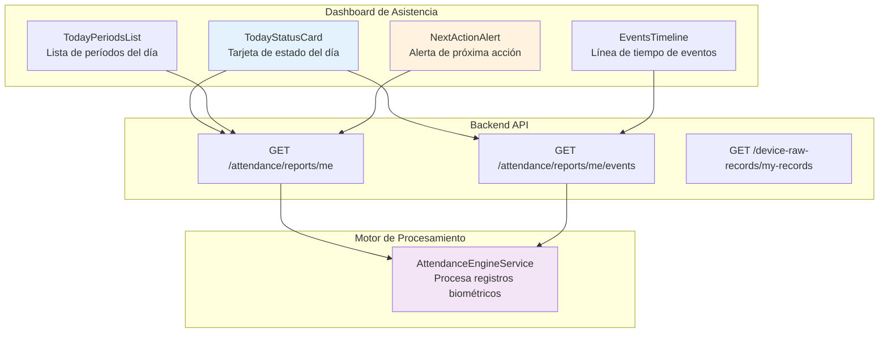
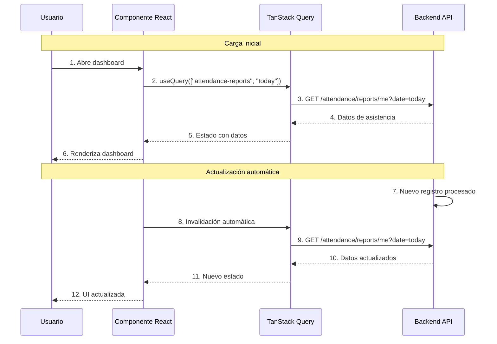
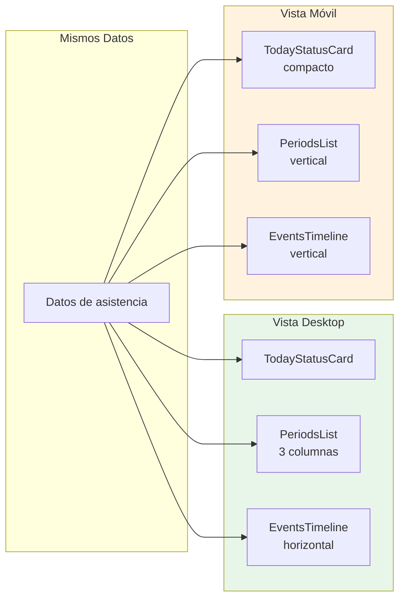
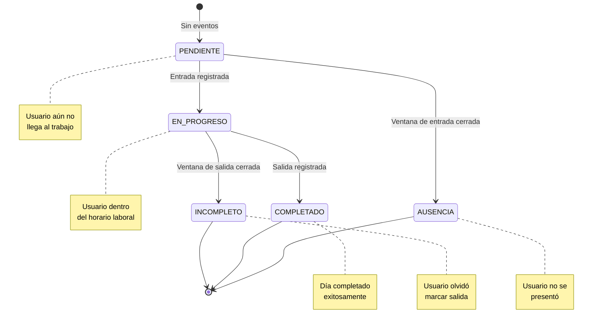

# 3.1 Descripción General del Módulo de Asistencia en Tiempo Real

Este módulo constituyó el primer objetivo específico del proyecto: **brindar información de las marcaciones de asistencia en tiempo real al personal administrativo y docente**, garantizando retroalimentación inmediata y facilitando la justificación oportuna de atrasos e inasistencias.

---

## 3.1.1 Propósito del Módulo

El módulo de asistencia en tiempo real tuvo como finalidad:

1. **Proporcionar visibilidad inmediata** de las marcaciones de asistencia al momento de ser procesadas.
2. **Permitir autogestión** del personal al poder consultar su estado actual de asistencia.
3. **Facilitar la justificación oportuna** de atrasos e inasistencias mediante alertas tempranas.
4. **Reducir consultas a RR.HH.** al brindar autonomía a los usuarios para consultar su información.

---

## 3.1.2 Componentes Principales

El módulo se compuso de los siguientes componentes en el frontend:

### TodayStatusCard (Tarjeta de Estado del Día)

Fue el componente principal que mostró el estado actual de asistencia del usuario:

- **Horas trabajadas** con barra de progreso en tiempo real
- **Estado de asistencia** (COMPLETE, INCOMPLETE, ABSENCE, etc.)
- **Estado de entrada** (ON_TIME, LATE, EARLY)
- **Estado de salida** (ON_TIME, EARLY_EXIT, OVERTIME)
- **Contador de minutos** trabajados, tardanzas, salidas tempranas y horas extras
- **Soporte para múltiples períodos** (mañana, tarde) con estados independientes

### NextActionAlert (Alerta de Próxima Acción)

Componente que indicó al usuario la siguiente acción requerida:

- **"Debe registrar su entrada"** - cuando aún no hay marcación
- **"Debe registrar su salida"** - cuando hay entrada pero no salida
- **"Día completado"** - cuando todas las marcaciones están registradas
- **"Tardanza detectada"** - cuando la entrada fue después de la tolerancia

### TodayPeriodsList (Lista de Períodos del Día)

Mostró todos los períodos de trabajo del día con su estado individual:

- **Nombre del período** (ej: "Mañana", "Tarde")
- **Horario programado** (ej: "08:00 - 12:00")
- **Estado actual** del período
- **Eventos registrados** (entrada, salida)

### EventsTimeline (Línea de Tiempo de Eventos)

Visualización cronológica de todas las marcaciones del día:

- **Hora exacta** de cada marcación
- **Tipo de evento** (entrada/salida)
- **Fuente del evento** (biométrico, manual, sistema)
- **Dispositivo** que registró la marcación

---

## 3.1.3 Actualización en Tiempo Real

El sistema implementó actualización en tiempo real mediante **TanStack Query**:

### Estrategia de Refresco

| Configuración | Valor | Descripción |
|--------------|-------|-------------|
| `staleTime` | 30 segundos | Tiempo antes de considerar datos obsoletos |
| `refetchOnWindowFocus` | true | Refresca cuando la ventana gana foco |
| `refetchInterval` | 2 minutos | Refresco automático periódico |
| `invalidateQueries` | Manual | Refresco inmediato después de acciones |

---

## 3.1.4 Interfaz de Usuario

El dashboard de asistencia se diseñó con un enfoque mobile-first:

El componente `AdaptiveListView` permitió que la interfaz se adaptara automáticamente:

- **Desktop (≥768px):** Layout de múltiples columnas con más información visible
- **Mobile (<768px):** Layout vertical con tarjetas apiladas para mejor usabilidad

---

## 3.1.5 Estados de una Sesión de Asistencia

El módulo manejó los diferentes estados posibles de una sesión de asistencia:

---

[Siguiente: Casos de Uso](./02-casos-de-uso.md) | [Anterior: Modelo de Datos](/documentacion/02-arquitectura-del-sistema/04-modelo-de-datos.md)
