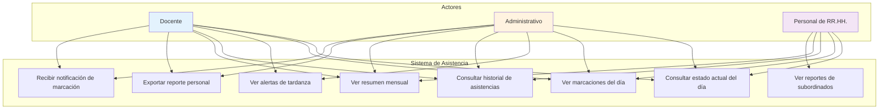

# 3.2 Casos de Uso del Módulo de Asistencia en Tiempo Real

Esta sección documenta los casos de uso del módulo de asistencia en tiempo real, identificando los actores y sus interacciones con el sistema.

---

## 3.2.1 Diagrama de Casos de Uso

---

## 3.2.2 Descripción de Casos de Uso

### CU-01: Consultar Estado Actual del Día

| Atributo | Valor |
|----------|-------|
| **Nombre** | Consultar Estado Actual del Día |
| **Actores** | Docente, Administrativo, Personal de RR.HH. |
| **Descripción** | El usuario consulta su estado de asistencia del día actual al ingresar al sistema |
| **Precondiciones** | El usuario debe estar autenticado |
| **Postcondiciones** | El sistema muestra el estado actual de asistencia del día |

#### Flujo Principal

1. El usuario accede al sistema con sus credenciales
2. El sistema redirige al Dashboard de Asistencia
3. El componente `TodayStatusCard` carga los datos del día actual
4. El sistema muestra:
   - Estado de asistencia (COMPLETE, INCOMPLETE, etc.)
   - Estado de entrada (ON_TIME, LATE, etc.)
   - Estado de salida (ON_TIME, EARLY_EXIT, etc.)
   - Minutos trabajados hasta el momento
   - Alerta de próxima acción requerida

#### Flujo Alternativo

| Condición | Acción |
|-----------|--------|
| No hay datos para el día actual | El sistema muestra mensaje "Sin registros hoy" |
| El usuario tiene múltiples períodos | El sistema muestra cada período con su estado individual |

---

### CU-02: Ver Marcaciones del Día

| Atributo | Valor |
|----------|-------|
| **Nombre** | Ver Marcaciones del Día |
| **Actores** | Docente, Administrativo, Personal de RR.HH. |
| **Descripción** | El usuario visualiza todas sus marcaciones (entradas y salidas) del día actual |
| **Precondiciones** | El usuario debe estar autenticado |
| **Postcondiciones** | El sistema muestra la línea de tiempo de eventos del día |

#### Flujo Principal

1. El usuario accede al Dashboard de Asistencia
2. El componente `EventsTimeline` carga los eventos del día
3. El sistema muestra cada evento con:
   - Hora exacta de la marcación
   - Tipo de evento (ENTRADA/SALIDA)
   - Dispositivo biométrico que registró
   - Icono distintivo según tipo

#### Flujo Alternativo

| Condición | Acción |
|-----------|--------|
| No hay eventos registrados | El sistema muestra mensaje "Sin marcaciones hoy" |
| Hay eventos inferidos por el sistema | Se indican con icono diferenciado |

---

### CU-03: Ver Alertas de Tardanza

| Atributo | Valor |
|----------|-------|
| **Nombre** | Ver Alertas de Tardanza |
| **Actores** | Docente, Administrativo |
| **Descripción** | El sistema muestra alertas visuales cuando se detecta una tardanza |
| **Precondiciones** | El usuario marcó entrada después de la hora permitida |
| **Postcondiciones** | El usuario visualiza la alerta de tardanza con minutos de retraso |

#### Flujo Principal

1. El usuario marca su entrada en el dispositivo biométrico
2. El motor de procesamiento calcula los minutos de tardanza
3. El componente `TodayStatusCard` muestra alerta "Tardanza detectada"
4. El componente muestra:
   - Minutos de tardanza
   - Hora de entrada real vs. hora programada
   - Indicador visual de alerta (color ámbar/rojo)

#### Flujo Alternativo

| Condición | Acción |
|-----------|--------|
| Entrada dentro de tolerancia | El sistema muestra "A tiempo" en verde |
| Entrada muy temprano | El sistema muestra "Temprano" en azul |

---

### CU-04: Consultar Historial de Asistencias

| Atributo | Valor |
|----------|-------|
| **Nombre** | Consultar Historial de Asistencias |
| **Actores** | Docente, Administrativo, Personal de RR.HH. |
| **Descripción** | El usuario consulta su historial de asistencias de fechas anteriores |
| **Precondiciones** | El usuario debe estar autenticado |
| **Postcondiciones** | El sistema muestra el historial de asistencias |

#### Flujo Principal

1. El usuario accede a la sección "Reportes de Asistencia"
2. El sistema muestra un calendario o selector de fechas
3. El usuario selecciona el rango de fechas deseado
4. El sistema carga y muestra:
   - Lista de días con sus estados
   - Resumen de métricas (total tardanzas, total horas extras)
   - Filtros por estado (AUSENCIA, COMPLETE, etc.)

---

### CU-05: Ver Resumen Mensual

| Atributo | Valor |
|----------|-------|
| **Nombre** | Ver Resumen Mensual |
| **Actores** | Docente, Administrativo, Personal de RR.HH. |
| **Descripción** | El usuario visualiza un resumen consolidado de su asistencia durante un mes |
| **Precondiciones** | El usuario debe estar autenticado |
| **Postcondiciones** | El sistema muestra métricas consolidadas del mes |

#### Flujo Principal

1. El usuario selecciona un mes en el calendario
2. El sistema calcula las métricas mensuales:
   - Total días trabajados
   - Total días con ausencia
   - Total minutos de tardanza
   - Total minutos de horas extras
   - Porcentaje de asistencia
3. El sistema muestra gráficos visuales:
   - Gráfico de barras de asistencia semanal
   - Gráfico circular de estados de asistencia
   - Tabla resumen con valores numéricos

---

### CU-06: Exportar Reporte Personal

| Atributo | Valor |
|----------|-------|
| **Nombre** | Exportar Reporte Personal |
| **Actores** | Docente, Administrativo |
| **Descripción** | El usuario exporta su reporte de asistencia en formato PDF |
| **Precondiciones** | El usuario debe estar autenticado y tener datos de asistencia |
| **Postcondiciones** | El sistema genera y descarga un archivo PDF |

#### Flujo Principal

1. El usuario selecciona el rango de fechas
2. El usuario hace clic en "Exportar PDF"
3. El sistema muestra indicador de carga
4. El backend genera el PDF con Puppeteer
5. El archivo PDF se descarga automáticamente
6. El sistema muestra notificación de éxito

---

### CU-07: Ver Reportes de Subordinados

| Atributo | Valor |
|----------|-------|
| **Nombre** | Ver Reportes de Subordinados |
| **Actores** | Personal de RR.HH. |
| **Descripción** | El personal de RR.HH. consulta los reportes de asistencia de los usuarios a su cargo |
| **Precondiciones** | El usuario debe tener rol de RR.HH. |
| **Postcondiciones** | El sistema muestra los reportes de los subordinados |

#### Flujo Principal

1. El usuario accede a la sección de "Reportes Administrativos"
2. El sistema muestra filtros:
   - Departamento
   - Usuario específico
   - Rango de fechas
3. El usuario aplica los filtros deseados
4. El sistema muestra tabla con:
   - Lista de usuarios
   - Estado de asistencia del período
   - Métricas individuales
   - Opciones para ver detalle

---

### CU-08: Recibir Notificación de Marcación

| Atributo | Valor |
|----------|-------|
| **Nombre** | Recibir Notificación de Marcación |
| **Actores** | Docente, Administrativo |
| **Descripción** | El usuario recibe notificación visual cuando su marcación es procesada |
| **Precondiciones** | El usuario tiene el dashboard abierto |
| **Postcondiciones** | El dashboard se actualiza con la nueva marcación |

#### Flujo Principal

1. El usuario marca su huella en el dispositivo biométrico
2. El dispositivo envía el registro al backend
3. El motor de procesamiento procesa el registro
4. TanStack Query detecta nueva versión de datos
5. El dashboard se actualiza automáticamente
6. El usuario ve su nueva marcación sin recargar la página

---

## 3.2.3 Matriz de Actores vs. Casos de Uso

| Caso de Uso | Docente | Administrativo | RR.HH. |
|-------------|---------|----------------|---------|
| CU-01: Consultar estado actual | ✅ | ✅ | ✅ |
| CU-02: Ver marcaciones del día | ✅ | ✅ | ✅ |
| CU-03: Ver alertas de tardanza | ✅ | ✅ | ❌ |
| CU-04: Consultar historial | ✅ | ✅ | ✅ |
| CU-05: Ver resumen mensual | ✅ | ✅ | ✅ |
| CU-06: Exportar reporte personal | ✅ | ✅ | ❌ |
| CU-07: Ver reportes de subordinados | ❌ | ❌ | ✅ |
| CU-08: Recibir notificación | ✅ | ✅ | ✅ |

---

[Siguiente: Flujo de Datos](./03-flujo-de-datos.md) | [Anterior: Descripción General](./01-descripcion-general.md)
