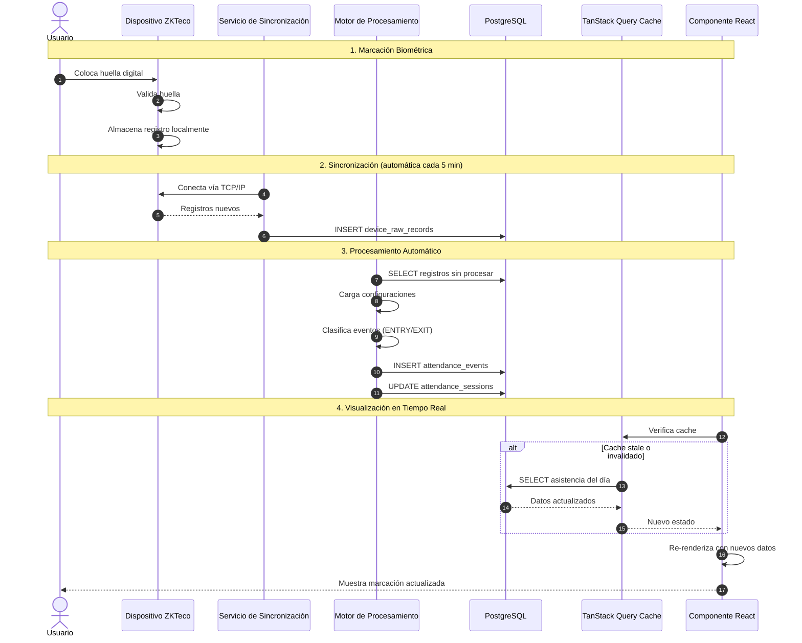
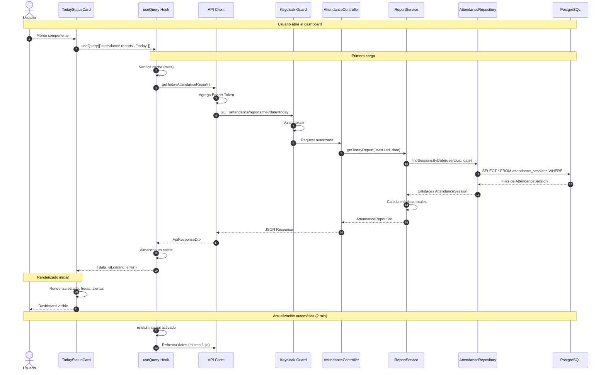
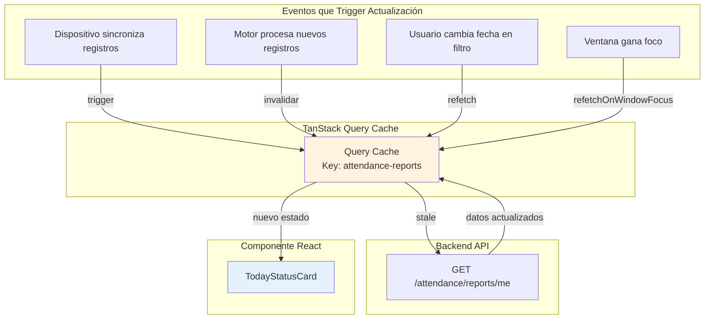
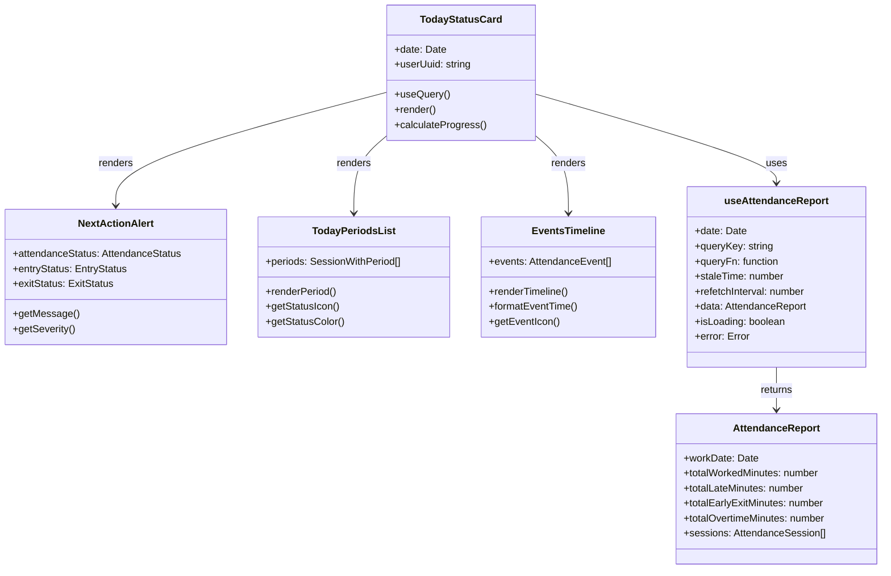
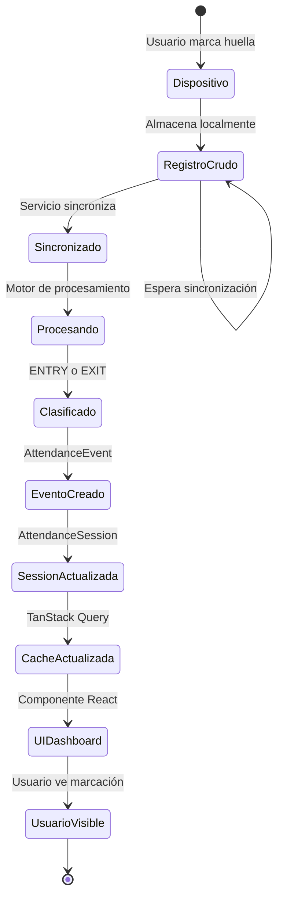
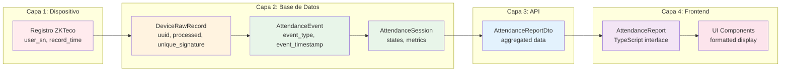

# 3.3 Flujo de Datos del Módulo de Asistencia en Tiempo Real

Esta sección documenta el flujo completo de datos desde que el usuario marca su huella digital hasta que la información se visualiza en el dashboard.

---

## 3.3.1 Diagrama de Secuencia Completo

---

## 3.3.2 Flujo Detallado de Consulta del Dashboard

---

## 3.3.3 Flujo de Actualización en Tiempo Real

El sistema implementó actualización en tiempo real mediante **invalidación de cache**:

### Estrategia de Refresco

| Evento | Acción | Configuración |
|--------|--------|---------------|
| **Montaje del componente** | Carga inicial | `staleTime: 30s` |
| **Ventana gana foco** | Refresco automático | `refetchOnWindowFocus: true` |
| **Intervalo periódico** | Refresco cada 2 min | `refetchInterval: 120000ms` |
| **Acción del usuario** | Invalidación manual | `queryClient.invalidateQueries()` |
| **Conexión restablecida** | Reintento automático | `retry: 3` |

---

## 3.3.4 Clas Type Diagram: Componentes del Módulo

---

## 3.3.5 Flujo de Datos de una Marcación Individual

---

## 3.3.6 Transformación de Datos

Los datos sufrieron múltiples transformaciones desde su origen hasta la visualización:

### Transformaciones por Capa

| Capa | Transformación |
|------|---------------|
| **Dispositivo** | Datos crudos del protocolo ZKTeco |
| **Ingesta** | Mapeo a `DeviceRawRecord` con `uniqueSignature` |
| **Procesamiento** | Clificación a `AttendanceEvent` y agregación en `AttendanceSession` |
| **API** | Transformación a DTOs para transferencia HTTP |
| **Frontend** | Mapeo a interfaces TypeScript con validación |
| **UI** | Formateo para display (horas legibles, colores, iconos) |

---

[Siguiente: Procedimiento Aplicativo](./04-procedimiento-aplicativo.md) | [Anterior: Casos de Uso](./02-casos-de-uso.md)
