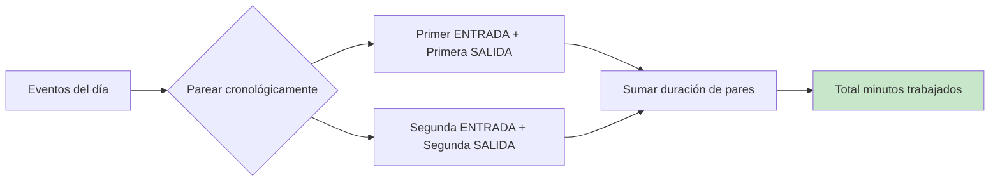

# 3.4 Procedimiento Aplicativo del Módulo de Asistencia en Tiempo Real

Esta sección describe cómo los usuarios interactuaron con el módulo de asistencia en tiempo real, incluyendo los procedimientos paso a paso para las tareas más comunes.

---

## 3.4.1 Acceso al Dashboard de Asistencia

### Procedimiento: Consultar Estado Actual del Día

**Objetivo:** Permitir al usuario visualizar su estado de asistencia del día actual.

**Pasos:**

1. **Iniciar sesión**
   - El usuario accede a la URL del sistema
   - Ingresa sus credenciales (documento de identidad y contraseña)
   - El sistema valida las credenciales con Keycloak

2. **Navegar al Dashboard**
   - El sistema redirige automáticamente a la página principal
   - El usuario selecciona "Asistencia" en el menú lateral
   - Se despliega el Dashboard de Asistencia

3. **Interpretar la información mostrada**
   - **Tarjeta de estado del día** (superior izquierda):
     - Estado actual (COMPLETO, INCOMPLETO, AUSENCIA)
     - Horas trabajadas con barra de progreso
     - Estado de entrada (A tiempo, Tardanza, Temprano)
     - Estado de salida (A tiempo, Salida temprana, Horas extra)
   - **Alerta de próxima acción** (superior derecha):
     - Indica qué acción debe realizar el usuario
     - Muestra advertencias si hay tardanzas
   - **Lista de períodos** (centro):
     - Períodos del día con su horario
     - Estado individual de cada período
   - **Línea de tiempo de eventos** (inferior):
     - Cronología de marcaciones del día
     - Dispositivo que registró cada marcación

---

## 3.4.2 Interpretación de Estados e Indicadores

### Tabla de Estados de Asistencia

| Estado Visual | Significado | Color |
|--------------|-------------|-------|
| ✅ COMPLETO | El día está completo con todas las marcaciones | Verde |
| ⏳ INCOMPLETO | Faltan marcaciones por registrar | Ámbar |
| ❌ AUSENCIA | No se registró ninguna marcación | Rojo |
| 🏖️ DÍA FESTIVO | El día corresponde a un festivo | Azul claro |
| 📄 JUSTIFICADO | El día tiene un permiso aprobado | Morado |

### Estados de Entrada

| Indicador | Condición | Acción Sugerida |
|-----------|-----------|-----------------|
| 🟢 A tiempo | Entrada dentro de los 15 min de tolerancia | Ninguna |
| 🟡 Tardanza | Entrada después de los 15 min de tolerancia | Justificar si aplica |
| 🔵 Temprano | Entrada antes de la hora de inicio | Ninguna |
| ⚪ Sin entrada | No se registró entrada | Verificar con RR.HH. |

### Estados de Salida

| Indicador | Condición | Acción Sugerida |
|-----------|-----------|-----------------|
| 🟢 A tiempo | Salida dentro de los 15 min de tolerancia | Ninguna |
| 🟠 Salida temprana | Salida antes de los 15 min de tolerancia | Justificar si aplica |
| 🔵 Horas extra | Salida después de los 15 min de tolerancia | Registrar en sistema |
| ⚪ Sin salida | No se registró salida | Verificar con RR.HH. |

---

## 3.4.3 Procedimientos Comunes

### Procedimiento: Verificar Marcaciones del Día

**Objetivo:** El usuario verifica que todas sus marcaciones fueron registradas correctamente.

**Pasos:**

1. Acceder al Dashboard de Asistencia
2. Revisar la sección "Línea de Tiempo de Eventos"
3. Verificar que cada marcación aparece con:
   - Hora correcta
   - Tipo correcto (ENTRADA/SALIDA)
   - Dispositivo correcto

**Si falta una marcación:**

1. Verificar en qué dispositivo se marcó
2. Contactar al área de sistemas para verificar sincronización
3. Si procede, solicitar corrección a RR.HH.

---

### Procedimiento: Identificar Tardanzas y Aplicar Descuentos

**Objetivo:** El personal de RR.HH. identifica tardanzas para aplicar descuentos según normativa.

**Pasos:**

1. **Acceder al reporte del período**
   - Ir a "Reportes de Asistencia"
   - Seleccionar el mes y departamento
   - Aplicar filtros

2. **Identificar tardanzas**
   - Buscar registros con estado "LATE" en entrada
   - Revisar columna "Minutos de tardanza"
   - Verificar que no tengan justificación

3. **Validar contra tolerancias**
   - Verificar que la tardanza exceda los 15 min de tolerancia
   - Confirmar que no sea un día festivo o permiso

4. **Aplicar descuento**
   - Exportar reporte a PDF
   - Remitir al área de nómina
   - El sistema de nómina aplica el descuento correspondiente

---

### Procedimiento: Consultar Historial de un Período

**Objetivo:** El usuario consulta su historial de asistencia de un mes específico.

**Pasos:**

1. **Acceder a la sección de reportes**
   - Hacer clic en "Reportes de Asistencia" en el menú

2. **Seleccionar el período**
   - Elegir mes y año en el selector
   - Opcional: Seleccionar rango de fechas personalizado

3. **Aplicar filtros**
   - Por estado: AUSENCIA, COMPLETO, INCOMPLETO
   - Por tipo de marcación: solo tardanzas, solo horas extra

4. **Interpretar el resumen**
   - **Total días trabajados**: Días con estado COMPLETO
   - **Total ausencias**: Días sin ninguna marcación
   - **Total minutos tardanza**: Suma de todas las tardanzas
   - **Total minutos horas extra**: Suma de todas las horas extra
   - **Porcentaje de asistencia**: (Días trabajados / Días laborables) × 100

---

## 3.4.4 Interpretación de Métricas

### Cálculo de Horas Trabajadas

El sistema calculó las horas trabajadas de la siguiente manera:



**Ejemplo:**
- ENTRADA 08:00, SALIDA 12:00 → 240 minutos (4 horas)
- ENTRADA 14:00, SALIDA 18:00 → 240 minutos (4 horas)
- **Total: 480 minutos (8 horas)**

### Cálculo de Minutos de Tardanza

```
Minutos de tardanza = (Hora de entrada real) - (Hora programada + Tolerancia)
```

**Ejemplo con tolerancia de 15 minutos:**
- Hora programada: 08:00
- Tolerancia: hasta 08:15
- Entrada real: 08:45
- **Tardanza: 30 minutos** (08:45 - 08:15)

### Cálculo de Minutos de Salida Temprana

```
Minutos de salida temprana = (Hora programada - Tolerancia) - (Hora de salida real)
```

**Ejemplo con tolerancia de 15 minutos:**
- Hora programada: 17:00
- Tolerancia: desde 16:45
- Salida real: 16:15
- **Salida temprana: 30 minutos** (16:45 - 16:15)

---

## 3.4.5 Procedimiento de Exportación de Reportes

### Pasos para Exportar a PDF

1. **Configurar el reporte**
   - Seleccionar rango de fechas
   - Aplicar filtros necesarios
   - Verificar que los datos sean correctos

2. **Generar el PDF**
   - Hacer clic en botón "Exportar PDF"
   - Esperar indicador de carga (5-15 segundos)
   - El archivo se descarga automáticamente

3. **Contenido del PDF**
   - Encabezado con nombre del empleado y período
   - Tabla resumen con métricas consolidadas
   - Detalle día por día con estados
   - Total de tardanzas y horas extras
   - Pie de página con fecha de generación

---

[Anterior: Flujo de Datos](./03-flujo-de-datos.md) | [Siguiente: Módulo de Procesamiento Biométrico](/documentacion/04-modulo-procesamiento-biometrico/01-descripcion-general.md)
