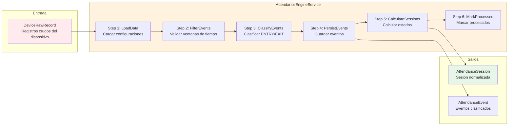
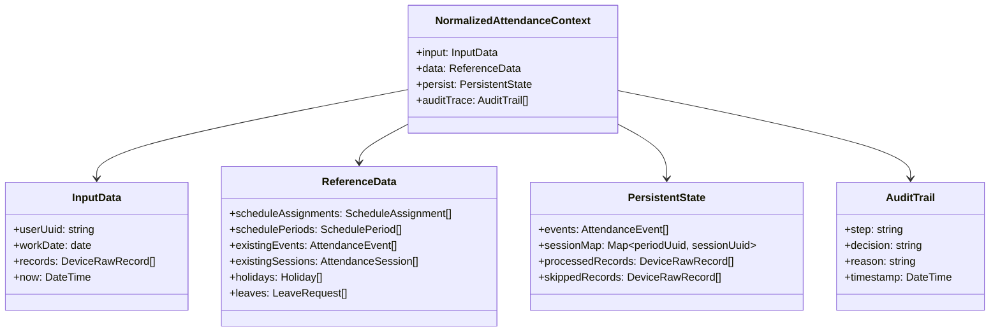
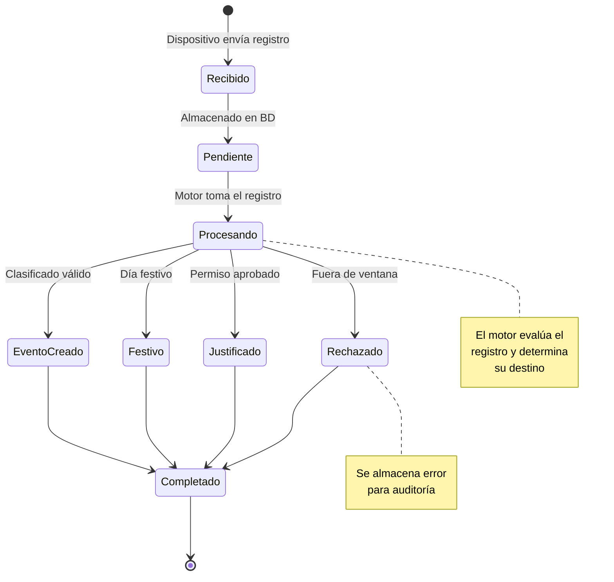
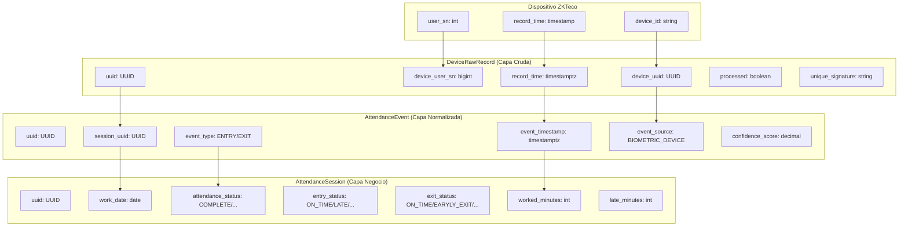

# 4.1 Descripción General del Módulo de Procesamiento Biométrico

Este módulo constituyó el segundo objetivo específico del proyecto: **implementar un módulo que permitió procesar automáticamente los datos biométricos de asistencia**, reduciendo la carga manual y garantizando información oportuna.

---

## 4.1.1 Propósito del Módulo

El módulo de procesamiento biométrico tuvo como finalidad:

1. **Automatizar la transformación** de registros crudos de dispositivos biométricos en información estructurada de asistencia.
2. **Normalizar los datos** provenientes de múltiples dispositivos en un formato unificado.
3. **Garantizar la idempotencia** para evitar procesamiento duplicado de registros.
4. **Proporcionar una única fuente de verdad** para todos los cálculos de asistencia.

---

## 4.1.2 El Motor de Procesamiento (AttendanceEngineService)

El componente central del módulo fue el **AttendanceEngineService**, un servicio diseñado como un pipeline de procesamiento secuencia que transformó los registros biométricos crudos en sesiones de asistencia normalizadas.

### Ventajas del Diseño en Pipeline

| Ventaja | Descripción |
|---------|-------------|
| **Modularidad** | Cada paso se pudo probar independientemente |
| **Mantenibilidad** | Los cambios en un paso no afectaron a los demás |
| **Escalabilidad** | El pipeline se pudo paralelizar por usuario |
| **Trazabilidad** | Cada paso dejó un registro de auditoría |
| **Performance** | Optimizaciones locales sin afectar el flujo global |

---

## 4.1.3 Componentes del Motor

### Context Object (Objeto de Contexto)

El pipeline utilizó un objeto de contexto para pasar datos entre pasos:

**Propósito del Context Object:**

- Centralizó todos los datos necesarios para el procesamiento
- Permitió pasar información entre pasos del pipeline
- Mantuvo un registro de auditoría para debugging
- Facilitó las pruebas unitarias

---

## 4.1.4 Estados de Procesamiento de un Registro

---

## 4.1.5 Normalización de Datos

El sistema transformó los datos crudos de los dispositivos en un modelo normalizado:

---

## 4.1.6 Características Técnicas del Motor

### Idempotencia

El motor garantizó que cada registro se procesara exactamente una vez:

- **uniqueSignature**: Hash compuesto por `device_uuid + user_sn + record_time`
- **Constraint único**: Previene inserción de duplicados
- **processed flag**: Marca registros ya procesados

### Soporte para Múltiples Períodos

El sistema manejó correctamente turnos partidos (ej: mañana + tarde):

- Cada período generó su propia `AttendanceSession`
- Los eventos se enrutaron al período correspondiente
- Los estados se calcularon independientemente por período

### Manejo de Casos Especiales

| Caso | Comportamiento del Motor |
|------|--------------------------|
| Día festivo | Marca registro procesado, no crea eventos, estado = HOLIDAY |
| Permiso aprobado | Marca registro procesado, no crea eventos, estado = JUSTIFIED |
| Registro fuera de ventana | Marca procesado con error, no crea eventos |
| Múltiples entradas | Usa la primera para estado, ignora el resto |
| Múltiples salidas | Usa la última para estado, ignora el resto |

---

[Siguiente: Pipeline de Procesamiento](./02-pipeline-de-procesamiento.md) | [Anterior: Procedimiento Aplicativo](../../03-modulo-asistencia-en-tiempo-real/04-procedimiento-aplicativo.md)
