# 4.2 Pipeline de Procesamiento Biométrico

El motor de procesamiento implementó un pipeline de **6 pasos secuenciales** que transformaron los registros crudos de los dispositivos biométricos en sesiones de asistencia normalizadas.

---

## 4.2.1 Vista General del Pipeline

```mermaid
flowchart TD
    subgraph Pipeline["AttendanceEngineService Pipeline"]
        direction TB
        P1["STEP 1: LoadData<br/>Cargar configuraciones"]
        P2["STEP 1.5: EnsureSessions<br/>Crear sesiones por período"]
        P3["STEP 2: FilterEvents<br/>Validar ventanas de tiempo"]
        P4["STEP 3: ClassifyEvents<br/>Determinar ENTRY vs EXIT"]
        P5["STEP 4: PersistEvents<br/>Guardar eventos"]
        P6["STEP 5: CalculateSessions<br/>Actualizar estados"]
        P7["STEP 6: MarkProcessed<br/>Marcar procesados"]
    end

    subgraph Input["INPUT"]
        I["Registros Dispositivo"]
    end

    subgraph Output["OUTPUT"]
        O["Sesiones de Asistencia"]
    end

    subgraph DB["PostgreSQL"]
        DB[(datos)]
    end

    I --> P1
    P1 --> P2
    P2 --> P3
    P3 --> P4
    P4 --> P5
    P5 --> P6
    P6 --> P7
    P7 --> O

    P1 -.->|consultas| DB
    P5 -.->|INSERT| DB
    P6 -.->|UPDATE| DB
    P7 -.->|UPDATE| DB

    style P1 fill:#e3f2fd
    style P2 fill:#e3f2fd
    style P3 fill:#fff3e0
    style P4 fill:#fff3e0
    style P5 fill:#e8f5e9
    style P6 fill:#e8f5e9
    style P7 fill:#fce4ec
```

---

## 4.2.2 Paso 1: LoadData (Carga de Datos)

**Objetivo:** Cargar todas las configuraciones y datos necesarios para el procesamiento.

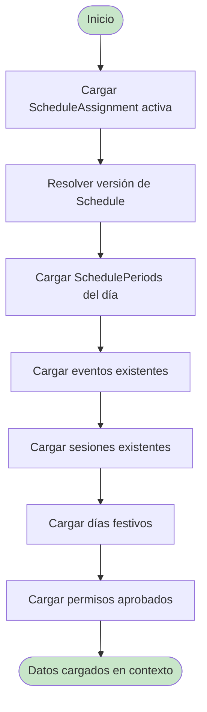

**Consultas Realizadas:**

| Consulta | Propósito |
|----------|-----------|
| `ScheduleAssignment` por usuario y fecha | Obtener horario asignado |
| `ScheduleVersion` | Resolver versión histórica del horario |
| `SchedulePeriod` por día de semana | Obtener períodos del día |
| `AttendanceEvent` existentes | Evitar duplicados |
| `AttendanceSession` existentes | Actualizar en lugar de crear |
| `Holiday` | Detectar días festivos |
| `LeaveRequest` aprobados | Detectar permisos |

**Early Exit:** Si no hay `ScheduleAssignment` activa, el processing termina inmediatamente.

---

## 4.2.3 Paso 1.5: EnsureSessions (Garantizar Sesiones)

**Objetivo:** Crear exactamente una sesión por período ANTES de procesar eventos.

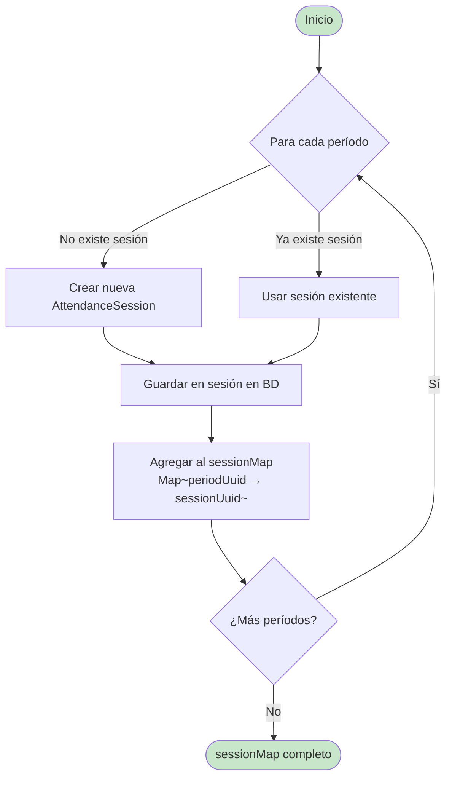

**¿Por qué este paso?**

- Los eventos necesitan un `sessionUuid` válido al crearse
- Crear las sesiones primero evita problemas de llave foránea
- Permite actualizar sesiones existentes en lugar de recrearlas

**Estado Inicial de Sesiones Nuevas:**

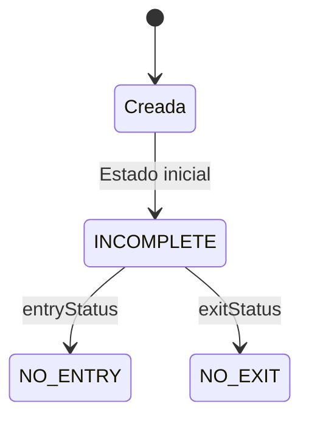

---

## 4.2.4 Paso 2: FilterEvents (Filtrar Eventos)

**Objetivo:** Validar que los registros estén dentro de las ventanas de tiempo permitidas.

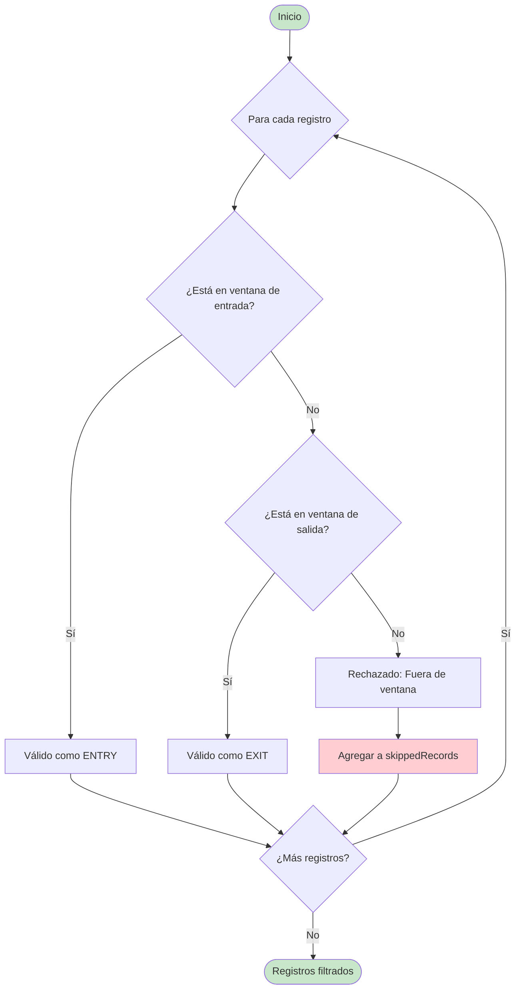

**Lógica de Validación:**

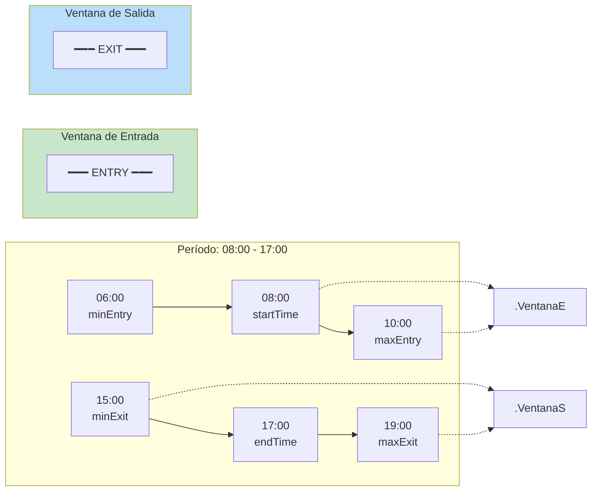

**Ejemplos de Clasificación:**

| Hora | Ventana de Entrada (06-10) | Ventana de Salida (15-19) | Resultado |
|------|----------------------------|---------------------------|-----------|
| 07:30 | ✅ Dentro | ❌ Fuera | Válido ENTRY |
| 11:00 | ❌ Fuera | ❌ Fuera | ⚠️ Rechazado |
| 16:30 | ❌ Fuera | ✅ Dentro | Válido EXIT |
| 20:00 | ❌ Fuera | ❌ Fuera | ⚠️ Rechazado |

---

## 4.2.5 Paso 3: ClassifyEvents (Clasificar Eventos)

**Objetivo:** Determinar si cada registro válido es ENTRY o EXIT, y manejar casos especiales.

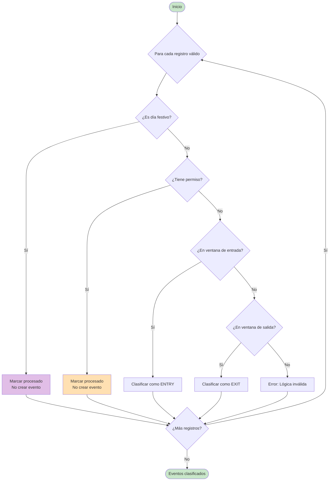

**Prioridad de Clasificación:**

1. **Día festivo** → Procesar sin evento
2. **Permiso aprobado** → Procesar sin evento
3. **Ventana de entrada** → ENTRY (prioridad)
4. **Ventana de salida** → EXIT

---

## 4.2.6 Paso 4: PersistEvents (Persistir Eventos)

**Objetivo:** Guardar los eventos clasificados en la base de datos.

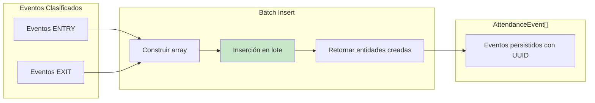

**Optimización:**

- **Batch insert**: Todos los eventos se insertaron en una sola transacción
- **Single transaction**: Garantizó consistencia (todo o nada)
- **Return entities**: Las entidades creadas incluyeron los UUIDs generados

---

## 4.2.7 Paso 5: CalculateSessions (Calcular Sesiones)

**Objetivo:** Calcular y actualizar los tres estados ortogonales de cada sesión.

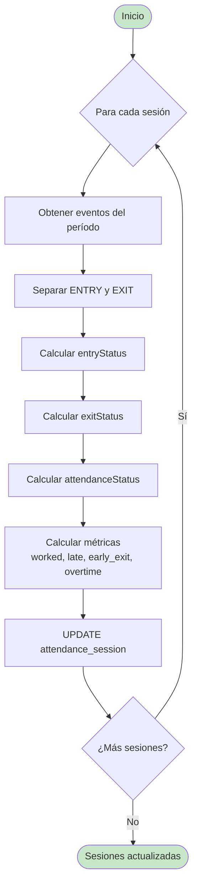

**Estados Ortogonales:**

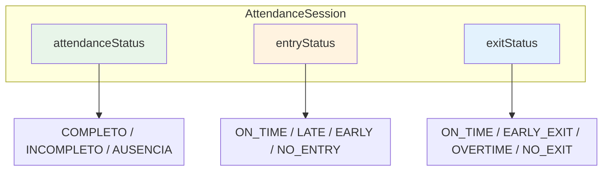

---

## 4.2.8 Paso 6: MarkProcessed (Marcar Procesados)

**Objetivo:** Actualizar el estado de procesamiento de los registros crudos.

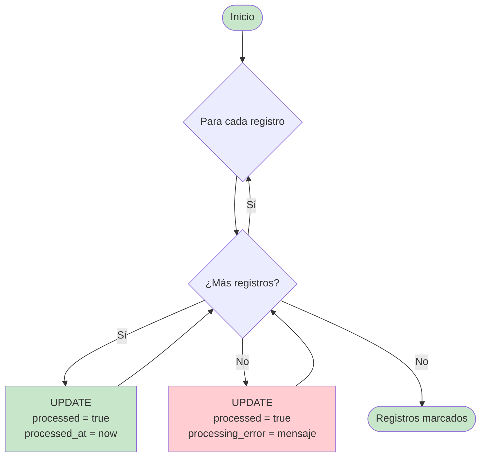

**Campos Actualizados:**

| Campo | Registros Exitosos | Registros Rechazados |
|-------|-------------------|---------------------|
| `processed` | `true` | `true` |
| `processed_at` | Timestamp actual | Timestamp actual |
| `processing_error` | `null` | Mensaje descriptivo |

---

## 4.2.9 Performance del Pipeline

### Métricas de Ejecución

| Paso | Queries | Tiempo Estimado |
|------|---------|-----------------|
| LoadData | ~5 | ~50ms |
| EnsureSessions | 0-2 | ~20ms |
| FilterEvents | 0 | ~1ms |
| ClassifyEvents | 0 | ~2ms |
| PersistEvents | 1 | ~15ms |
| CalculateSessions | ~2 | ~30ms |
| MarkProcessed | 2 | ~10ms |
| **Total** | **~14** | **~138ms** |

### Optimizaciones Implementadas

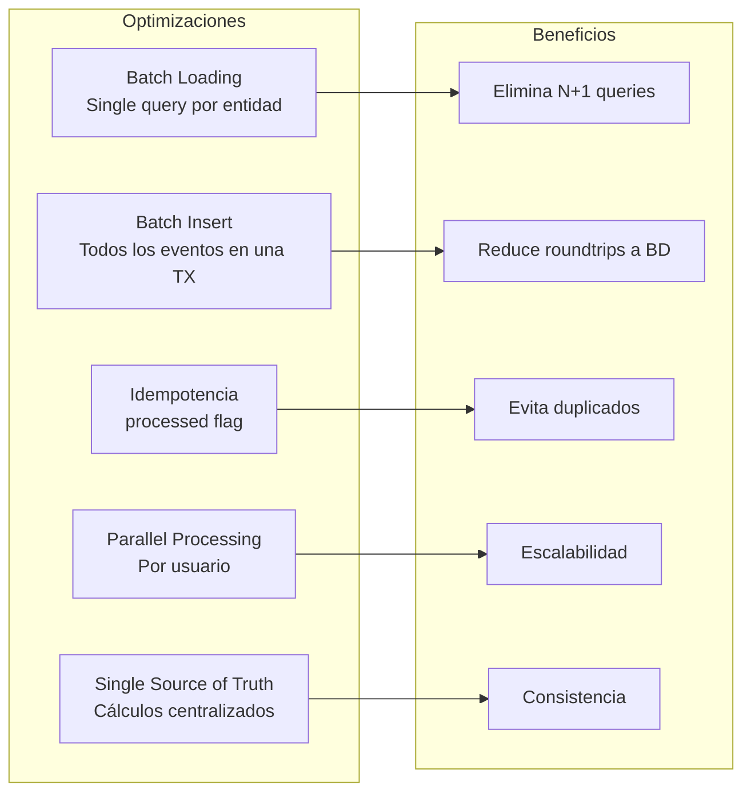

---

[Siguiente: Clasificación de Eventos](./03-clasificacion-eventos.md) | [Anterior: Descripción General](./01-descripcion-general.md)
