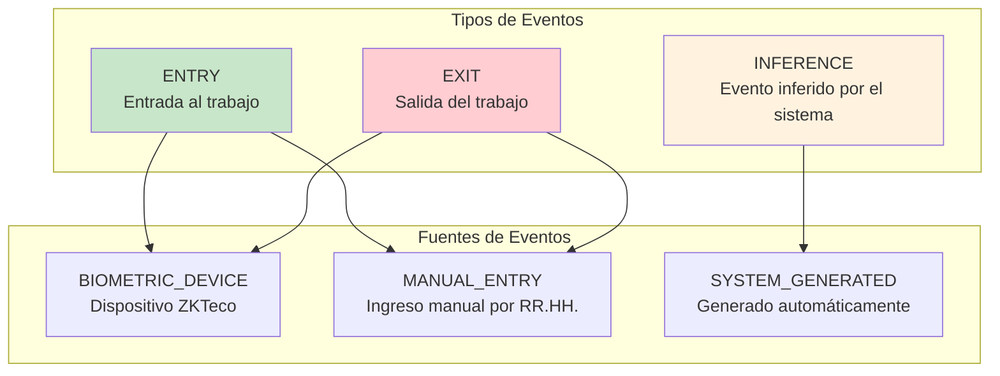
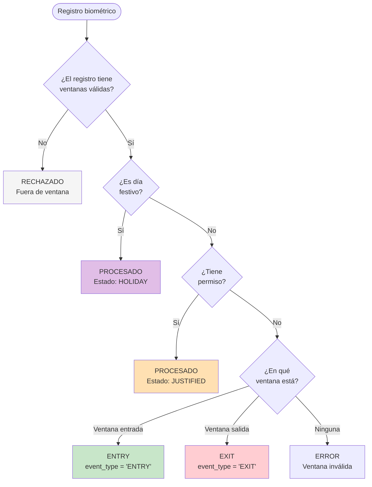
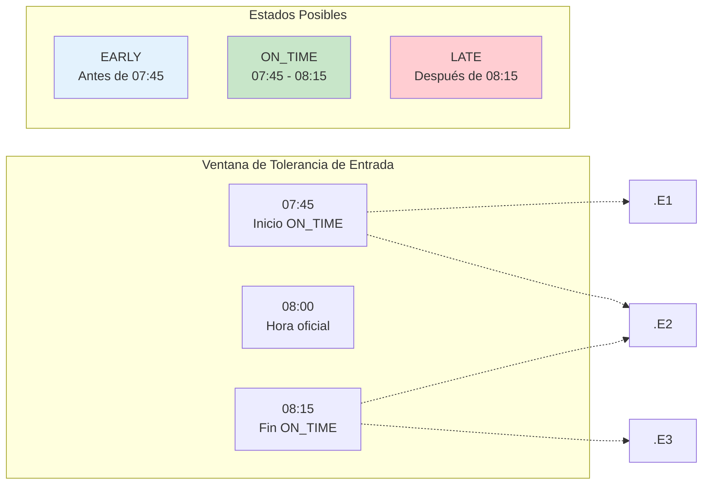
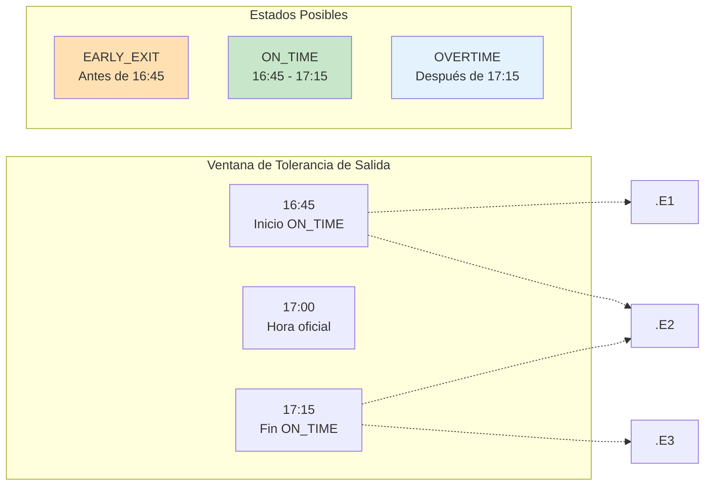
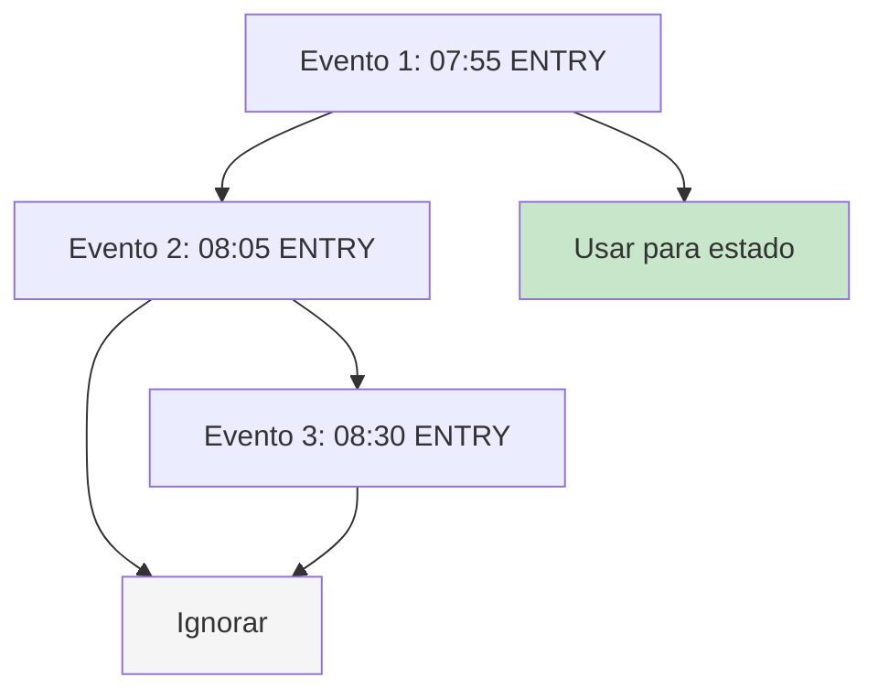
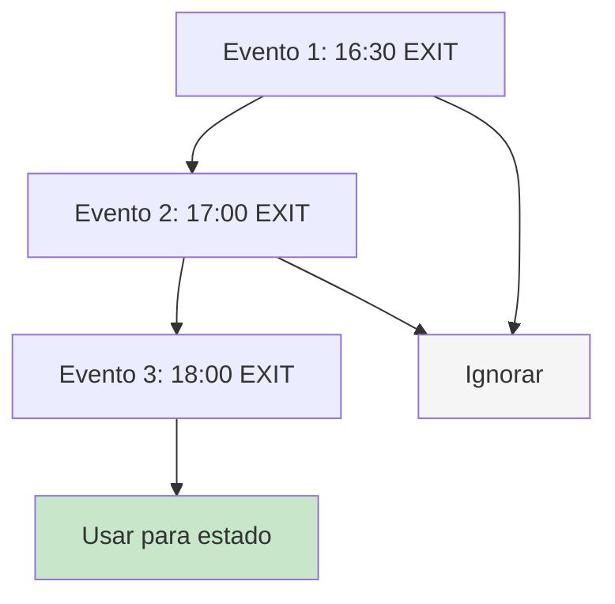
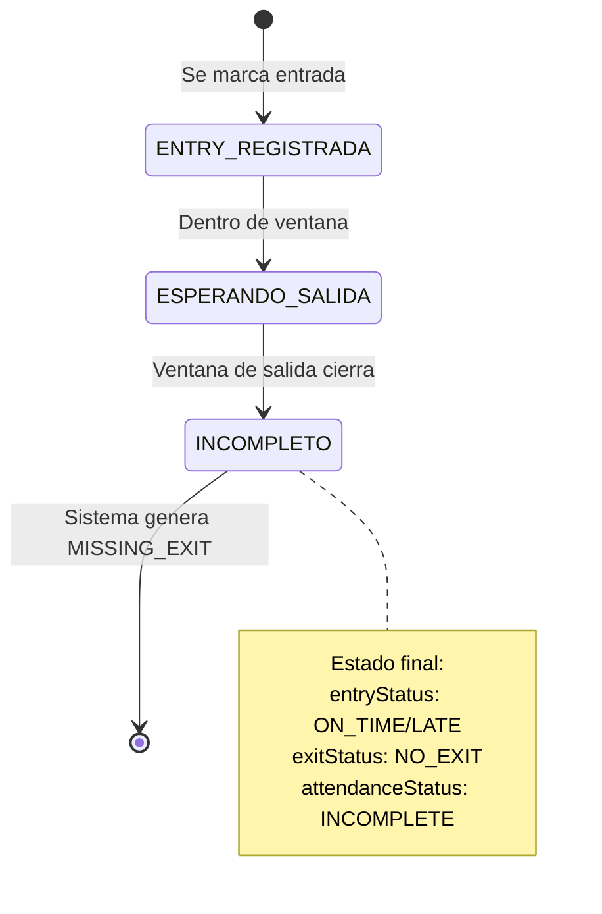
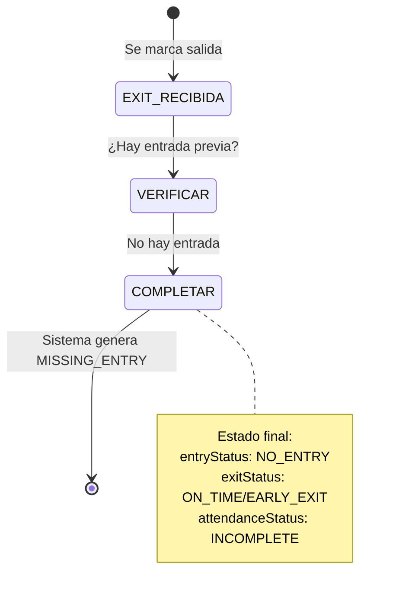
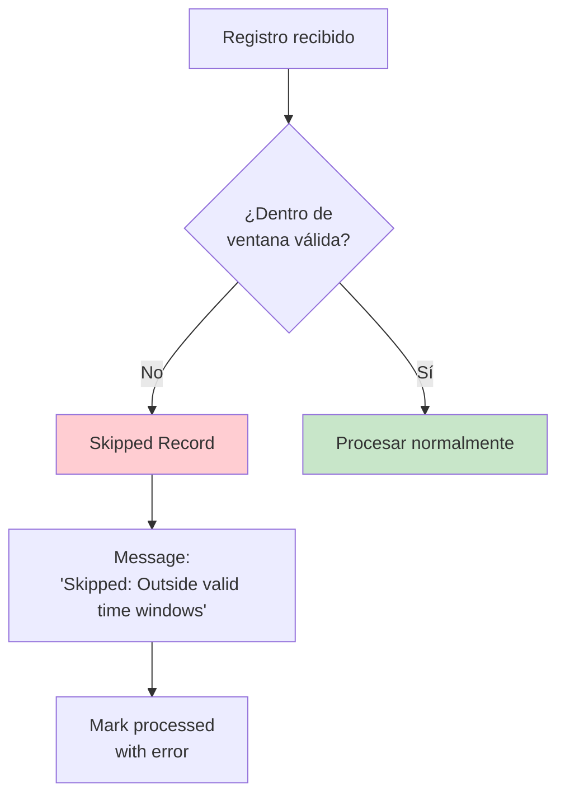

# 4.3 Clasificación de Eventos Biométricos

Esta sección documenta la lógica mediante la cual el sistema clasificó cada registro biométrico como entrada (ENTRY) o salida (EXIT), y cómo se manejaron los casos especiales.

---

## 4.3.1 Tipos de Eventos

El sistema reconoció tres tipos de eventos:

---

## 4.3.2 Algoritmo de Clasificación

### Diagrama de Decisión

### Prioridad de Clasificación

| Orden | Condición | Resultado |
|-------|-----------|-----------|
| 1 | Día festivo | Procesar sin evento (estado HOLIDAY) |
| 2 | Permiso aprobado | Procesar sin evento (estado JUSTIFIED) |
| 3 | Dentro de ventana de entrada | Clasificar como ENTRY |
| 4 | Dentro de ventana de salida | Clasificar como EXIT |
| 5 | Fuera de ambas ventanas | Rechazar con error |

---

## 4.3.3 Ventanas de Clasificación

Las ventanas de tiempo se configuraron por período de horario:

```mermaid
gantt
    title Ventanas de Tiempo para Clasificación
    dateFormat HH:mm
    axisFormat %H:%M

    section Período
    Horario laboral    :08:00, 540m

    section Ventana Entrada
    Inicio ventana     :06:00, 240m
    Tolera ON_TIME     :07:45, 30m
    Tolera LATE        :08:15, 105m

    section Ventana Salida
    Inicio ventana     :15:00, 240m
    Tolera ON_TIME     :16:45, 30m
    Tolera OVERTIME    :17:15, 105m
```

### Parámetros de Ventana

| Parámetro | Descripción | Ejemplo |
|-----------|-------------|---------|
| `startTime` | Hora oficial de inicio | 08:00 |
| `endTime` | Hora oficial de fin | 17:00 |
| `minEntry` | Hora mínima permitida para entrada | 06:00 |
| `maxEntry` | Hora máxima permitida para entrada | 10:00 |
| `minExit` | Hora mínima permitida para salida | 15:00 |
| `maxExit` | Hora máxima permitida para salida | 19:00 |
| `toleranceMinutes` | Minutos de tolerancia para puntualidad | 15 |

---

## 4.3.4 Determinación de Estados

### Estado de Entrada (entryStatus)

### Tabla de Estados de Entrada

| Hora de Marcación | vs Hora Oficial | vs Tolerancia (±15) | Estado |
|-------------------|-----------------|---------------------|--------|
| 07:30 | Antes de 08:00 | Antes de 07:45 | **EARLY** |
| 07:50 | Antes de 08:00 | Dentro de ±15 | **ON_TIME** |
| 08:10 | Después de 08:00 | Dentro de ±15 | **ON_TIME** |
| 08:30 | Después de 08:00 | Después de 08:15 | **LATE** |

### Estado de Salida (exitStatus)

### Tabla de Estados de Salida

| Hora de Marcación | vs Hora Oficial | vs Tolerancia (±15) | Estado |
|-------------------|-----------------|---------------------|--------|
| 16:30 | Antes de 17:00 | Antes de 16:45 | **EARLY_EXIT** |
| 16:50 | Antes de 17:00 | Dentro de ±15 | **ON_TIME** |
| 17:10 | Después de 17:00 | Dentro de ±15 | **ON_TIME** |
| 17:30 | Después de 17:00 | Después de 17:15 | **OVERTIME** |

---

## 4.3.5 Manejo de Múltiples Eventos

### Múltiples Entradas en el Mismo Período

**Regla:** Se utilizó la **PRIMERA entrada** para calcular el estado de entrada. Las entradas adicionales se registraron pero no afectaron el estado.

### Múltiples Salidas en el Mismo Período

**Regla:** Se utilizó la **ÚLTIMA salida** para calcular el estado de salida. Las salidas adicionales se registraron pero no afectaron el estado.

---

## 4.3.6 Casos Especiales de Clasificación

### Entrada sin Salida Correspondiente

### Salida sin Entrada Correspondiente

### Registros en Horario No Laborable

---

## 4.3.7 Matriz de Clasificación Completa

| Escenario | Hay ENTRY | Hay EXIT | Estado Asistencia | Estado Entrada | Estado Salida |
|-----------|-----------|----------|-------------------|----------------|---------------|
| Día perfecto | ✅ | ✅ | COMPLETE | ON_TIME | ON_TIME |
| Llegada tarde | ✅ | ✅ | COMPLETE | LATE | ON_TIME |
| Salida temprana | ✅ | ✅ | COMPLETE | ON_TIME | EARLY_EXIT |
 | Tarde y sale temprano | ✅ | ✅ | COMPLETE | LATE | EARLY_EXIT |
| Horas extra | ✅ | ✅ | COMPLETE | ON_TIME | OVERTIME |
| Olvidó marcar entrada | ❌ | ✅ | INCOMPLETE | NO_ENTRY | ON_TIME |
| Olvidó marcar salida | ✅ | ❌ | INCOMPLETE | ON_TIME | NO_EXIT |
| No se presentó | ❌ | ❌ | ABSENCE | NO_ENTRY | NO_EXIT |
| Día festivo | ❌ | ❌ | HOLIDAY | - | - |
| Permiso aprobado | ❌ | ❌ | JUSTIFIED | - | - |

---

[Siguiente: Ventanas de Tiempo](./04-ventanas-de-tiempo.md) | [Anterior: Pipeline de Procesamiento](./02-pipeline-de-procesamiento.md)
