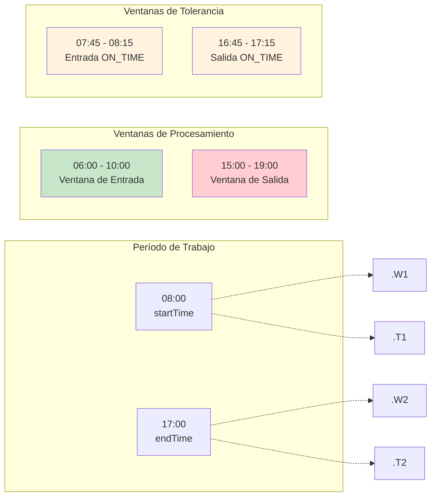
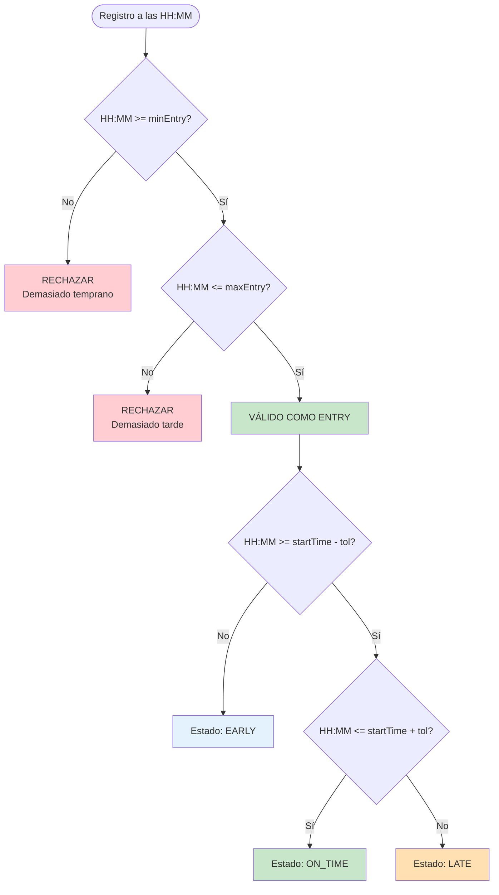
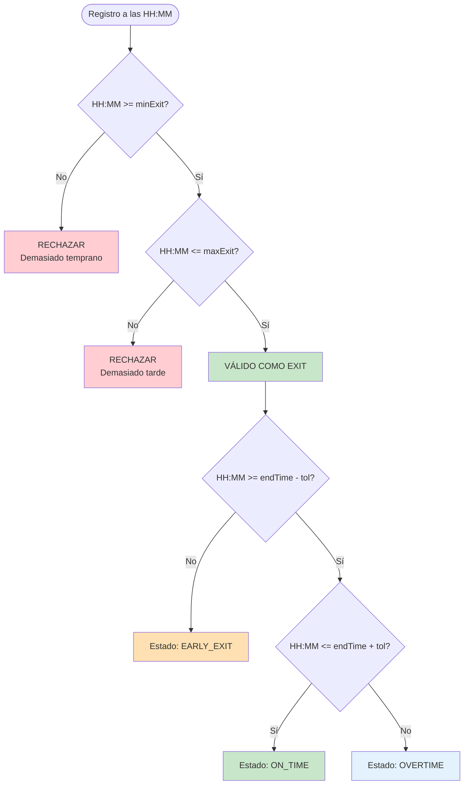
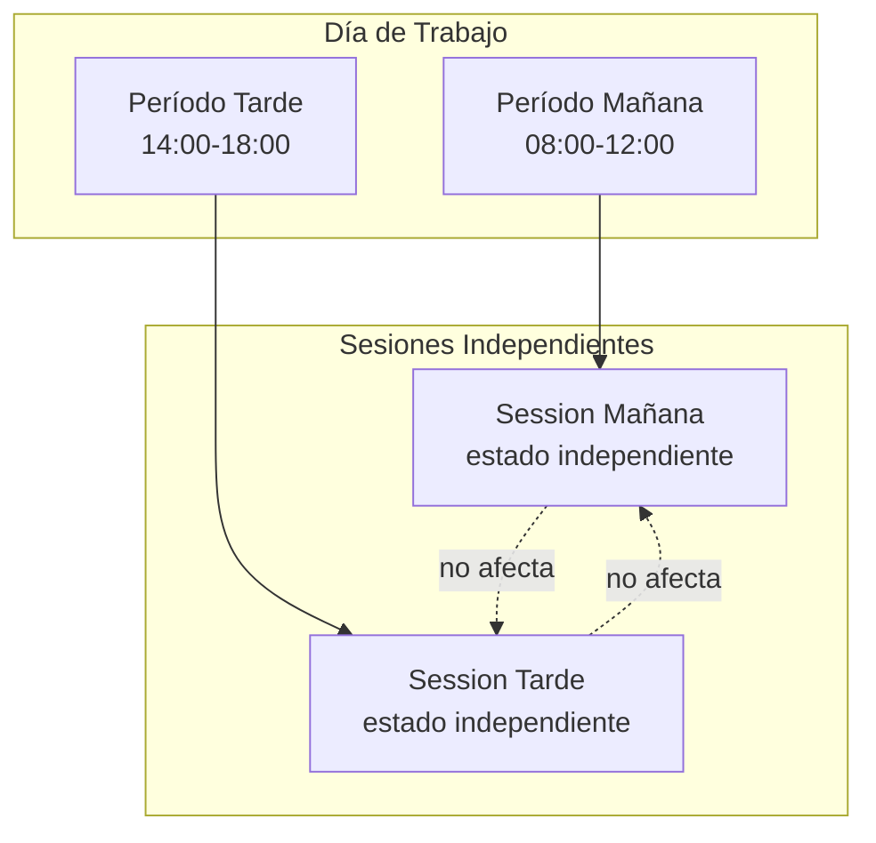
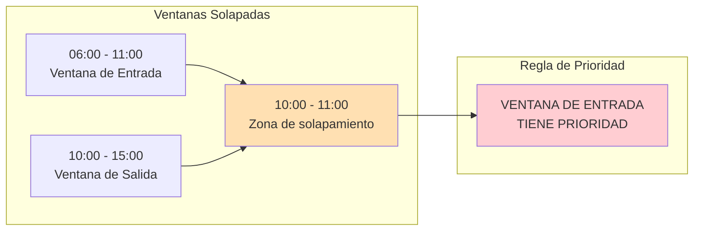

# 4.4 Ventanas de Tiempo en el Procesamiento Biométrico

Las ventanas de tiempo fueron un componente crítico del sistema, definiendo los rangos horarios válidos para la clasificación de eventos de asistencia.

---

## 4.4.1 Concepto de Ventanas de Tiempo

Una **ventana de tiempo** definió el rango de horas durante el cual una marcación biométrica fue considerada válida para ser procesada.



---

## 4.4.2 Parámetros de Configuración

Cada `SchedulePeriod` configuró los siguientes parámetros de ventana:

| Parámetro | Tipo | Descripción | Ejemplo |
|-----------|------|-------------|---------|
| `startTime` | time | Hora oficial de inicio del período | 08:00 |
| `endTime` | time | Hora oficial de fin del período | 17:00 |
| `minEntry` | time | Hora mínima aceptada como entrada | 06:00 |
| `maxEntry` | time | Hora máxima aceptada como entrada | 10:00 |
| `minExit` | time | Hora mínima aceptada como salida | 15:00 |
| `maxExit` | time | Hora máxima aceptada como salida | 19:00 |
| `toleranceMinutes` | int | Minutos de tolerancia para puntualidad | 15 |

---

## 4.4.3 Visualización de Ventanas

### Diagrama de Gantt de Ventanas

```mermaid
gantt
    title Configuración de Ventanas para Período 08:00-17:00
    dateFormat HH:mm
    axisFormat %H:%M

    section Horario Oficial
    Hora de inicio      :milestone, 08:00, 0m
    Hora de fin         :milestone, 17:00, 0m

    section Ventana de Entrada
    Inicio ventana      :06:00, 240m
    Inicio tolerancia   :07:45, 30m
    Hora oficial        :crit, 08:00, 15m
    Fin tolerancia      :08:15, 105m
    Fin ventana         :10:00, 0m

    section Ventana de Salida
    Inicio ventana      :15:00, 120m
    Inicio tolerancia   :16:45, 30m
    Hora oficial        :crit, 17:00, 15m
    Fin tolerancia      :17:15, 105m
    Fin ventana         :19:00, 0m
```



### Escala de Tiempo Detallada

```
Ventana de Entrada (Período 08:00-17:00, Tolerancia 15min)
━━━━━━━━━━━━━━━━━━━━━━━━━━━━━━━━━━━━━━━━━━━━━━━━━━━━━━━━━━━━━━━━━━

06:00    07:00    07:45    08:00    08:15    09:00    10:00
  │────────│────────│────────│────────│────────│────────│
  │        │        │        │        │        │        │
  │<────────────── ENTRY WINDOW ────────────────────────>│
  │        │        │        │        │        │        │
           │<─ EARLY ─>│<─ ON_TIME ─>│<──── LATE ─────>│
           │   07:45   │    08:15    │               │


Ventana de Salida (Período 08:00-17:00, Tolerancia 15min)
━━━━━━━━━━━━━━━━━━━━━━━━━━━━━━━━━━━━━━━━━━━━━━━━━━━━━━━━━━━━━━━━━━

15:00    16:00    16:45    17:00    17:15    18:00    19:00
  │────────│────────│────────│────────│────────│────────│
  │        │        │        │        │        │        │
  │<─────────────────── EXIT WINDOW ──────────────────────>│
  │        │        │        │        │        │        │
           │<─ EARLY_EXIT ─>│<─ ON_TIME ─>│<─ OVERTIME ─>│
           │      16:45      │    17:15    │             │
```

---

## 4.4.4 Algoritmo de Validación por Ventana

### Lógica de Validación de Entrada



### Lógica de Validación de Salida



---

## 4.4.5 Casos de Ejemplo

### Ejemplo 1: Entrada a Tiempo

| Campo | Valor |
|-------|-------|
| Hora programada | 08:00 |
| Hora de marcación | 07:55 |
| Tolerancia | 15 min (07:45 - 08:15) |
| **Resultado** | **ON_TIME** ✅ |

```
07:45     07:55     08:00     08:15
  │─────────│─────────│─────────│
           ┃
         Dentro de tolerancia → ON_TIME
```

### Ejemplo 2: Llegada Tardía

| Campo | Valor |
|-------|-------|
| Hora programada | 08:00 |
| Hora de marcación | 08:45 |
| Tolerancia | 15 min (07:45 - 08:15) |
| Minutos de tardanza | 30 min (08:45 - 08:15) |
| **Resultado** | **LATE** ⚠️ |

```
07:45     08:00     08:15     08:45
  │─────────│─────────│─────────│
                              ┃
                          Fuera de tolerancia → LATE
```

### Ejemplo 3: Salida Temprana

| Campo | Valor |
|-------|-------|
| Hora programada | 17:00 |
| Hora de marcación | 16:20 |
| Tolerancia | 15 min (16:45 - 17:15) |
| Minutos de salida temprana | 25 min (16:45 - 16:20) |
| **Resultado** | **EARLY_EXIT** ⚠️ |

```
16:45     16:20     17:00     17:15
  │─────────│─────────│─────────│
       ┃
    Fuera de tolerancia → EARLY_EXIT
```

### Ejemplo 4: Horas Extras

| Campo | Valor |
|-------|-------|
| Hora programada | 17:00 |
| Hora de marcación | 18:30 |
| Tolerancia | 15 min (16:45 - 17:15) |
| Minutos de horas extra | 75 min (18:30 - 17:15) |
| **Resultado** | **OVERTIME** 🔵 |

```
16:45     17:00     17:15     18:30
  │─────────│─────────│─────────│
                              ┃
                          Fuera de tolerancia → OVERTIME
```

---

## 4.4.6 Ventanas para Múltiples Períodos

El sistema soportó horarios con múltiples períodos por día (turnos partidos):

```mermaid
gantt
    title Horario con Múltiples Períodos
    dateFormat HH:mm
    axisFormat %H:%M

    section Período Mañana
    Ventana entrada M   :06:00, 240m
    Trabajo mañana       :crit, 08:00, 240m
    Ventana salida M     :12:00, 120m

    section Período Tarde
    Ventana entrada T    :12:00, 180m
    Trabajo tarde        :crit, 14:00, 240m
    Ventana salida T     :18:00, 120m
```



### Configuración de Turno Partido

| Período | startTime | endTime | minEntry | maxEntry | minExit | maxExit |
|---------|-----------|---------|----------|----------|---------|---------|
| Mañana | 08:00 | 12:00 | 06:00 | 10:00 | 10:00 | 14:00 |
| Tarde | 14:00 | 18:00 | 12:00 | 16:00 | 16:00 | 20:00 |

### Procesamiento Independiente

Cada período generó su propia `AttendanceSession` con estados independientes:



---

## 4.4.7 Ventanas Solapadas (Edge Case)

Aunque no fue recomendado, el sistema manejó ventanas solapadas:



**Regla:** Si un registro caía en una zona de solapamiento, se clasificó como **ENTRY** (la ventana de entrada tuvo prioridad).

---

[Anterior: Clasificación de Eventos](./03-clasificacion-eventos.md) | [Siguiente: Módulo de Reportes](../../05-modulo-reportes/01-descripcion-general.md)
