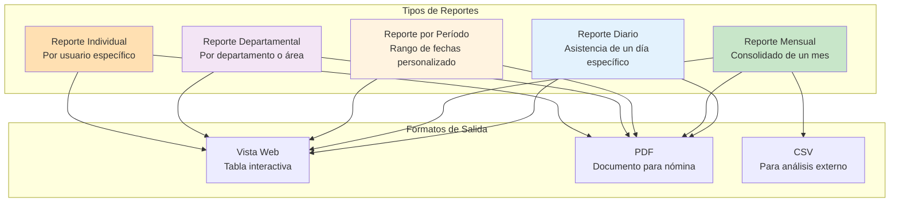
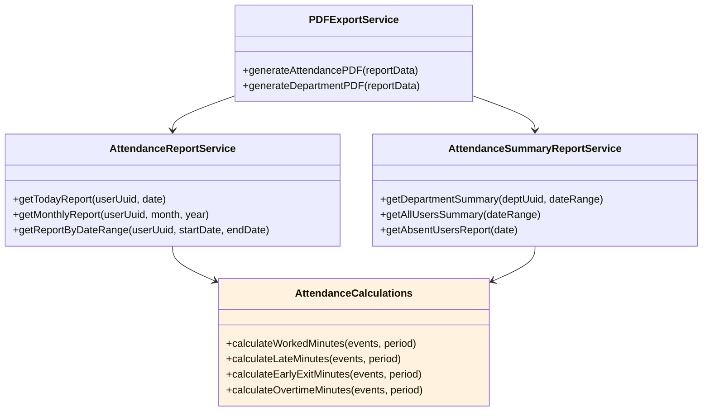
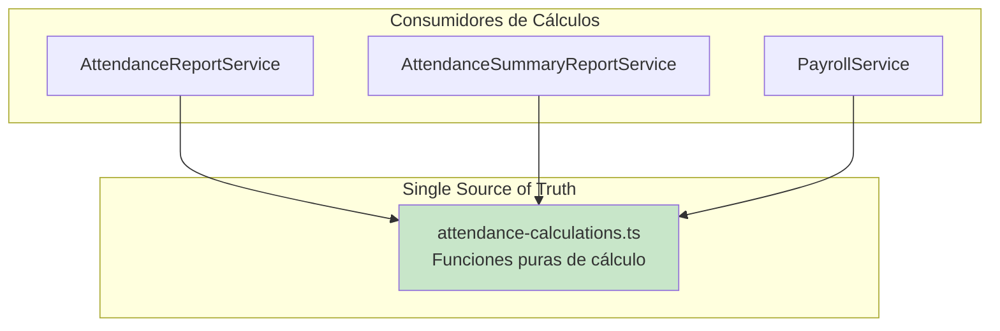
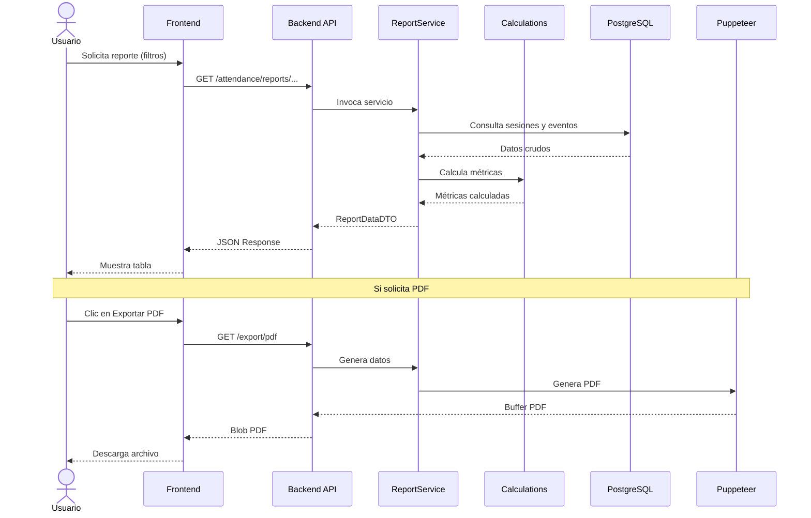

# 5.1 Descripción General del Módulo de Reportes

Este módulo constituyó el tercer objetivo específico del proyecto: **desarrollar un módulo que generó reportes de asistencia actualizados y confiables**, facilitando la aplicación de descuentos por atrasos y respaldando decisiones oportunas en la administración del recurso humano.

---

## 5.1.1 Propósito del Módulo

El módulo de reportes tuvo como finalidad:

1. **Generar reportes consolidados** de asistencia con múltiples criterios de filtrado.
2. **Calcular métricas precisas** de tardanzas, salidas tempranas y horas extras.
3. **Facilitar la exportación** a PDF para integración con sistemas de nómina.
4. **Proporcionar una única fuente de verdad** para todos los cálculos de asistencia.

---

## 5.1.2 Tipos de Reportes Implementados

### Descripción de Tipos de Reporte

| Tipo | Descripción | Caso de Uso |
|------|-------------|-------------|
| **Diario** | Asistencia de un día específico | Verificación diaria de asistencia |
| **Mensual** | Consolidado de todas las sesiones de un mes | Resumen para nómina mensual |
| **Por Período** | Rango de fechas personalizado | Reportes de quincena o semana |
| **Departamental** | Agregado por departamento | Análisis por área |
| **Individual** | Historial de un usuario específico | Consulta personal o auditoría |

---

## 5.1.3 Componentes del Módulo

### Arquitectura de Servicios de Reportes

### Single Source of Truth

Todos los cálculos de asistencia se centralizaron en `/src/utils/reports/attendance-calculations.ts`:

---

## 5.1.4 Métricas Calculadas

El módulo calculó las siguientes métricas para cada sesión de asistencia:

| Métrica | Descripción | Fórmula Base |
|---------|-------------|--------------|
| **Minutos Trabajados** | Total de tiempo entre entradas y salidas | Σ(SALIDA - ENTRADA) |
| **Minutos de Tardanza** | Tiempo después de la tolerancia de entrada | max(0, entrada - (inicio + tolerancia)) |
| **Minutos de Salida Temprana** | Tiempo antes de la tolerancia de salida | max(0, (fin - tolerancia) - salida) |
| **Minutos de Horas Extras** | Tiempo después de la tolerancia de salida | max(0, salida - (fin + tolerancia)) |
| **Porcentaje de Asistencia** | Ratio de días completos vs. laborables | (completos / laborables) × 100 |

---

## 5.1.5 Endpoints de la API

### Reportes Individuales

| Endpoint | Método | Descripción |
|----------|--------|-------------|
| `/attendance/reports/me` | GET | Reporte del usuario autenticado |
| `/attendance/reports/me/events` | GET | Eventos del usuario autenticado |
| `/attendance/reports/me/export/pdf` | GET | Exportar a PDF |
| `/device-raw-records/my-records` | GET | Registros crudos del usuario |

### Reportes Administrativos

| Endpoint | Método | Descripción |
|----------|--------|-------------|
| `/attendance/reports/admin` | GET | Reporte administrativo filtrable |
| `/attendance/reports/monthly` | GET | Reporte mensual consolidado |
| `/attendance/reports/department` | GET | Reporte por departamento |
| `/attendance/reports/absences` | GET | Reporte de ausencias |
| `/device-raw-records` | GET | Todos los registros (admin) |

---

## 5.1.6 Flujo de Generación de Reportes

---

[Siguiente: Cálculos de Asistencia](./02-calculos-asistencia.md) | [Anterior: Ventanas de Tiempo](/documentacion/04-modulo-procesamiento-biometrico/04-ventanas-de-tiempo.md)
