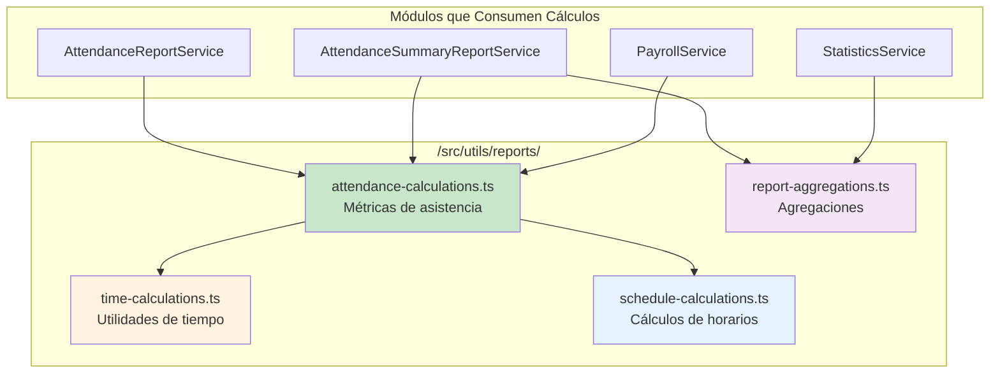
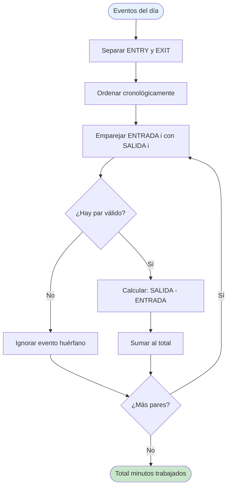
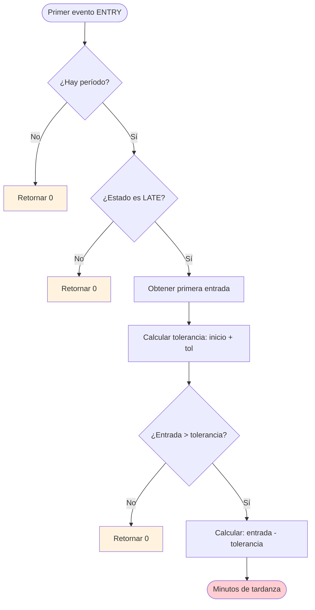
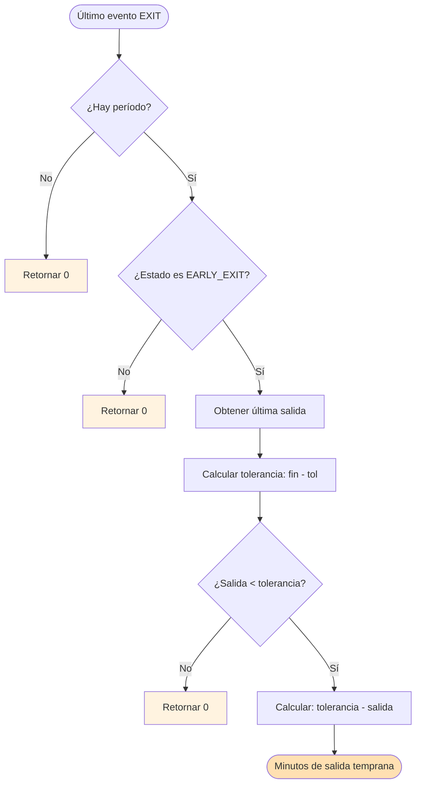
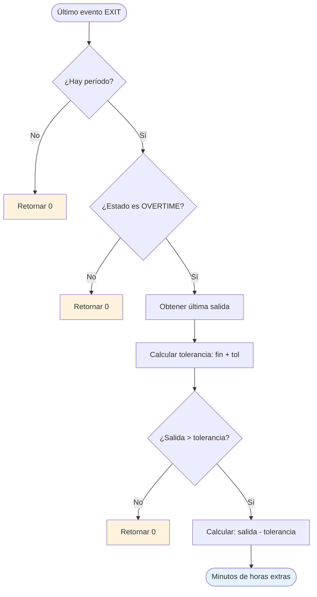
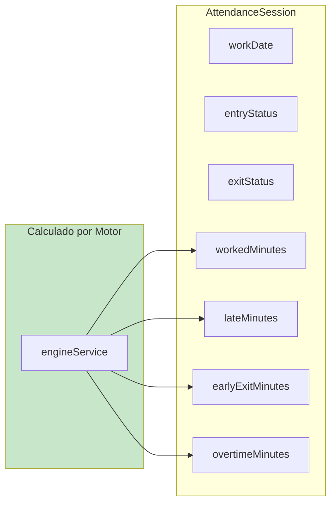

# 5.2 Cálculos de Asistencia

Todos los cálculos de asistencia se centralizaron en funciones puras ubicadas en `/src/utils/reports/attendance-calculations.ts`, garantizando consistencia y facilitando las pruebas unitarias.

---

## 5.2.1 Single Source of Truth



---

## 5.2.2 Cálculo de Minutos Trabajados

### Algoritmo



### Ejemplo Práctico

```
Eventos del día:
  ENTRADA: 08:00
  SALIDA:  12:00
  ENTRADA: 14:00
  SALIDA:  18:00

Cálculo:
  Par 1: 12:00 - 08:00 = 240 minutos (4 horas)
  Par 2: 18:00 - 14:00 = 240 minutos (4 horas)
  Total: 480 minutos (8 horas)
```

### Función: calculateWorkedMinutes()

```
Entrada:
  events: Array de AttendanceEvent
  period: SchedulePeriod opcional

Salida:
  minutos: Número entero de minutos trabajados

Lógica:
  1. Filtrar eventos por tipo (ENTRY vs EXIT)
  2. Ordenar cada lista cronológicamente
  3. Emparejar ENTRY[i] con EXIT[i]
  4. Sumar diferencia de tiempo de cada par válido
```

---

## 5.2.3 Cálculo de Minutos de Tardanza

### Algoritmo



### Ejemplo Práctico

```
Configuración:
  Hora oficial: 08:00
  Tolerancia: 15 minutos
  Ventana ON_TIME: 07:45 - 08:15

Caso 1: Llegada a las 08:45
  Tolerancia fin: 08:00 + 15 = 08:15
  Tardanza: 08:45 - 08:15 = 30 minutos

Caso 2: Llegada a las 07:50 (EARLY)
  No se considera tardanza
  Tardanza: 0 minutos

Caso 3: Llegada a las 08:10 (ON_TIME)
  Dentro de tolerancia
  Tardanza: 0 minutos
```

### Función: calculateLateMinutes()

```
Entrada:
  events: Array de AttendanceEvent
  period: SchedulePeriod
  entryStatus: EntryStatus
  workDate: Date

Salida:
  minutos: Número entero de minutos de tardanza

Lógica:
  1. Si no hay período o entryStatus ≠ LATE, retornar 0
  2. Obtener el primer evento ENTRY
  3. Calcular hora fin de tolerancia (startTime + toleranceMinutes)
  4. Si entrada > finTolerancia, retornar diferencia
  5. Si no, retornar 0
```

---

## 5.2.4 Cálculo de Minutos de Salida Temprana

### Algoritmo



### Ejemplo Práctico

```
Configuración:
  Hora oficial: 17:00
  Tolerancia: 15 minutos
  Ventana ON_TIME: 16:45 - 17:15

Caso 1: Salida a las 16:20
  Tolerancia inicio: 17:00 - 15 = 16:45
  Salida temprana: 16:45 - 16:20 = 25 minutos

Caso 2: Salida a las 17:05 (ON_TIME)
  Dentro de tolerancia
  Salida temprana: 0 minutos

Caso 3: Salida a las 18:00 (OVERTIME)
  No es salida temprana
  Salida temprana: 0 minutos
```

---

## 5.2.5 Cálculo de Minutos de Horas Extras

### Algoritmo



### Ejemplo Práctico

```
Configuración:
  Hora oficial: 17:00
  Tolerancia: 15 minutos
  Ventana ON_TIME: 16:45 - 17:15

Caso 1: Salida a las 18:30
  Tolerancia fin: 17:00 + 15 = 17:15
  Horas extras: 18:30 - 17:15 = 75 minutos
```

---

## 5.2.6 Matriz de Cálculos

| Estado Entrada | Estado Salida | Trabajados | Tardanza | Salida Temprana | Horas Extras |
|----------------|---------------|------------|----------|-----------------|--------------|
| ON_TIME | ON_TIME | ✅ Calculado | 0 | 0 | 0 |
| LATE | ON_TIME | ✅ Calculado | ✅ Calculado | 0 | 0 |
| ON_TIME | EARLY_EXIT | ✅ Calculado | 0 | ✅ Calculado | 0 |
| LATE | EARLY_EXIT | ✅ Calculado | ✅ Calculado | ✅ Calculado | 0 |
| ON_TIME | OVERTIME | ✅ Calculado | 0 | 0 | ✅ Calculado |
| LATE | OVERTIME | ✅ Calculado | ✅ Calculado | 0 | ✅ Calculado |
| NO_ENTRY | NO_EXIT | 0 | 0 | 0 | 0 |
| NO_ENTRY | ON_TIME | ✅ Calculado | 0 | 0 | 0 |
| ON_TIME | NO_EXIT | ✅ Parcial | 0 | 0 | 0 |

---

## 5.2.7 Agregaciones para Reportes

### Nivel Sesión



### Nivel Diario

```
Resumen del día:
  - Total minutos trabajados = Σ(sessions.workedMinutes)
  - Total minutos tardanza = Σ(sessions.lateMinutes)
  - Total minutos salida temprana = Σ(sessions.earlyExitMinutes)
  - Total minutos horas extras = Σ(sessions.overtimeMinutes)
  - Estado del día = Determinado por lógica de negocio
```

### Nivel Mensual

```
Resumen del mes:
  - Total días trabajados = Count(sessions WHERE attendanceStatus = COMPLETE)
  - Total días ausencia = Count(sessions WHERE attendanceStatus = ABSENCE)
  - Total días justificados = Count(sessions WHERE attendanceStatus = JUSTIFIED)
  - Total días festivos = Count(sessions WHERE attendanceStatus = HOLIDAY)
  - Porcentaje asistencia = (trabajados / laborables) × 100
```

---

[Siguiente: Casos de Uso](./03-casos-de-uso.md) | [Anterior: Descripción General](./01-descripcion-general.md)
