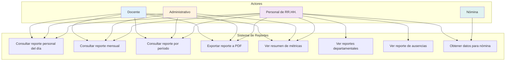
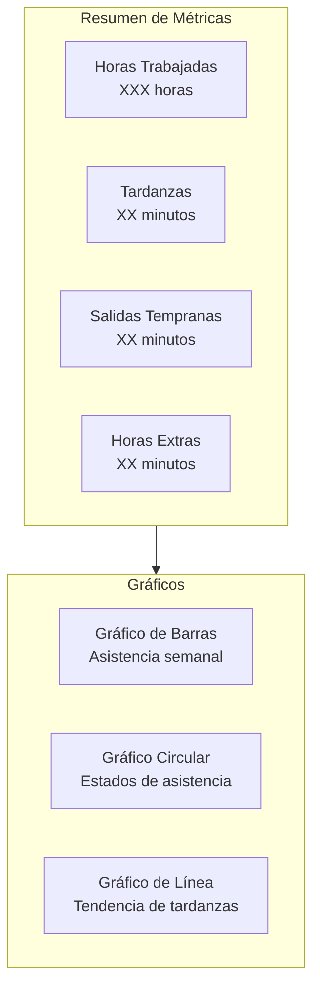

# 5.3 Casos de Uso del Módulo de Reportes

Esta sección documenta los casos de uso del módulo de reportes, identificando los actores y sus interacciones para generar y consumir reportes de asistencia.

---

## 5.3.1 Diagrama de Casos de Uso

---

## 5.3.2 Descripción de Casos de Uso

### CU-R01: Consultar Reporte Personal del Día

| Atributo | Valor |
|----------|-------|
| **Nombre** | Consultar Reporte Personal del Día |
| **Actores** | Docente, Administrativo, Personal de RR.HH. |
| **Descripción** | El usuario consulta su reporte de asistencia del día actual |
| **Precondiciones** | El usuario debe estar autenticado |
| **Postcondiciones** | El sistema muestra el reporte con métricas del día |

#### Flujo Principal

1. El usuario accede a "Reportes de Asistencia"
2. El sistema muestra por defecto el reporte del día actual
3. El sistema despliega:
   - Total minutos trabajados
   - Total minutos de tardanza
   - Total minutos de salida temprana
   - Total minutos de horas extras
   - Estado general del día (COMPLETO, INCOMPLETO, etc.)
   - Lista de eventos con horas

---

### CU-R02: Consultar Reporte Mensual

| Atributo | Valor |
|----------|-------|
| **Nombre** | Consultar Reporte Mensual |
| **Actores** | Docente, Administrativo, Personal de RR.HH. |
| **Descripción** | El usuario consulta el resumen de su asistencia durante un mes |
| **Precondiciones** | El usuario debe estar autenticado |
| **Postcondiciones** | El sistema muestra el resumen mensual |

#### Flujo Principal

1. El usuario selecciona "Reporte Mensual"
2. El usuario elige el mes y año deseado
3. El sistema calcula y muestra:
   - **Resumen de días:**
     - Días completos: X
     - Días incompletos: Y
     - Ausencias: Z
     - Días festivos: W
     - Días justificados: V
   - **Totales del mes:**
     - Total horas trabajadas
     - Total minutos de tardanza
     - Total minutos de salida temprana
     - Total minutos de horas extras
   - **Porcentaje de asistencia:** XX%
   - **Gráfico visual** de asistencia por semana

---

### CU-R03: Consultar Reporte por Período

| Atributo | Valor |
|----------|-------|
| **Nombre** | Consultar Reporte por Período |
| **Actores** | Docente, Administrativo, Personal de RR.HH. |
| **Descripción** | El usuario consulta su asistencia en un rango de fechas personalizado |
| **Precondiciones** | El usuario debe estar autenticado |
| **Postcondiciones** | El sistema muestra el reporte del período |

#### Flujo Principal

1. El usuario selecciona "Por Período"
2. El usuario ingresa o selecciona fecha inicio y fecha fin
3. El sistema valida que el rango sea válido (fin ≥ inicio)
4. El sistema muestra la tabla con:
   - Columnas: Fecha, Estado, Entrada, Salida, Trabajados, Tardanza, Extras
   - Filtros por estado
   - Totales del período en el pie de tabla

---

### CU-R04: Exportar Reporte a PDF

| Atributo | Valor |
|----------|-------|
| **Nombre** | Exportar Reporte a PDF |
| **Actores** | Docente, Administrativo, Personal de RR.HH. |
| **Descripción** | El usuario exporta su reporte a formato PDF |
| **Precondiciones** | El usuario debe estar autenticado y tener datos de asistencia |
| **Postcondiciones** | El sistema genera y descarga un archivo PDF |

#### Flujo Principal

1. El usuario configura los filtros del reporte
2. El usuario hace clic en "Exportar PDF"
3. El sistema muestra indicador de carga
4. El backend genera el PDF con Puppeteer:
   - Encabezado con logo y título
   - Datos del empleado
   - Tabla de asistencias
   - Resumen de métricas
   - Pie de página con fecha de generación
5. El archivo PDF se descarga automáticamente
6. El sistema muestra notificación de éxito

---

### CU-R05: Ver Resumen de Métricas

| Atributo | Valor |
|----------|-------|
| **Nombre** | Ver Resumen de Métricas |
| **Actores** | Docente, Administrativo, Personal de RR.HH. |
| **Descripción** | El usuario visualiza un resumen visual de sus métricas de asistencia |
| **Precondiciones** | El usuario debe estar autenticado |
| **Postcondiciones** | El sistema muestra gráficos y tarjetas de resumen |

#### Métricas Mostradas

---

### CU-R06: Ver Reportes Departamentales

| Atributo | Valor |
|----------|-------|
| **Nombre** | Ver Reportes Departamentales |
| **Actores** | Personal de RR.HH. |
| **Descripción** | El personal de RR.HH. consulta los reportes agregados por departamento |
| **Precondiciones** | El usuario debe tener rol de RR.HH. |
| **Postcondiciones** | El sistema muestra el reporte departamental |

#### Flujo Principal

1. El usuario accede a "Reportes Administrativos"
2. Selecciona "Por Departamento"
3. Elige el departamento y rango de fechas
4. El sistema muestra:
   - Lista de empleados del departamento
   - Métricas individuales por empleado
   - Totales agregados del departamento
   - Opción para ver detalle de cada empleado
   - Comparativa de asistencia entre empleados

---

### CU-R07: Ver Reporte de Ausencias

| Atributo | Valor |
|----------|-------|
| **Nombre** | Ver Reporte de Ausencias |
| **Actores** | Personal de RR.HH. |
| **Descripción** | El personal de RR.HH. consulta el reporte de ausencias del día o período |
| **Precondiciones** | El usuario debe tener rol de RR.HH. |
| **Postcondiciones** | El sistema muestra el listado de ausencias |

#### Flujo Principal

1. El usuario selecciona "Reporte de Ausencias"
2. Elige la fecha o rango de fechas
3. El sistema muestra:
   - Lista de empleados con estado ABSENCE
   - Fecha de la ausencia
   - Departamento del empleado
   - Datos de contacto
   - Opción para enviar notificación

---

### CU-R08: Obtener Datos para Nómina

| Atributo | Valor |
|----------|-------|
| **Nombre** | Obtener Datos para Nómina |
| **Actores** | Personal de RR.HH., Sistema de Nómina |
| **Descripción** | Se obtienen los datos de asistencia procesados para generar la nómina |
| **Precondiciones** | El período debe estar cerrado |
| **Postcondiciones** | Los datos se exportan para procesamiento de nómina |

#### Flujo Principal

1. El usuario selecciona el período de nómina (ej: quincena, mes)
2. El sistema valida que todos los días estén procesados
3. El usuario genera el reporte:
   - Por empleado: horas trabajadas, tardanzas, descuentos
   - Totales para cálculo de salario
4. El usuario exporta a PDF o CSV
5. Los datos se integran con el sistema de nómina

---

## 5.3.3 Matriz de Actores vs. Casos de Uso

| Caso de Uso | Docente | Administrativo | RR.HH. | Nómina |
|-------------|---------|----------------|--------|--------|
| CU-R01: Reporte diario | ✅ | ✅ | ✅ | ❌ |
| CU-R02: Reporte mensual | ✅ | ✅ | ✅ | ❌ |
| CU-R03: Reporte por período | ✅ | ✅ | ✅ | ❌ |
| CU-R04: Exportar PDF | ✅ | ✅ | ✅ | ❌ |
| CU-R05: Resumen de métricas | ✅ | ✅ | ✅ | ❌ |
| CU-R06: Reportes departamentales | ❌ | ❌ | ✅ | ❌ |
| CU-R07: Reporte de ausencias | ❌ | ❌ | ✅ | ❌ |
| CU-R08: Datos para nómina | ❌ | ❌ | ✅ | ✅ |

---

[Siguiente: Generación de PDF](./04-generacion-de-pdf.md) | [Anterior: Cálculos de Asistencia](./02-calculos-asistencia.md)
