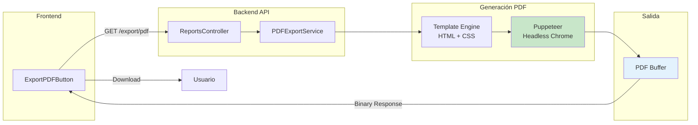
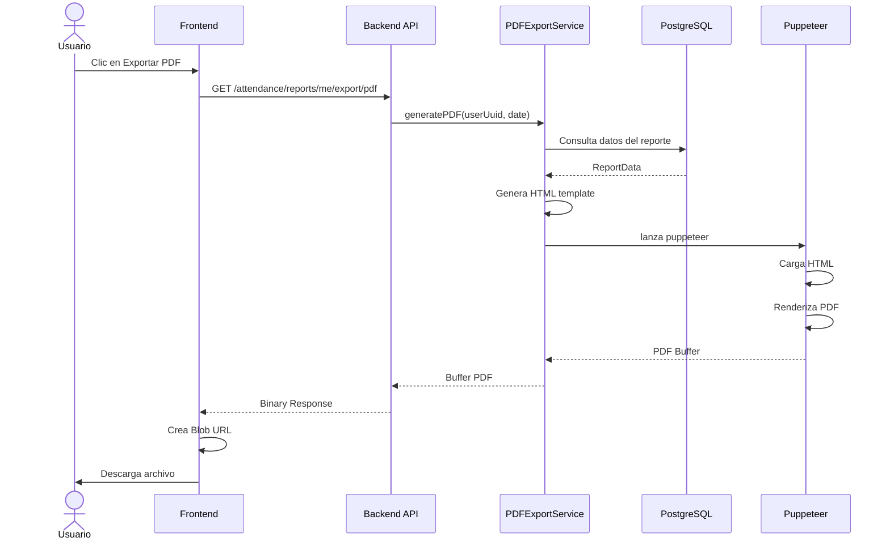
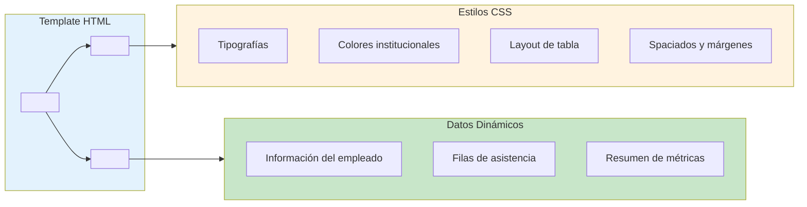
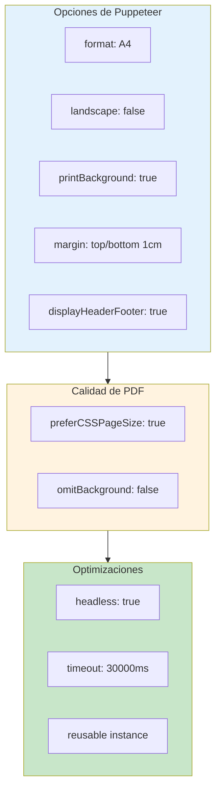
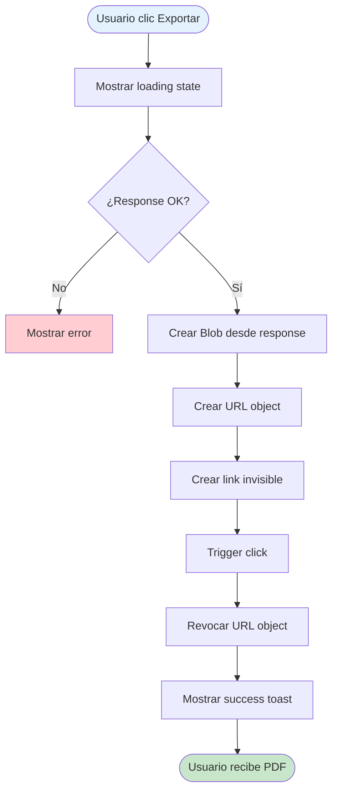
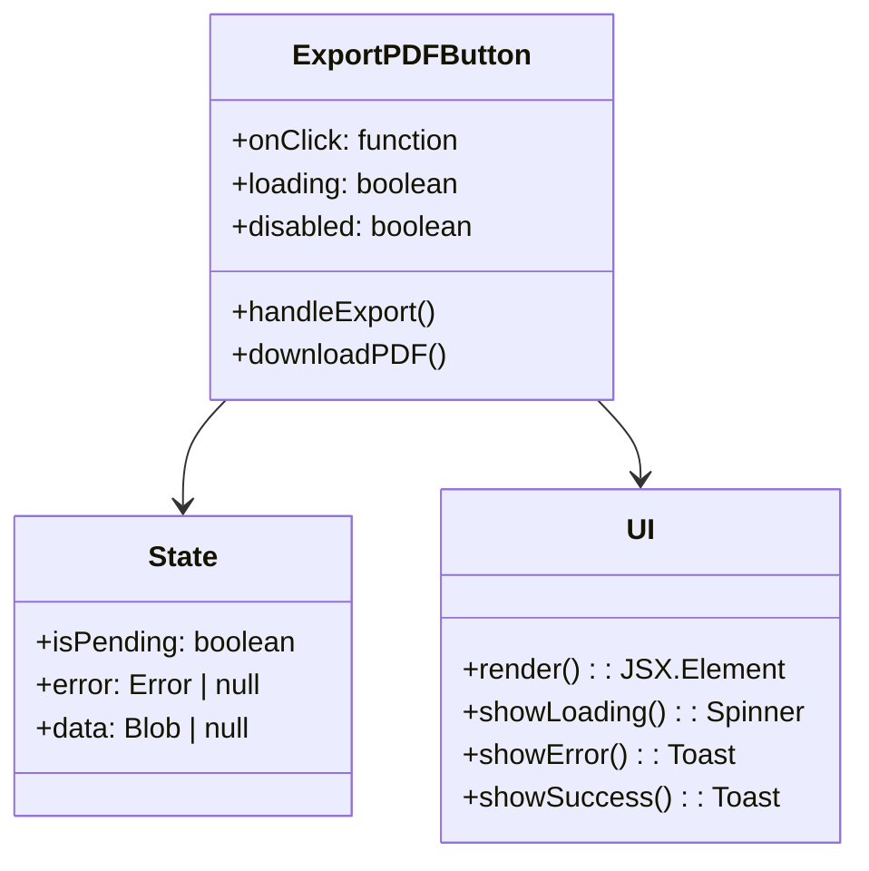
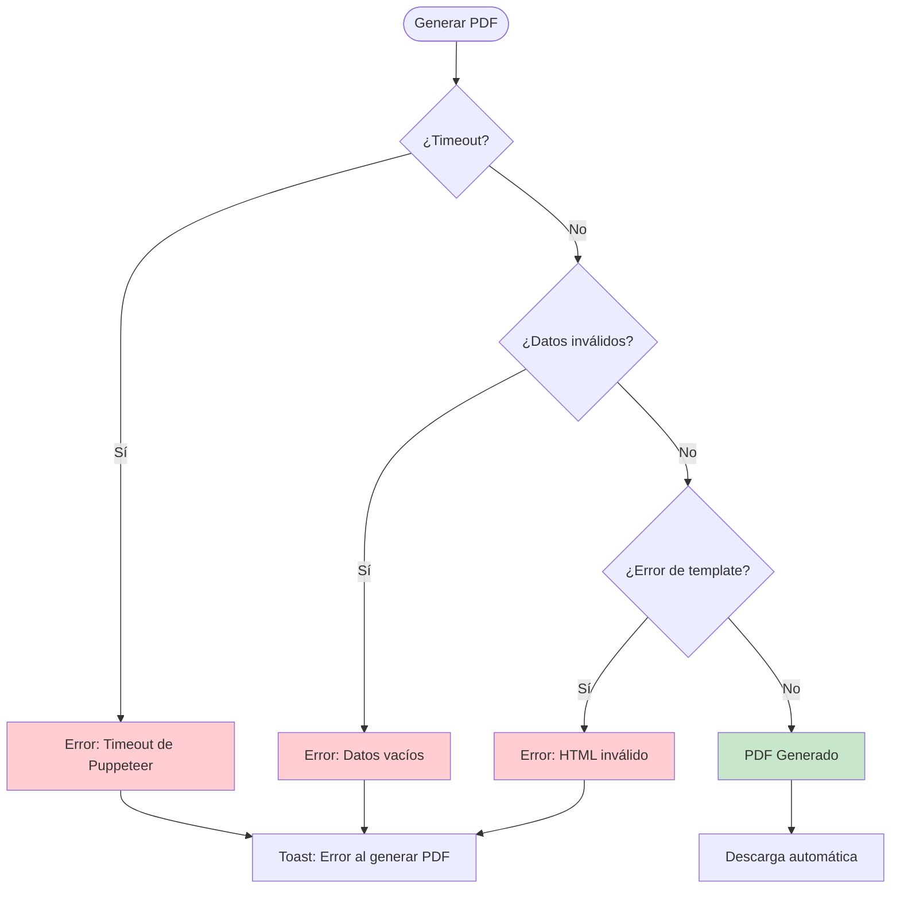
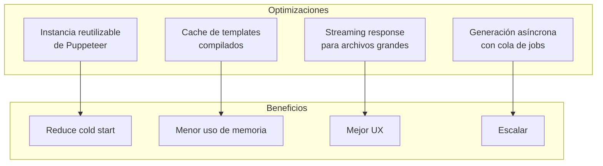

# 5.4 Generación de PDF

El sistema implementó la generación de reportes en formato PDF utilizando **Puppeteer**, una librería que permitió la renderización de documentos PDF server-side con alta fidelidad.

---

## 5.4.1 Arquitectura de Generación de PDF

---

## 5.4.2 Proceso de Generación

---

## 5.4.3 Estructura del PDF Generado

```mermaid
flowchart TD
    subgraph PDF["Estructura del Documento PDF"]
        H[Encabezado]
        D1[Datos del Empleado]
        D2[Período del Reporte]
        T1[Tabla de Asistencias]
        S[Resumen de Métricas]
        F[Pie de Página]
    end

    subgraph Detalles["Detalles"]
        H1[Logo de la institución]
        H2[Título del reporte]
        H3[Fecha de generación]
        D1a[Nombre completo]
        D1b[Documento]
        D1c[Departamento]
        T1a[Filas por día]
        T1b[Columnas de métricas]
        Sa[Total horas trabajadas]
        Sb[Total tardanzas]
        Sc[Total salidas tempranas]
        Sd[Total horas extras]
        F1[Firma digital]
        F2[Número de reporte]
    end

    H --> H1
    H --> H2
    H --> H3
    D1 --> D1a
    D1 --> D1b
    D1 --> D1c
    T1 --> T1a
    T1 --> T1b
    S --> Sa
    S --> Sb
    S --> Sc
    S --> Sd
    F --> F1
    F --> F2
```

### Elementos del PDF

| Sección | Contenido |
|---------|-----------|
| **Encabezado** | Logo, título "Reporte de Asistencia", fecha de generación |
| **Datos del Empleado** | Nombre completo, documento, departamento, cargo |
| **Período** | Rango de fechas del reporte |
| **Tabla de Asistencias** | Una fila por día con: fecha, estado, entrada, salida, trabajados, tardanza, extras |
| **Resumen** | Totales del período y porcentaje de asistencia |
| **Pie de Página** | Número de reporte, fecha de generación, disclaimer |

---

## 5.4.4 Template HTML

El sistema utilizó templates HTML con CSS inline para garantizar la consistencia visual:

### Características del Template

| Característica | Implementación |
|----------------|----------------|
| **Responsivo** | CSS media queries para A4 |
| **Identidad visual** | Colores y logo de la institución |
| **Accesibilidad** | Estructura semántica HTML |
| **Impresión** | Optimizado para impresión en papel |
| **Metadata** | Título, autor, fecha en el PDF |

---

## 5.4.5 Configuración de Puppeteer

---

## 5.4.6 Flujo de Descarga en el Frontend

### Componente ExportPDFButton

---

## 5.4.7 Manejo de Errores

---

## 5.4.8 Performance y Optimizaciones

### Métricas de Generación

| Métrica | Valor |
|---------|-------|
| **Tiempo promedio** | 5-15 segundos |
| **Tamaño del PDF** | 50-500 KB (depende de filas) |
| **Concurrencia** | Hasta 5 PDFs simultáneos |
| **Memory usage** | ~100MB por instancia |

### Optimizaciones Implementadas

---

[Anterior: Casos de Uso](./03-casos-de-uso.md) | [Siguiente: Integración de Dispositivos](/06-integracion-dispositivos/01-integracion-zkteco.md)
