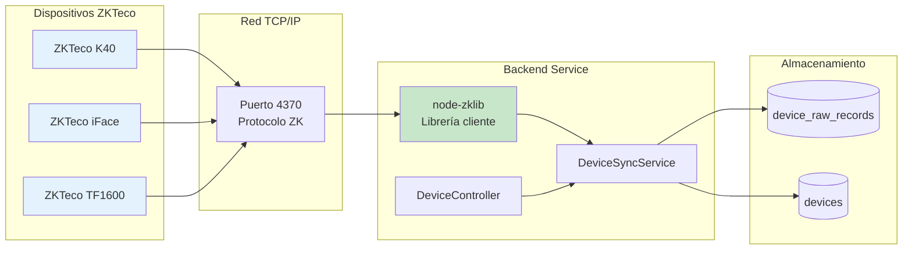
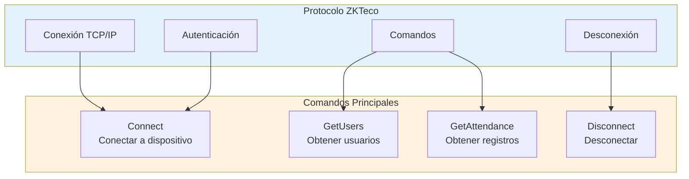
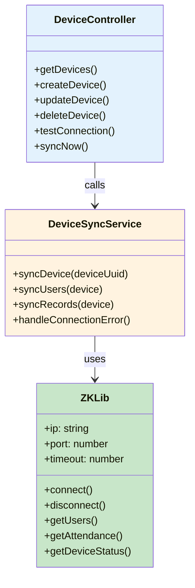
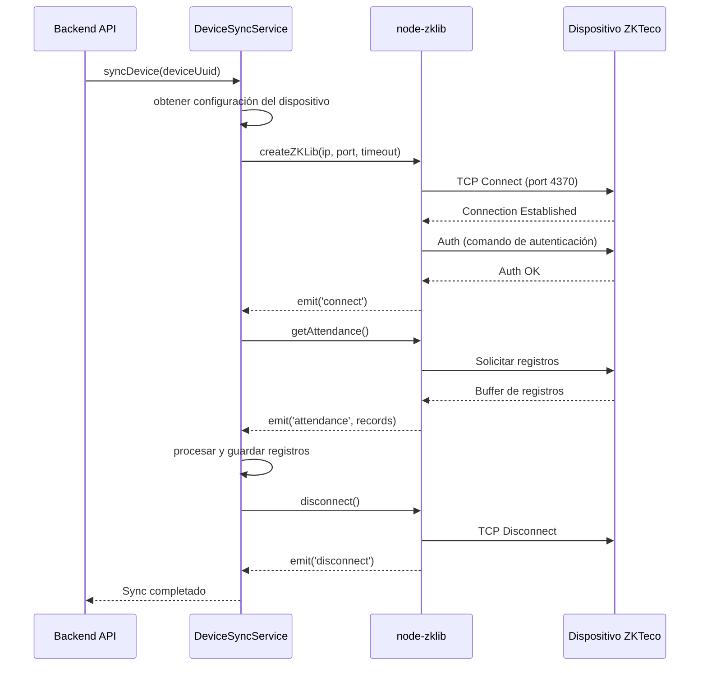
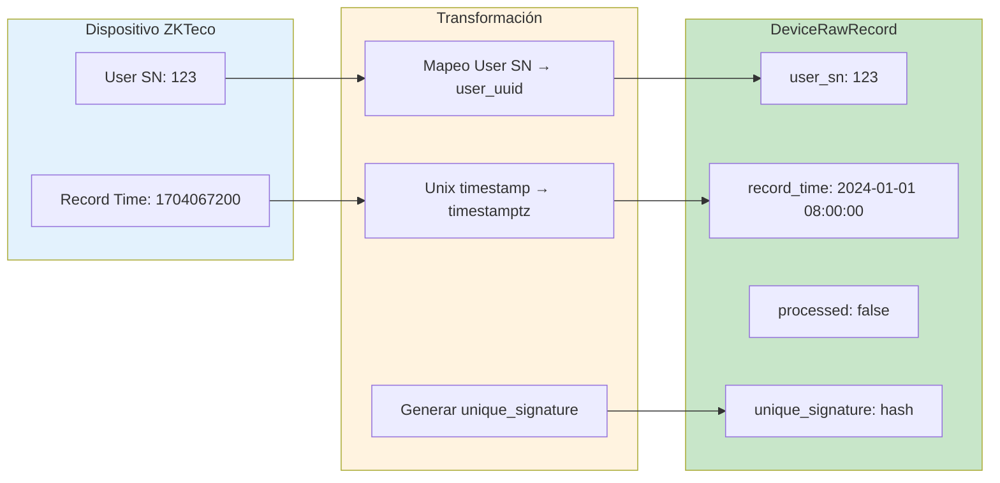
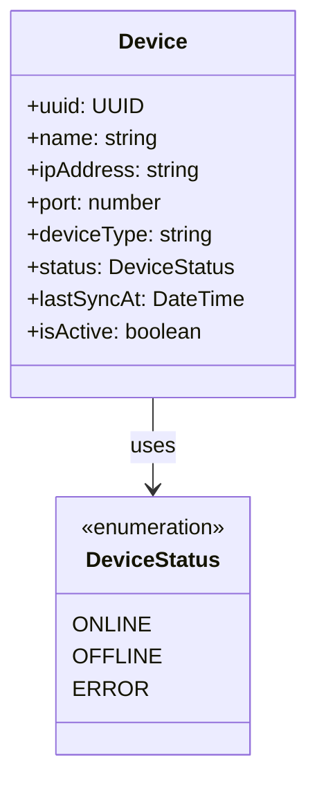
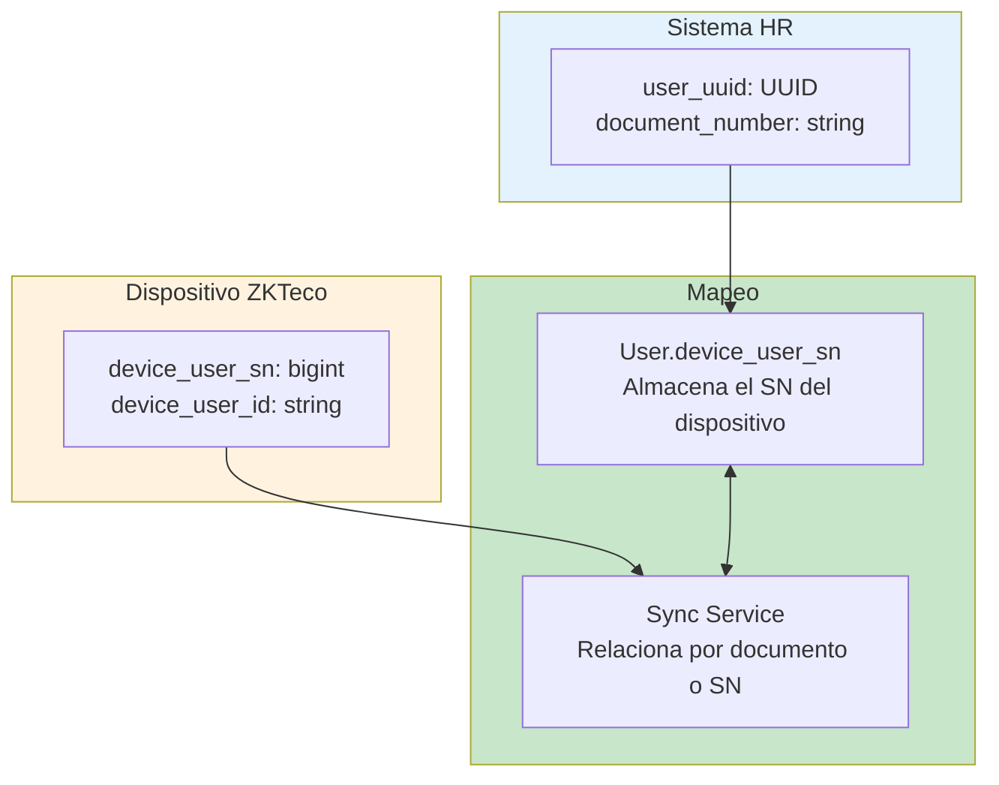
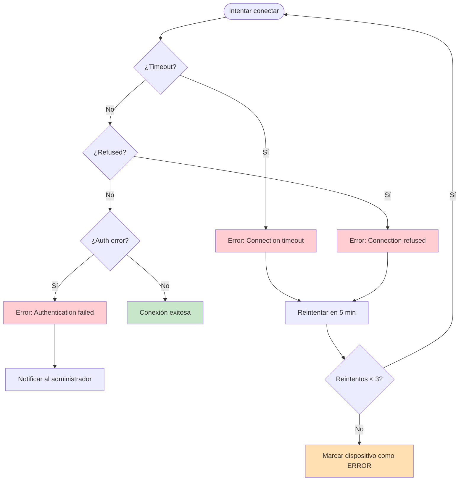

# 6.1 Integración con Dispositivos Biométricos ZKTeco

El sistema se integró con dispositivos biométricos de la marca **ZKTeco** para la captura automática de marcaciones de asistencia mediante huella digital.

---

## 6.1.1 Arquitectura de Integración



---

## 6.1.2 Características de los Dispositivos

| Modelo | Tipo | Capacidad | Usuarios | Registros |
|--------|------|-----------|----------|-----------|
| **K40** | Huella + RFID | 3,000 | 10,000 | 100,000 |
| **iFace** | Facial | 3,000 | 10,000 | 100,000 |
| **TF1600** | Huella TCP/IP | 3,000 | 10,000 | 100,000 |

### Protocolo de Comunicación



---

## 6.1.3 Librería node-zklib

El sistema utilizó la librería `node-zklib` como cliente para comunicarse con los dispositivos:



---

## 6.1.4 Flujo de Conexión



---

## 6.1.5 Estructura de Registro ZKTeco

Los dispositivos ZKTeco generaron registros con el siguiente formato:

```
Crudo (del dispositivo):
  - User SN:    Serial number del usuario (bigint)
  - Device ID:  Identificador del dispositivo (string)
  - Record Time: Timestamp de la marcación (uint32)
  - Verify Mode: Tipo de verificación (huella, password, cardface)
```



---

## 6.1.6 Gestión de Dispositivos

### Entidad Device



### Operaciones CRUD

| Operación | Endpoint | Descripción |
|-----------|----------|-------------|
| **Crear** | `POST /devices` | Registrar nuevo dispositivo |
| **Listar** | `GET /devices` | Obtener todos los dispositivos |
| **Actualizar** | `PATCH /devices/:id` | Modificar configuración |
| **Eliminar** | `DELETE /devices/:id` | Eliminar dispositivo |
| **Probar conexión** | `POST /devices/:id/test` | Verificar conectividad |
| **Sincronizar ahora** | `POST /devices/:id/sync` | Forzar sincronización |

---

## 6.1.7 Mapeo de Usuarios

El sistema requirió mapear los usuarios del dispositivo con los usuarios del sistema:



### Estrategias de Mapeo

| Estrategia | Descripción | Ventajas |
|------------|-------------|----------|
| **Por documento** | El `device_user_id` contiene el documento | Mapeo directo |
| **Por SN asignado** | Se asigna manualmente el `device_user_sn` | Mayor control |
| **Por importación** | Se importa desde el dispositivo | Automático |

---

## 6.1.8 Manejo de Errores de Conexión



---

[Siguiente: Sincronización de Datos](./02-sincronizacion-de-datos.md) | [Anterior: Generación de PDF](../../05-modulo-reportes/04-generacion-de-pdf.md)
