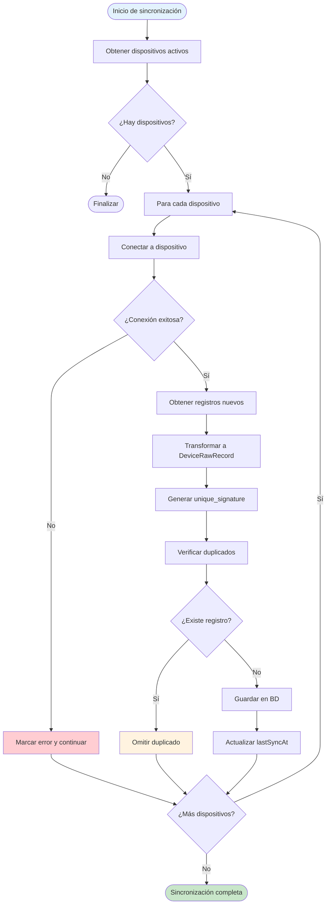
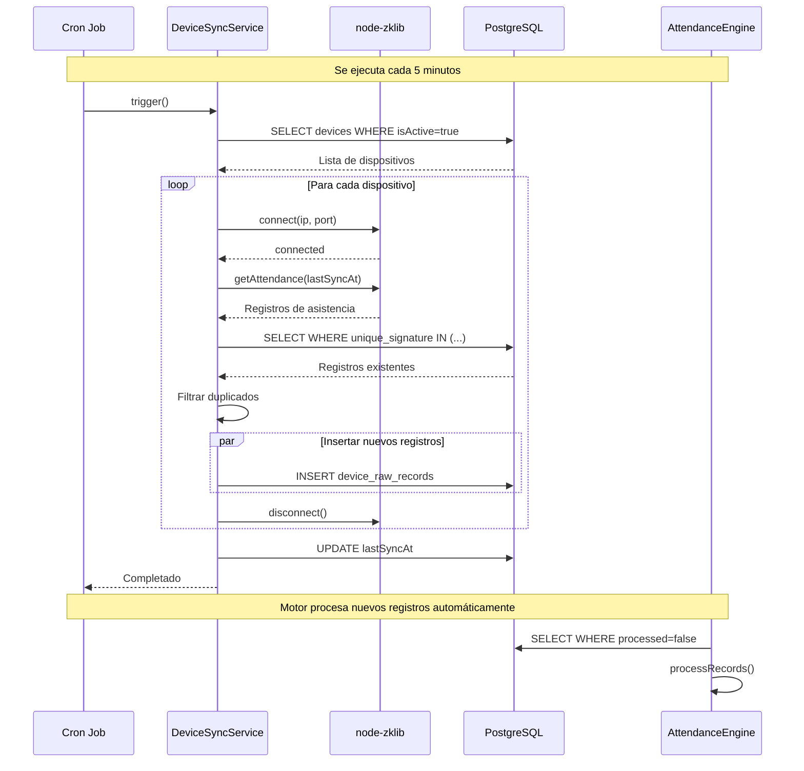
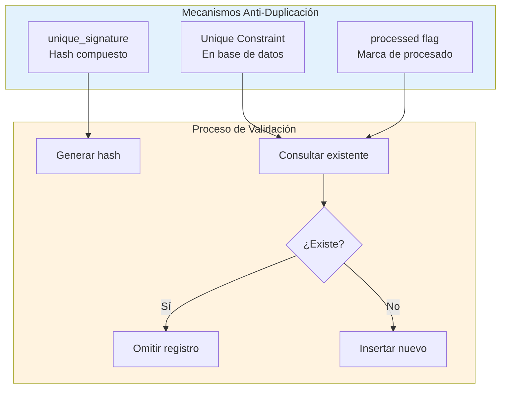
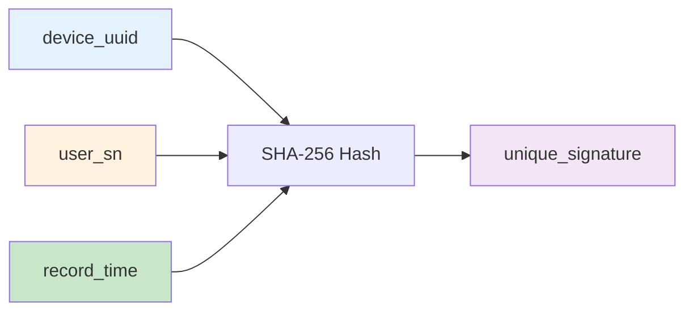
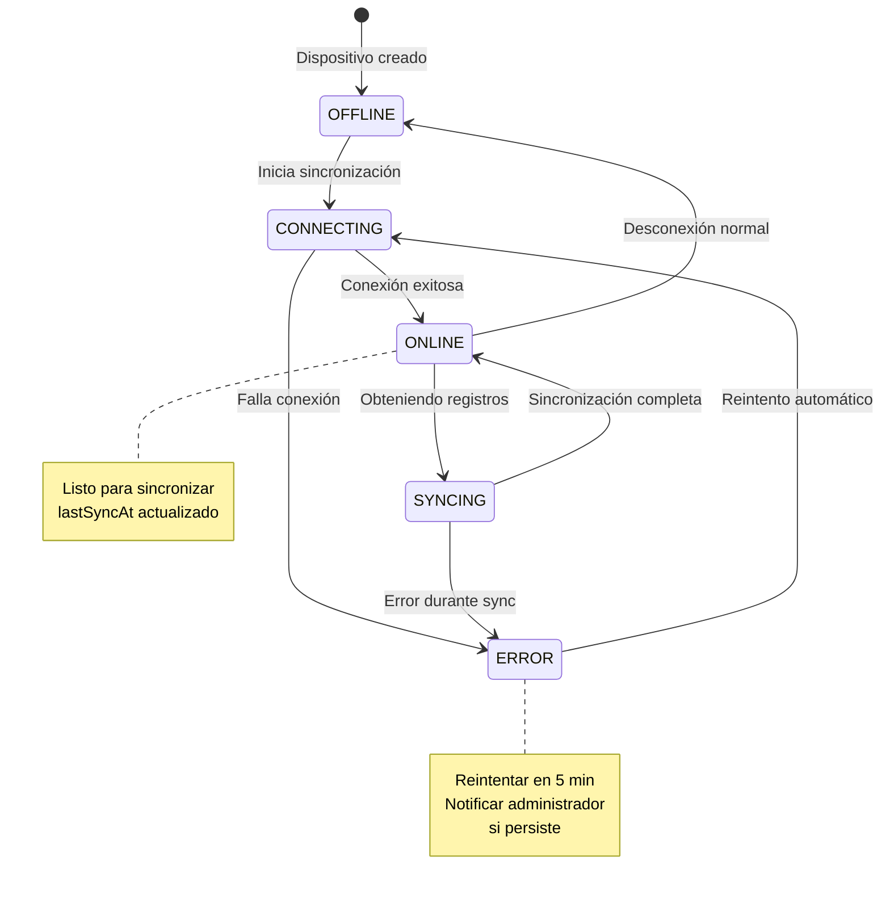
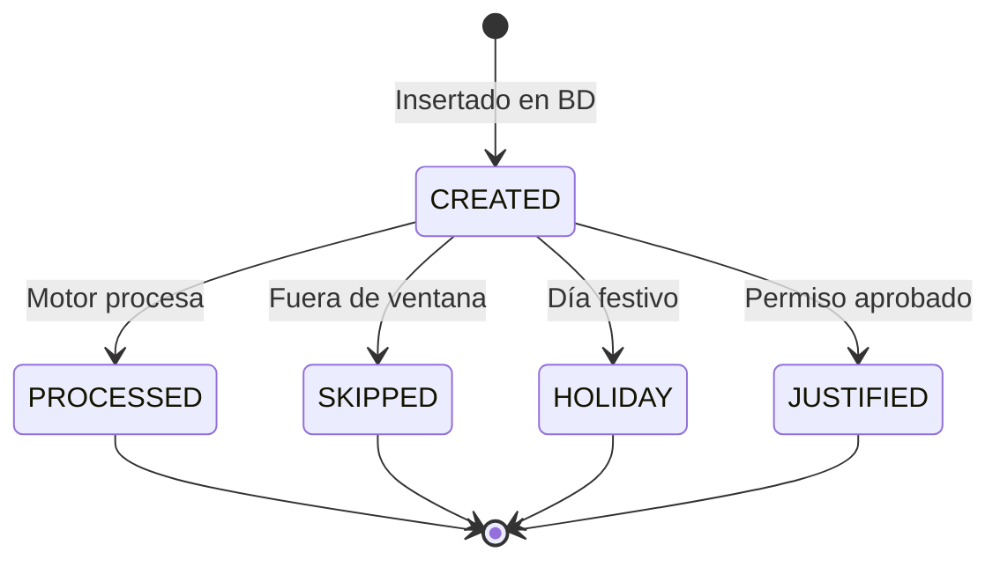
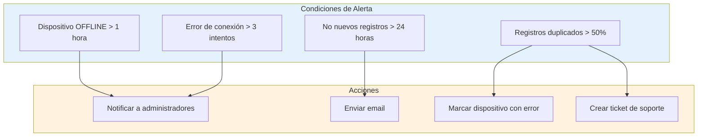
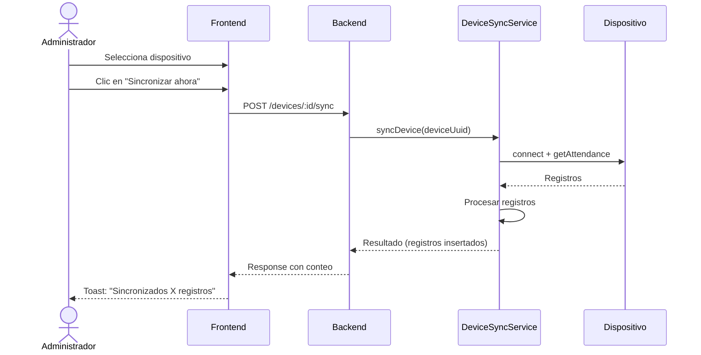

# 6.2 Sincronización de Datos Biométricos

La sincronización de datos fue el proceso mediante el cual el sistema recuperó los registros biométricos de los dispositivos y los almacenó en la base de datos centralizada.

---

## 6.2.1 Proceso de Sincronización

---

## 6.2.2 Job Programado de Sincronización

El sistema implementó un job programado que ejecutó la sincronización automáticamente:

```mermaid
gantt
    title Ejecución del Job de Sincronización
    dateFormat HH:mm
    axisFormat %H:%M

    section Job Programado
    Inicio del job       :milestone, s1, 00:00, 0m
    Primera ejecución    :active, exec1, 00:00, 2m
    Espera               :wait1, 02:00, 3m
    Segunda ejecución    :exec2, 05:00, 2m
    Espera               :wait2, 07:00, 3m
    Tercera ejecución    :exec3, 10:00, 2m
```

### Configuración del Job

| Parámetro | Valor |
|-----------|-------|
| **Cron expression** | `*/5 * * * *` (cada 5 minutos) |
| **Timezone** | Tiempo local del servidor |
| **Concurrent** | false (no ejecutar si ya hay uno corriendo) |
| **Max retries** | 3 |
| **Retry delay** | 1 minuto |

---

## 6.2.3 Flujo Detallado de Sincronización

---

## 6.2.4 Prevención de Duplicados

El sistema implementó múltiples mecanismos para prevenir el procesamiento duplicado de registros:

### Unique Signature

El `unique_signature` se generó como un hash de:

---

## 6.2.5 Transformación de Datos

### Formato de Registro ZKTeco → DeviceRawRecord

```mermaid
flowchart LR
    subgraph ZKFormat["Formato ZKTeco"]
        Z1[userid: 16 bytes]
        Z2[timestamp: 4 bytes uint32]
        Z3[verify_mode: 1 byte]
        Z4[reserved: 8 bytes]
    end

    subgraph Transformation["Transformación"]
        T1[userid → user_sn: bigint]
        T2[timestamp → record_time: timestamptz]
        T3[verify_mode → inference]
    end

    subgraph DBFormat["DeviceRawRecord"]
        DB1[uuid: UUID]
        DB2[device_uuid: UUID]
        DB3[user_sn: bigint]
        DB4[record_time: timestamptz]
        DB5[processed: boolean]
        DB6[unique_signature: string]
    end

    ZKFormat --> Transformation
    Transformation --> DBFormat

    style ZKFormat fill:#e3f2fd
    style Transformation fill:#fff3e0
    style DBFormat fill:#c8e6c9
```

---

## 6.2.6 Estados de Sincronización

### Estados de un Dispositivo

### Estados de un Registro

---

## 6.2.7 Monitoreo y Alertas

### Métricas de Sincronización

| Métrica | Descripción |
|---------|-------------|
| **Registros por sincronización** | Cantidad de registros recuperados |
| **Tiempo de sincronización** | Duración del proceso por dispositivo |
| **Última sincronización exitosa** | Timestamp de última sync correcta |
| **Estado del dispositivo** | ONLINE, OFFLINE, ERROR |
| **Registros duplicados** | Cantidad omitidos por duplicidad |

### Alertas Implementadas

---

## 6.2.8 Sincronización Manual

Además del job automático, el sistema permitió la sincronización manual:

---

[Anterior: Integración ZKTeco](./01-integracion-zkteco.md) | [Siguiente: Seguridad y Autenticación](/documentacion/07-seguridad-y-autenticacion.md)
