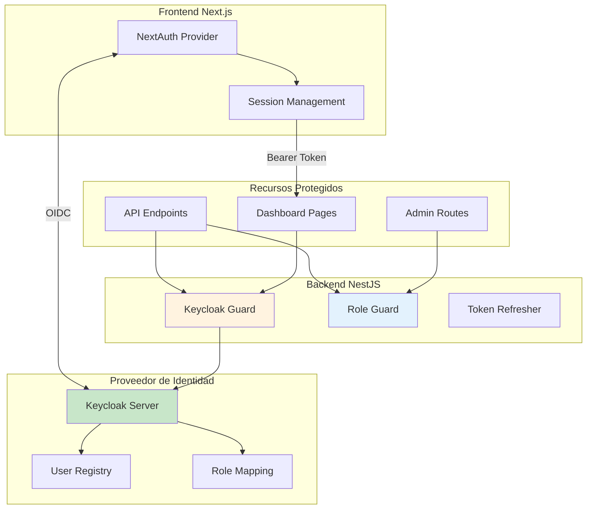
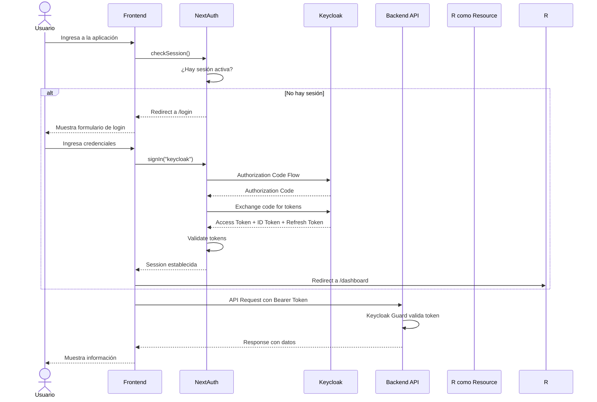
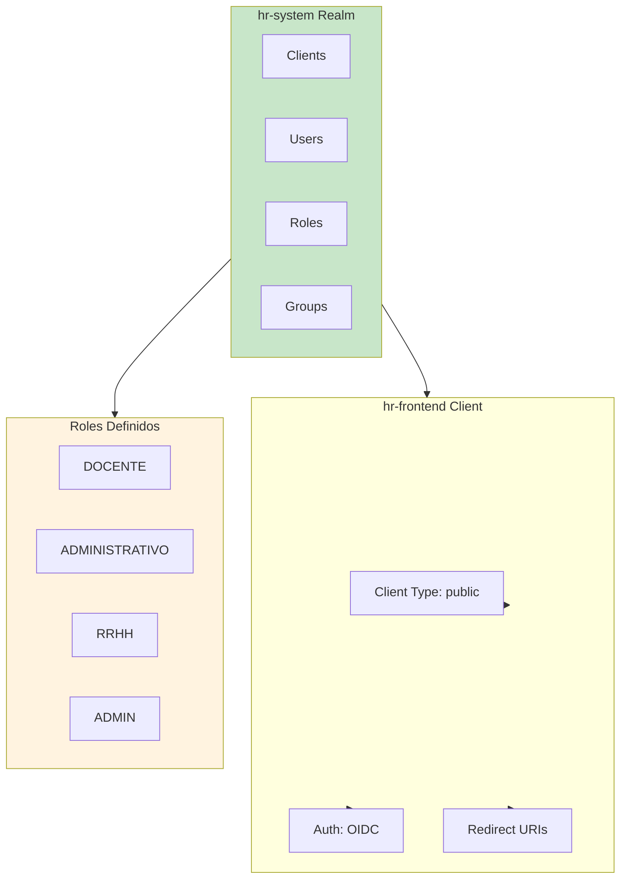
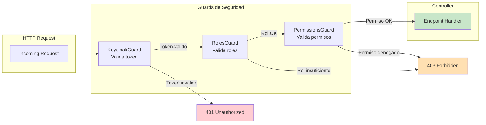
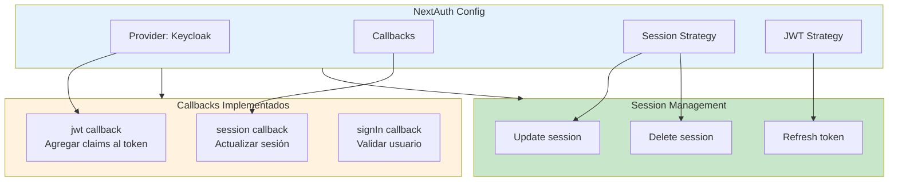
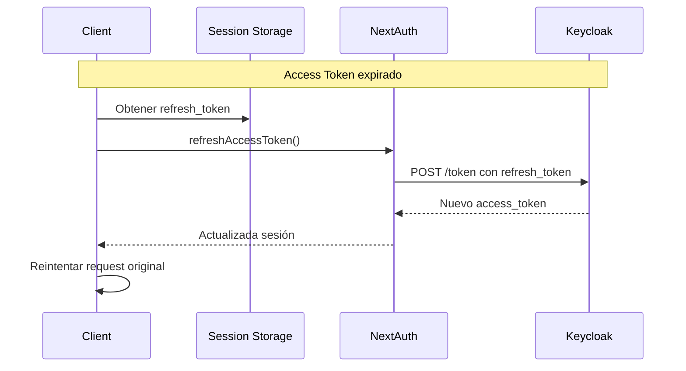
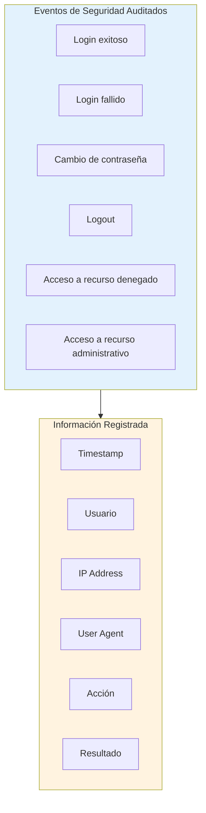

# 7. Seguridad y Autenticación

El sistema implementó un modelo de seguridad robusto basado en **Keycloak** como proveedor de identidad y **NextAuth** para la integración con el frontend.

---

## 7.1 Arquitectura de Seguridad



---

## 7.2 Flujo de Autenticación



---

## 7.3 Configuración de Keycloak

### Realm Configuration



### Roles y Permisos

| Rol | Permisos | Acceso |
|-----|----------|--------|
| **DOCENTE** | Ver su propio reporte | Dashboard personal |
| **ADMINISTRATIVO** | Ver su propio reporte | Dashboard personal |
| **RRHH** | Ver todos los reportes, gestionar usuarios | Reportes administrativos |
| **ADMIN** | Configuración completa, gestión de dispositivos | Panel de administración |

---

## 7.4 Protección de Endpoints

### Guards en NestJS



### Ejemplo de Decoradores

```typescript
// Endpoint protegido con autenticación
@UseGuards(KeycloakGuard)
@Get('me')
getMyReport(@CurrentUser() user: User) {
  return this.reportService.getTodayReport(user.uuid);
}

// Endpoint protegido con rol
@UseGuards(KeycloakGuard, RolesGuard)
@Roles('RRHH', 'ADMIN')
@Get('admin')
getAdminReport() {
  return this.reportService.getAllReports();
}
```

---

## 7.5 Gestión de Sesiones en Frontend

### NextAuth Configuration



---

## 7.6 Token Management

### Tipos de Token

| Tipo | Propósito | Duración |
|------|-----------|----------|
| **Access Token** | Acceso a recursos API | 5 minutos |
| **Refresh Token** | Obtener nuevo access token | 30 días |
| **ID Token** | Información del usuario | 5 minutos |

### Flujo de Refresh



---

## 7.7 Auditoría y Logging

### Registro de Eventos de Seguridad



---

## 7.8 Consideraciones de Seguridad

### Mejores Prácticas Implementadas

| Aspecto | Implementación |
|---------|----------------|
| **HTTPS** | Todo el tráfico sobre TLS |
| **Tokens** | Almacenamiento seguro en cookies httpOnly |
| **CSRF** | Tokens CSRF en formularios |
| **XSS** | Sanitización de inputs, CSP headers |
| **SQL Injection** | Queries parametrizadas con TypeORM |
| **Authorization** | Verificación de roles en cada endpoint |
| **Audit Trail** | Todas las entidades con auditoría |

---

[Anterior: Integración de Dispositivos](./06-integracion-dispositivos/02-sincronizacion-de-datos.md) | [Siguiente: Tecnologías Utilizadas](./08-tecnologias-utilizadas.md)
