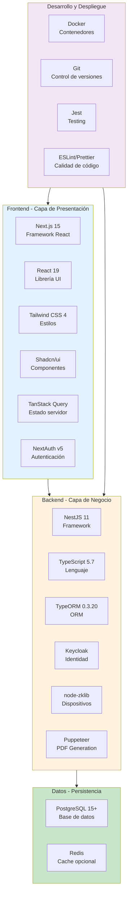
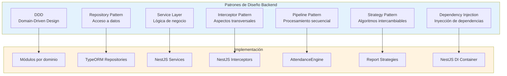
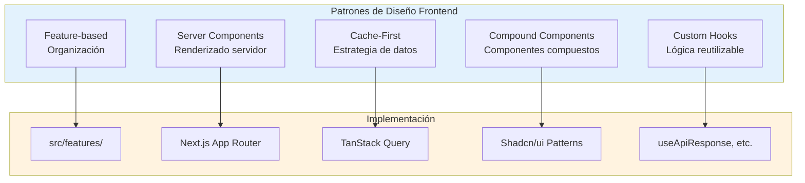
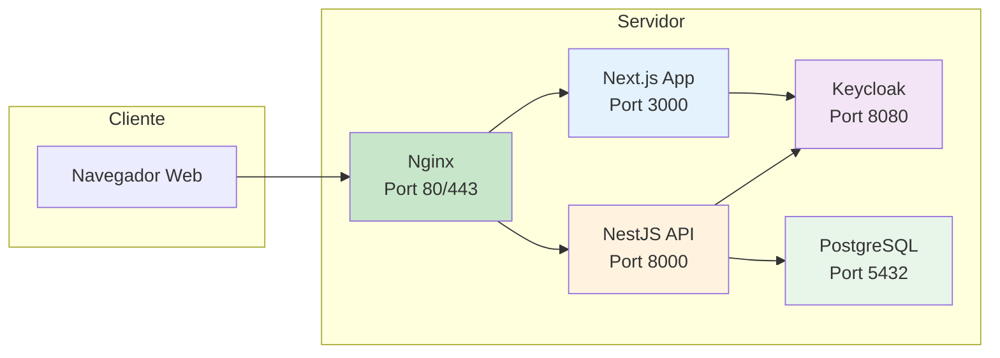

# 8. Tecnologías Utilizadas

El sistema se implementó utilizando un stack tecnológico moderno, seleccionado por su robustez, escalabilidad y soporte a largo plazo.

---

## 8.1 Stack Tecnológico Completo

---

## 8.2 Tabla Detallada de Tecnologías

### Backend

| Tecnología | Versión | Propósito | Descripción |
|-----------|---------|-----------|-------------|
| **Node.js** | 20 LTS | Runtime | Entorno de ejecución JavaScript |
| **NestJS** | 11.x | Framework | Framework progresivo para aplicaciones Node.js |
| **TypeScript** | 5.7 | Lenguaje | Superset tipado de JavaScript |
| **TypeORM** | 0.3.20 | ORM | Mapeo objeto-relacional para PostgreSQL |
| **PostgreSQL** | 15+ | Base de datos | Sistema de base de datos relacional |
| **Keycloak** | 24+ | Identidad | Servidor de identidad y acceso |
| **nest-keycloak-connect** | Latest | Integración | Integración de Keycloak con NestJS |
| **@nestjs-cls/transactional** | Latest | Transacciones | Soporte transaccional con CLS |
| **node-zklib** | Latest | Dispositivos | Cliente para dispositivos ZKTeco |
| **Puppeteer** | Latest | PDF | Generación de PDF server-side |
| **PapaParse** | Latest | CSV | Procesamiento de archivos CSV |
| **Zod** | 4.x | Validación | Validación de esquemas |
| **Jest** | 29.x | Testing | Framework de pruebas |
| **Supertest** | Latest | Testing E2E | Pruebas de integración HTTP |

### Frontend

| Tecnología | Versión | Propósito | Descripción |
|-----------|---------|-----------|-------------|
| **Next.js** | 15.x | Framework | Framework React con App Router |
| **React** | 19.x | Librería UI | Librería para construir interfaces |
| **TypeScript** | 5.9 | Lenguaje | Tipado estático para JavaScript |
| **Tailwind CSS** | 4.0 | Estilos | Framework de utilidades CSS |
| **Shadcn/ui** | Latest | Componentes | Componentes UI reutilizables |
| **Radix UI** | Latest | Componentes | Primitivos accesibles |
| **TanStack Query** | 5.90 | Estado servidor | Gestión de estado y cache |
| **Zustand** | 5.0 | Estado cliente | Gestión de estado local |
| **React Hook Form** | 7.71 | Formularios | Gestión de formularios |
| **NextAuth** | v5 | Autenticación | Autenticación para Next.js |
| **Axios** | Latest | HTTP | Cliente HTTP |
| **Recharts** | 3.7 | Gráficos | Librería de visualización |
| **Framer Motion** | 12.28 | Animaciones | Librería de animaciones |
| **Lucide React** | Latest | Iconos | Librería de iconos |
| **Sonner** | Latest | Notificaciones | Toast notifications |

### Infraestructura

| Tecnología | Versión | Propósito | Descripción |
|-----------|---------|-----------|-------------|
| **Docker** | Latest | Contenedores | Empaquetado y despliegue |
| **Docker Compose** | Latest | Orquestación | Definición de servicios |
| **PostgreSQL** | 15-alpine | Imagen BD | Base de datos en contenedor |
| **Nginx** | Latest | Web Server | Servidor web y proxy reverso |

---

## 8.3 Patrones de Diseño Implementados

### Arquitectura Backend

### Arquitectura Frontend

---

## 8.4 Arquitectura de Despliegue

---

## 8.5 Justificación de Selección Tecnológica

### ¿ Por qué NestJS ?

| Criterio | Justificación |
|----------|---------------|
| **Arquitectura** | Estructura modular basada en DDD |
| **TypeScript** | Soporte nativo de tipado |
| **Inyección de dependencias** | Facilita testing y desacoplamiento |
| **Documentación** | Amplia documentación y comunidad |
| **Escalabilidad** | Arquitectura lista para escalar |

### ¿ Por qué Next.js ?

| Criterio | Justificación |
|----------|---------------|
| **Server Components** | Mejor performance y SEO |
| **App Router** | Estructura de archivos moderna |
| **TypeScript** | Tipado de extremo a extremo |
| **Ecosistema** | Amplia biblioteca de componentes |
| **Optimización** | Compilación automática y code splitting |

### ¿ Por qué Keycloak ?

| Criterio | Justificación |
|----------|---------------|
| **Estándar OIDC** | Compatible con OAuth 2.0 / OpenID Connect |
| **Funcionalidad** | Gestión completa de usuarios y roles |
| **Independencia** | No acopla a un proveedor específico |
| **Administración** | Consola de administración completa |
| **Seguridad** | Seguridad probada en producción |

### ¿ Por qué PostgreSQL ?

| Criterio | Justificación |
|----------|---------------|
| **Confiable** | Base de datos probada en producción |
| **Features** | Soporte de JSON, full-text search |
| **Transacciones** | ACID compliance |
| **Performance** | Optimizado para operaciones complejas |
| **Open Source** | Sin costos de licenciamiento |

---

[Anterior: Seguridad y Autenticación](./07-seguridad-y-autenticacion.md) | [Siguiente: Conclusiones](./09-conclusiones.md)
