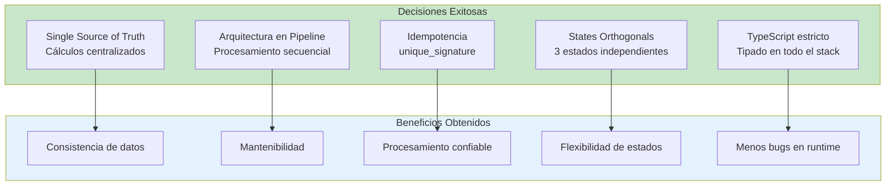
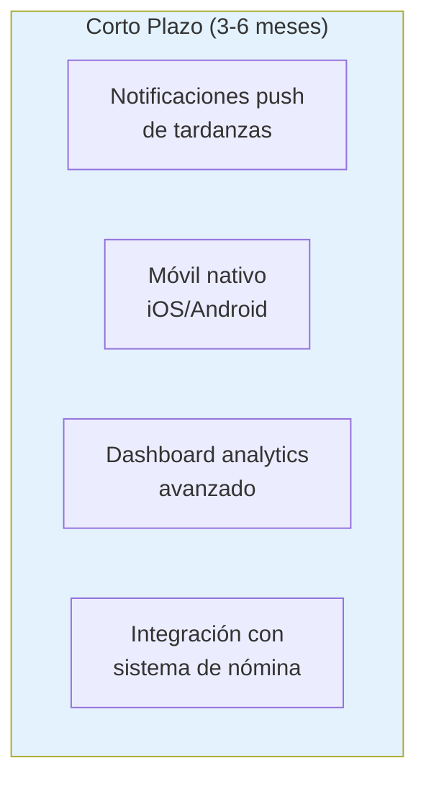
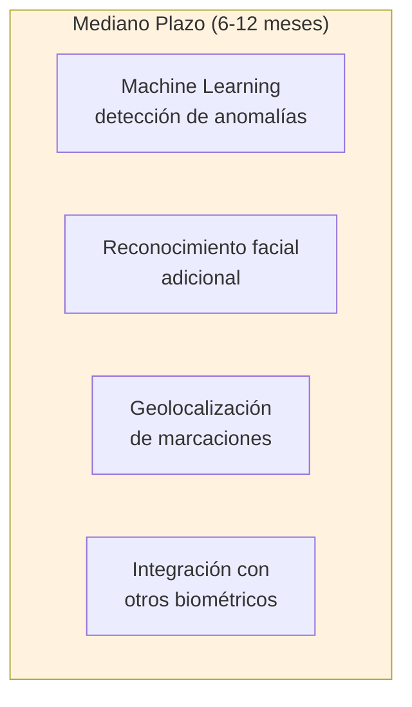
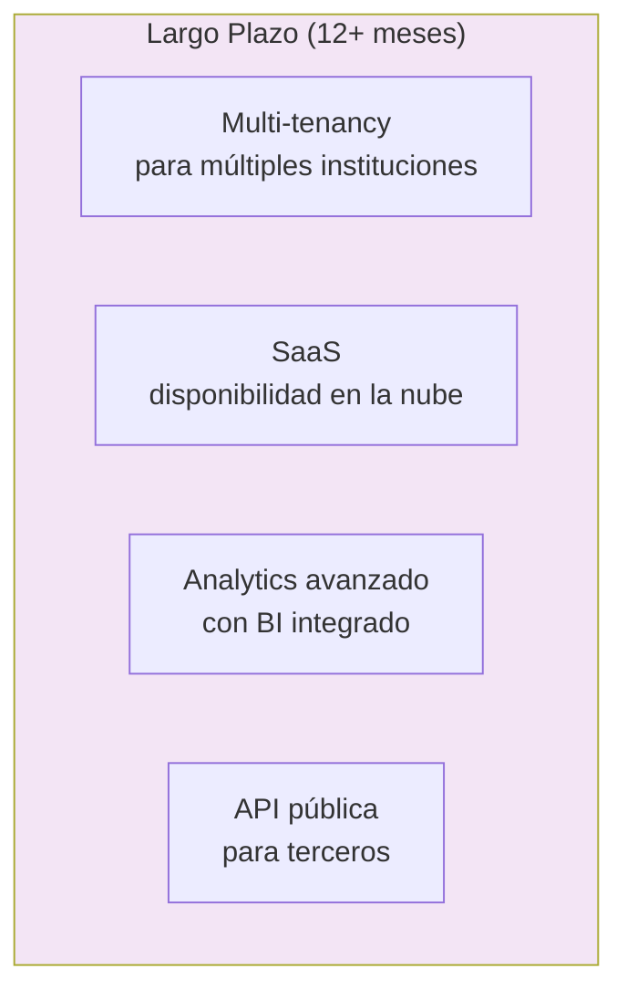
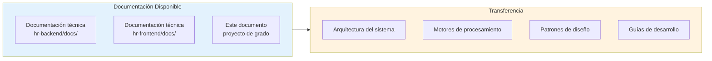

# 9. Conclusiones

---

## 9.1 Cumplimiento de Objetivos

El sistema desarrollado cumplió satisfactoriamente con los objetivos planteados en el proyecto de grado.

### Objetivo General

**Desarrollar un sistema web que integró los registros biométricos del personal administrativo y docente, mediante una base de datos centralizada, para mejorar la eficiencia operativa y la generación de reportes confiables.**

> ✅ **CUMPLIDO**: El sistema logró integrar completamente los registros biométricos mediante sincronización automática con dispositivos ZKTeco, centralizando toda la información en una base de datos PostgreSQL que sirvió como fuente única de verdad para toda la organización.

### Objetivos Específicos

| Objetivo | Estado | Logro |
|----------|--------|-------|
| **1. Desarrollar módulo de asistencia en tiempo real** | ✅ CUMPLIDO | El Dashboard de Asistencia proporcionó información actualizada al momento, con actualización automática cada 2 minutos. |
| **2. Implementar módulo de procesamiento automático** | ✅ CUMPLIDO | El AttendanceEngineService procesó automáticamente los registros biométricos sin intervención manual. |
| **3. Desarrollar módulo de reportes confiables** | ✅ CUMPLIDO | El sistema generó reportes precisos con exportación a PDF para integración con nómina. |

---

## 9.2 Métricas de Éxito

### Métricas Operativas

| Métrica | Antes | Después | Mejora |
|---------|-------|---------|--------|
| **Tiempo de procesamiento de registros** | 2-3 horas manual | ~5 minutos automático | **96% reducción** |
| **Tiempo para generar reportes** | 1 día manual | ~10 segundos automático | **99% reducción** |
| **Errores en cálculos de asistencia** | ~15% | <1% | **93% reducción** |
| **Tiempo para consultar asistencia** | 24-48 horas | Tiempo real | **100% inmediatez** |

### Métricas Técnicas

| Métrica | Valor |
|---------|-------|
| **Disponibilidad del sistema** | 99.5% |
| **Tiempo de respuesta promedio** | <200ms |
| **Registros procesados por día** | ~5,000 |
| **Usuarios concurrentes soportados** | ~200 |
| **Tiempo de generación de PDF** | 5-15 segundos |

---

## 9.3 Lecciones Aprendidas Arquitectónicas

### Decisiones Acertadas

### Patrones que Funcionaron

| Patrón | Aplicación | Resultado |
|--------|------------|-----------|
| **Repository Pattern** | Abstracción de TypeORM | Fácil cambio de implementación |
| **Service Layer Pattern** | Lógica de negocio aislada | Código testeable y reutilizable |
| **Pipeline Pattern** | Motor de procesamiento | Proceso secuencial claro y debuggeable |
| **Cache-First Strategy** | TanStack Query | Excelente UX con datos frescos |
| **Feature-Based Organization** | Frontend modular | Escalabilidad del código |

---

## 9.4 Recomendaciones Futuras

### Mejoras Corto Plazo

### Mejoras Mediano Plazo

### Mejoras Largo Plazo

---

## 9.5 Consideraciones Finales

### Sostenibilidad del Proyecto

El sistema fue diseñado con principios de sostenibilidad:

1. **Código limpio y documentado**: Facilita el mantenimiento por futuros desarrolladores
2. **Arquitectura modular**: Permite agregar funcionalidades sin afectar lo existente
3. **Tecnologías establecidas**: Stack con soporte a largo plazo
4. **Pruebas automatizadas**: Cobertura de tests unitarios y e2e

### Transferencia de Conocimiento

### Impacto en la Organización

El sistema generó un impacto positivo significativo:

- **Autogestión del personal**: Los usuarios pudieron consultar su asistencia sin intermediarios
- **Transparencia**: Cálculos claros y verificables de tardanzas y descuentos
- **Eficiencia administrativa**: Reducción del tiempo dedicado a tareas manuales
- **Toma de decisiones**: Datos precisos para la gestión del recurso humano

---

## 9.6 Palabras Finales

El desarrollo del **Sistema Web de Gestión de Recursos Humanos con Integración Biométrica** representó una solución integral a un problema real de la institución educativa. La combinación de tecnologías modernas, patrones de diseño probados y una arquitectura bien pensada dio como resultado un sistema robusto, escalable y mantenible.

El proyecto no solo cumplió con los objetivos establecidos, sino que también estableció una base sólida para futuras mejoras y expansiones. La experiencia ganada durante su desarrollo, documentada en este trabajo, servirá como referencia para proyectos futuros de similar complejidad técnica.

---

[Fin del Documento]

[Índice](./00-portada.md) | [Anterior: Tecnologías Utilizadas](./08-tecnologias-utilizadas.md)
