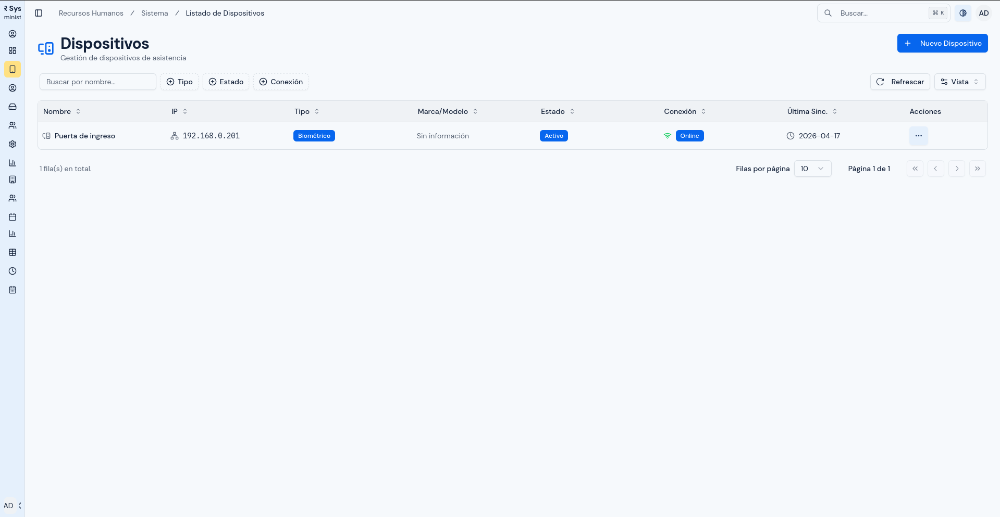

# Guía para un Agente de IA: Documentación, Imágenes y PDF

---

## Objetivo

Esta guía explica cómo debe trabajar un agente de IA cuando cree o actualice la documentación de esta carpeta.

El objetivo es que el agente mantenga un criterio uniforme para:

- redactar manuales;
- organizar imágenes;
- insertar capturas en los archivos Markdown;
- generar archivos PDF para revisión.

---

## Ubicación de trabajo

La documentación funcional está en:

`/home/developer/documentacion/10-manuales-de-usuario`

Las imágenes deben organizarse dentro de:

`/home/developer/documentacion/files`

---

## Regla general de redacción

Los manuales están dirigidos a personas usuarias de negocio, no a desarrolladores.

Por lo tanto, el agente debe escribir con estas reglas:

- usar español claro;
- evitar lenguaje técnico de desarrollo;
- explicar pasos de forma operativa;
- usar títulos naturales para el usuario;
- escribir una acción por paso;
- indicar qué revisar antes de guardar o confirmar;
- explicar el resultado esperado;
- incluir errores frecuentes cuando sea útil.

No usar expresiones como:

- `usuario final`;
- `payload`;
- `endpoint`;
- `backend`;
- `frontend`;
- `request`;
- `response`;
- `UUID`, salvo que sea realmente necesario para comprender una tarea.

---

## Cómo deben organizarse los manuales

En esta carpeta existen dos niveles de documentación:

### 1. Manual por rol

Estos archivos funcionan como portadas de navegación:

- `manual-administrador.md`
- `manual-rrhh.md`
- `manual-usuario-final.md`

Su función principal es:

- explicar a quién aplica el manual;
- mostrar qué módulos existen;
- indicar en qué orden leerlos;
- enlazar a manuales más específicos.

### 2. Manual por módulo

Estos archivos documentan procesos concretos, por ejemplo:

- `manual-admin-dispositivos.md`
- `manual-admin-dashboard.md`
- `manual-rrhh-reportes-asistencia.md`
- `manual-rrhh-horarios.md`

Cada manual por módulo debe incluir, cuando corresponda:

1. objetivo;
2. a quién aplica;
3. ruta de acceso;
4. qué verá la persona al abrir la pantalla;
5. pasos detallados;
6. validaciones antes de guardar;
7. errores o situaciones frecuentes;
8. resultado esperado;
9. imágenes insertadas o imágenes pendientes por capturar.

---

## Cómo deben organizarse las imágenes

No se deben dejar capturas sueltas con nombres por fecha dentro de `files/`.

El agente debe ordenarlas por dominio y módulo.

Estructura actual recomendada:

```text
files/
  usuario-final/
    acceso/
  admin/
    dashboard/
    dispositivos/
    mapeo-usuarios/
    registros-dispositivos/
    usuarios/
    configuraciones/
    reportes-globales/
  rrhh/
    reportes-asistencia/
    tabla-mensual-personal/
    departamentos/
    asignaciones-personal/
    feriados/
    horarios/
    asignaciones-horario/
    solicitudes-permiso/
    pendientes-aprobacion/
    tipos-permiso/
  referencias/
```

### Regla de carpetas

- usar `usuario-final/` para capturas del personal general;
- usar `admin/` para módulos del rol administrador;
- usar `rrhh/` para módulos del rol RRHH;
- usar `referencias/` solo para imágenes auxiliares que no se insertan directamente en un manual.

---

## Cómo renombrar las imágenes

No usar nombres como:

- `2026-05-04_15-35.png`
- `captura1.png`
- `foto-final.png`

Usar nombres secuenciales y descriptivos.

### Formato recomendado

```text
01-listado.png
02-crear.png
03-editar.png
04-acciones.png
05-confirmacion.png
```

### Ejemplos reales

```text
files/admin/dashboard/01-dashboard-admin-resumen.png
files/admin/dashboard/02-dashboard-admin-analitica.png

files/admin/dispositivos/01-listado-dispositivos.png
files/admin/dispositivos/02-crear-dispositivo.png
files/admin/dispositivos/03-acciones-dispositivo.png
files/admin/dispositivos/04-estado-conexion.png
files/admin/dispositivos/05-sincronizacion-dispositivo.png
```

### Regla de orden

El número debe seguir el orden en que la imagen aparece en el manual.

Si una captura se inserta antes en el flujo, debe tener un número menor.

---

## Cómo decidir qué imágenes hacen falta

El agente no debe insertar capturas por relleno.

Las imágenes deben usarse cuando ayudan a entender:

- una pantalla principal;
- un formulario;
- un modal;
- un menú de acciones;
- una confirmación importante;
- un resultado que el usuario debe reconocer.

### Cobertura mínima recomendada por módulo

Para la mayoría de módulos, el agente debe intentar cubrir:

1. pantalla principal;
2. formulario o modal principal;
3. acción crítica o confirmación.

### Ejemplo

Para `admin/dispositivos`:

- listado;
- crear dispositivo;
- editar dispositivo;
- menú de acciones;
- conexión;
- sincronización;
- confirmar activar o inactivar.

---

## Cómo insertar imágenes en Markdown

Para estos manuales conviene usar HTML en lugar de Markdown simple.

No usar:

```md

```

Porque el generador de PDF suele expandir demasiado la imagen.

Usar:

```md
<p align="center">
  
</p>
```

### Reglas recomendadas

- centrar la imagen con `<p align="center">`;
- usar `alt` descriptivo;
- controlar el ancho con `width`.

### Tamaños recomendados

Para capturas horizontales grandes:

- `width="700"`
- si queda muy grande en PDF, bajar a `620`

Para modales medianos:

- `width="520"`
- si queda muy grande, bajar a `460`

Para cuadros de confirmación pequeños:

- `width="420"`

Para capturas verticales de login o formularios altos:

- `width="260"`
- `width="280"`

### Regla práctica

Si una imagen ocupa demasiada página en PDF:

1. bajar el `width`;
2. volver a generar el PDF;
3. revisar el resultado.

---

## Cómo generar un PDF temporal

Desde `/home/developer/documentacion`, usar:

```bash
npx md-to-pdf --basedir . 10-manuales-de-usuario/manual-admin-dashboard.md
```

Ejemplos:

```bash
npx md-to-pdf --basedir . 10-manuales-de-usuario/manual-admin-dispositivos.md
npx md-to-pdf --basedir . 10-manuales-de-usuario/manual-rrhh-reportes-asistencia.md
```

### Qué hace `--basedir .`

Permite que el generador resuelva correctamente rutas relativas como:

```text
../files/admin/dispositivos/01-listado-dispositivos.png
```

Sin esa opción, las imágenes pueden no aparecer.

---

## Cómo configurar tamaño carta en el PDF

Si un manual debe salir en tamaño carta, el archivo Markdown debe comenzar con un bloque como este:

```yaml
---
pdf_options:
  format: Letter
  margin: 18mm
  printBackground: true
---
```

### Reglas

- usar `format: Letter`;
- mantener un margen razonable;
- usar `printBackground: true` para conservar mejor el estilo visual.

---

## Cómo revisar por qué una imagen no aparece en el PDF

Si una imagen no aparece, el agente debe revisar en este orden:

1. si la imagen realmente está insertada en el `.md`;
2. si la ruta es correcta;
3. si el comando usa `--basedir .`;
4. si el nombre del archivo coincide exactamente;
5. si la imagen fue movida de carpeta y no se actualizó la referencia.

### Error común

Escribir en el manual solo:

`Imágenes recomendadas`

Eso no inserta la imagen. Solo deja una nota para capturarla más adelante.

---

## Cómo revisar si falta una imagen

Cuando un manual ya tiene capturas, el agente debe compararlas contra el flujo del documento.

Preguntas clave:

1. ¿La pantalla principal está cubierta?
2. ¿El formulario principal está cubierto?
3. ¿La acción crítica está cubierta?
4. ¿El manual habla de un modal o confirmación que todavía no tiene captura?

Si falta una de esas piezas, el agente debe decir exactamente cuál imagen falta y sugerir el nombre final que debería tener.

---

## Cómo actuar cuando llegan nuevas capturas

Si aparecen imágenes nuevas en otra carpeta, por ejemplo:

`/home/developer/shared`

el agente debe:

1. revisar el contenido visual;
2. identificar a qué módulo pertenecen;
3. moverlas o copiarlas a la carpeta correcta dentro de `files/`;
4. renombrarlas con el criterio oficial;
5. verificar si el manual ya las necesita insertadas.

No dejar capturas nuevas con nombres por fecha dentro de la carpeta final.

---

## Flujo recomendado de trabajo para el agente

### Si el usuario pide crear o mejorar un manual

1. revisar el `.md` actual;
2. revisar el módulo real en código o capturas disponibles;
3. simplificar o ampliar el contenido según la audiencia;
4. insertar imágenes si ya existen;
5. si faltan imágenes, dejar indicado cuáles faltan;
6. generar PDF temporal si el usuario quiere revisar el resultado.

### Si el usuario pide revisar imágenes

1. inspeccionar visualmente cada imagen;
2. agruparlas por módulo;
3. renombrarlas;
4. moverlas a `files/`;
5. comparar contra el manual;
6. decir si falta alguna o si alguna debe repetirse.

---

## Archivos que el agente debe mantener actualizados

Cuando se agregan manuales o módulos nuevos, el agente también debe revisar:

- `10-manuales-de-usuario/01-indice-general.md`
- `10-manuales-de-usuario/03-inventario-de-modulos.md`
- `10-manuales-de-usuario/README.md`

Esto evita que existan manuales nuevos sin aparecer en el índice.

---

## Resultado esperado

Si el agente sigue esta guía, debería poder:

- crear manuales consistentes;
- ordenar correctamente las capturas;
- insertar imágenes sin romper el PDF;
- generar PDFs de revisión en tamaño carta;
- mantener una estructura estable para crecer la documentación sin desorden.
