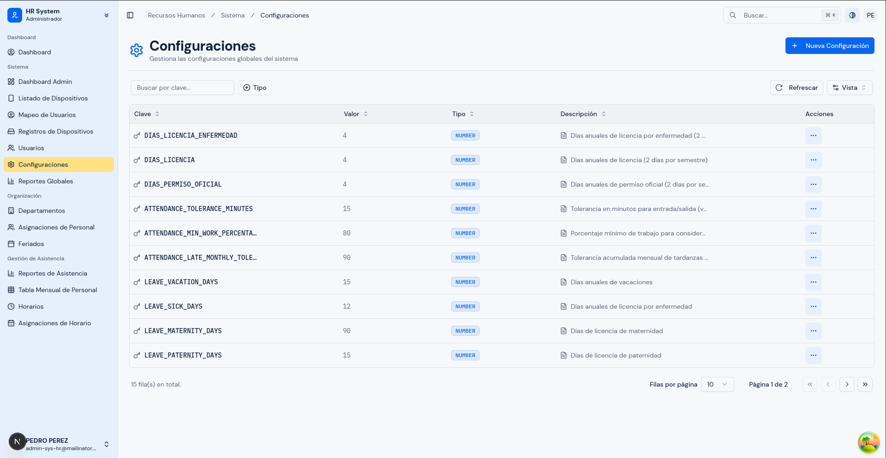
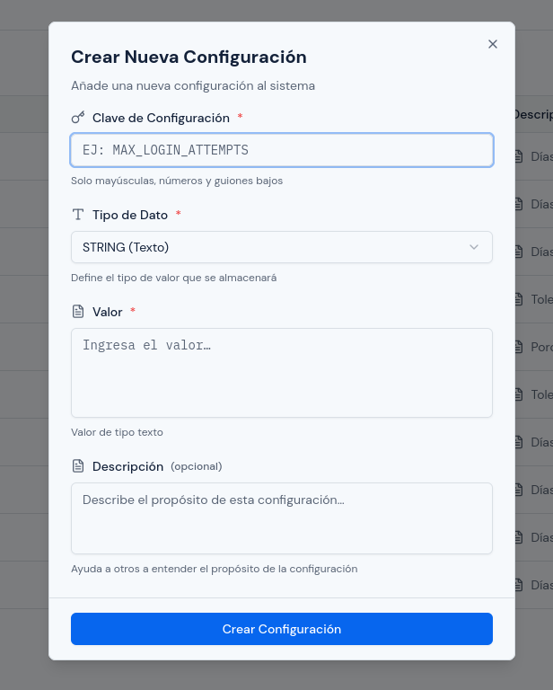
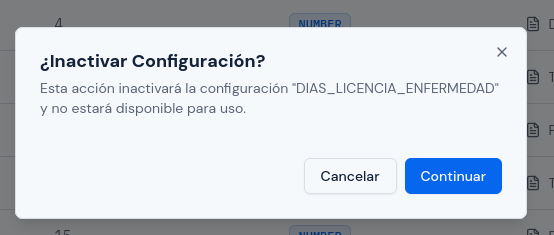

# Configuraciones del Sistema

---

## Objetivo

Explicar cómo crear, editar, activar e inactivar configuraciones funcionales del sistema.

---

## A quién aplica

Este manual aplica al personal con rol `Administrador`.

---

## Ruta de acceso

1. Ingresa al sistema.
2. En el menú lateral, abre `Sistema`.
3. Haz clic en `Configuraciones`.

Ruta habitual: `/hr/admin/configurations`

---

## Qué verás en esta pantalla

En esta pantalla verás un listado de configuraciones del sistema.

La tabla normalmente muestra:

- `Clave`;
- `Valor`;
- `Tipo`;
- `Descripción`;
- `Acciones`.

También puedes encontrar:

- búsqueda por clave;
- filtro por `Tipo`;
- botón `Nueva Configuración`.

El cambio de estado se realiza desde las acciones de cada fila.

  

---

## Qué significa cada campo

- `Clave`: identificador de la configuración. Una vez creada, normalmente no se modifica.
- `Valor`: dato que usará el sistema.
- `Tipo`: define cómo debe interpretarse el valor. Puede ser texto, número, booleano o JSON.
- `Descripción`: explica para qué sirve la configuración.

En esta pantalla no se editan los límites `minValue` y `maxValue`; esos datos existen en el sistema, pero no forman parte del formulario visible actual.

---

## Cómo crear una configuración nueva

1. Haz clic en `Nueva Configuración`.
2. En `Clave de Configuración`, escribe la clave correspondiente.
3. En `Tipo de Dato`, selecciona el tipo correcto.
4. En `Valor`, escribe el dato que corresponda al tipo elegido.
5. Si es necesario, agrega una `Descripción`.
6. Revisa cuidadosamente la información.
7. Haz clic en `Crear Configuración`.

Recuerda:

- la clave debe escribirse en mayúsculas;
- solo se permiten letras mayúsculas, números y guiones bajos;
- el valor debe coincidir con el tipo elegido.

  

---

## Cómo editar una configuración

1. Busca la configuración en la tabla.
2. En `Acciones`, selecciona `Editar`.
3. Revisa el valor actual.
4. Modifica solo los campos necesarios.
5. Guarda los cambios.

Ten en cuenta que la `Clave` no puede modificarse una vez creada.
Si cambias el `Tipo`, revisa también que el `Valor` siga siendo válido.

---

## Cómo activar o inactivar una configuración

1. Busca el registro en la tabla.
2. En `Acciones`, selecciona `Activar` o `Inactivar`.
3. Lee la confirmación.
4. Confirma solo si estás seguro de la acción.

El estado de la configuración afecta si el sistema la toma en cuenta o no para su comportamiento.

  

---

## Qué revisar antes de guardar

1. confirma que la clave es la correcta;
2. revisa que el tipo de dato coincida con el valor ingresado;
3. si el tipo es `BOOLEAN`, confirma si debe ser `true` o `false`;
4. si el tipo es `NUMBER`, verifica que el valor sea numérico;
5. si el tipo es `JSON`, valida que el contenido sea correcto;
6. revisa el impacto funcional antes de confirmar.

Límites del formulario:

- `Clave`: entre 3 y 100 caracteres;
- `Valor`: hasta 1000 caracteres;
- `Descripción`: hasta 500 caracteres.

---

## Cuándo tener especial cuidado

Debes tener mayor precaución cuando:

- la configuración afecta reglas de negocio;
- el cambio impacta a muchas personas;
- no conoces el efecto del valor que estás modificando.

Si no estás seguro del impacto, documenta primero el valor actual antes de cambiarlo.

---

## Errores o situaciones frecuentes

### El sistema no permite guardar

Revisa:

1. si la clave ya existe;
2. si el valor no coincide con el tipo;
3. si el JSON tiene formato inválido;
4. si el número ingresado no es válido.

### El sistema se comporta distinto después del cambio

En ese caso:

1. revisa qué configuración fue modificada;
2. confirma el valor anterior y el nuevo;
3. si corresponde, restaura el valor correcto;
4. valida nuevamente el comportamiento.

---

## Resultado esperado

Al finalizar, debes poder:

- consultar configuraciones existentes;
- crear nuevas configuraciones cuando corresponda;
- modificar valores de forma segura;
- activar o inactivar registros según necesidad.
