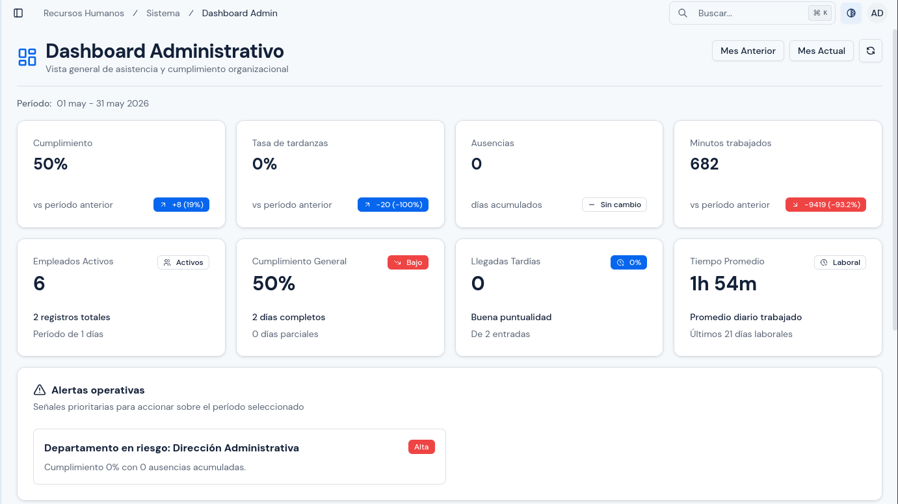
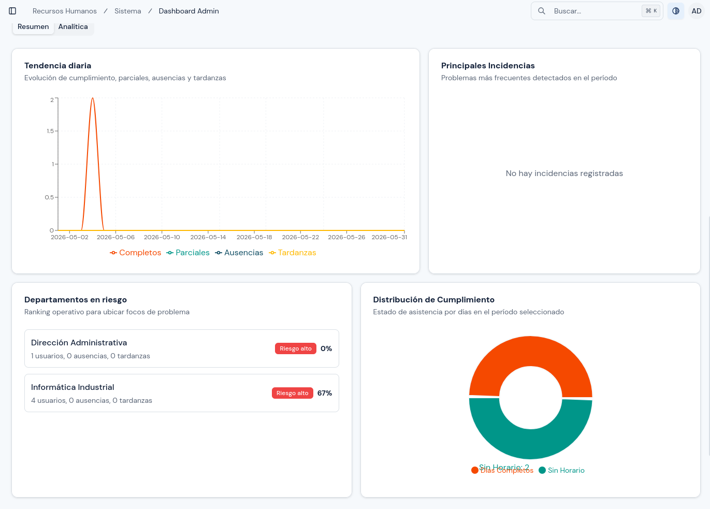

# Dashboard Administrativo

---

## Objetivo

Explicar cómo usar el `Dashboard Admin` para revisar rápidamente el estado general de asistencia del sistema.

---

## A quién aplica

Este manual aplica al personal con rol `Administrador`.

---

## Ruta de acceso

1. Ingresa al sistema.
2. En el menú lateral, abre `Sistema`.
3. Haz clic en `Dashboard Admin`.

Ruta habitual: `/hr/admin/overview`

---

## Qué verás en esta pantalla

En esta pantalla encontrarás un resumen general del sistema para un período de fechas.

Normalmente verás:

- tarjetas de resumen;
- indicadores de cumplimiento;
- comparativos del período;
- distribución por departamento;
- distribución por usuario;
- alertas o incidencias principales.

  

---

## Qué revisar al abrir el dashboard

1. Revisa el período de fechas mostrado.
2. Confirma si estás viendo el mes o rango que necesitas analizar.
3. Revisa el total de usuarios considerados en el resumen.
4. Observa si existen alertas visibles o indicadores fuera de lo esperado.

---

## Cómo usar los filtros

1. Ubica los filtros de fecha del dashboard.
2. Selecciona la fecha de inicio.
3. Selecciona la fecha de fin.
4. Si la pantalla permite filtrar por departamento, selecciona el departamento deseado.
5. Espera a que los indicadores se actualicen.

Usa filtros cortos cuando quieras revisar incidencias puntuales.
Usa filtros amplios cuando quieras una visión general del comportamiento.

En la vista actual, los controles visibles del período se encuentran en la parte superior derecha.

---

## Cómo interpretar la información principal

### Resumen general

Revisa primero:

- cantidad total de usuarios;
- porcentaje de cumplimiento;
- ausencias registradas;
- tardanzas;
- tiempo promedio trabajado.

### Distribución por departamentos

Úsala para detectar:

- áreas con mayor incumplimiento;
- departamentos con más ausencias;
- diferencias marcadas entre equipos.

### Alertas

Las alertas te ayudan a detectar casos que requieren revisión inmediata.

Si ves una alerta importante:

1. anota el dato observado;
2. identifica el período afectado;
3. confirma el problema en el módulo correspondiente.

Por ejemplo:

- si la alerta apunta a marcaciones, revisa `Registros de Dispositivos`;
- si la alerta apunta a comportamiento general, revisa `Reportes Globales`.

  

---

## Validaciones recomendadas

Antes de usar la información del dashboard para tomar decisiones:

1. confirma que el rango de fechas sea correcto;
2. verifica que el sistema tenga datos recientes;
3. revisa si existen dispositivos sin sincronizar;
4. confirma si el valor observado requiere revisión más detallada en otro módulo.

---

## Errores o situaciones frecuentes

### No aparecen datos

Revisa:

1. si el rango de fechas está vacío o mal definido;
2. si el sistema aún no tiene registros para ese período;
3. si hubo problemas recientes de sincronización.

### Los datos parecen incompletos

Antes de asumir un error:

1. revisa `Registros de Dispositivos`;
2. valida si el equipo correspondiente fue sincronizado;
3. revisa el módulo de reportes para confirmar el dato.

---

## Resultado esperado

Al finalizar esta revisión, debes poder:

- identificar el estado general de asistencia;
- detectar incidencias prioritarias;
- decidir qué módulo revisar después.

---
