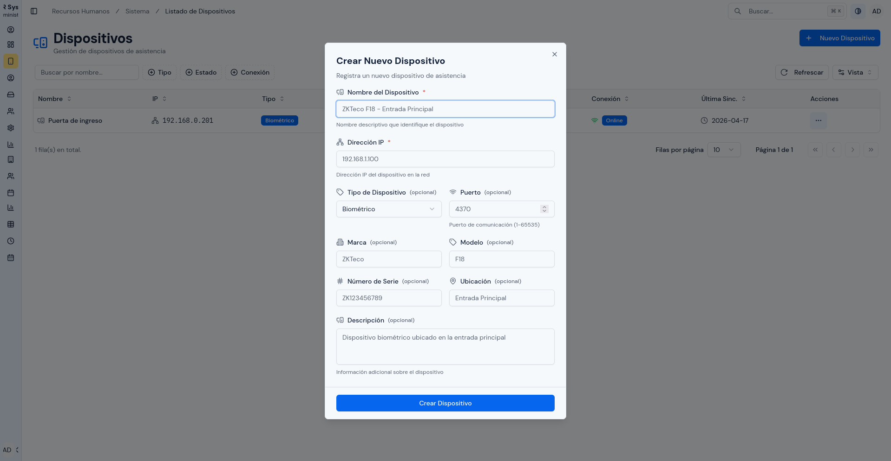
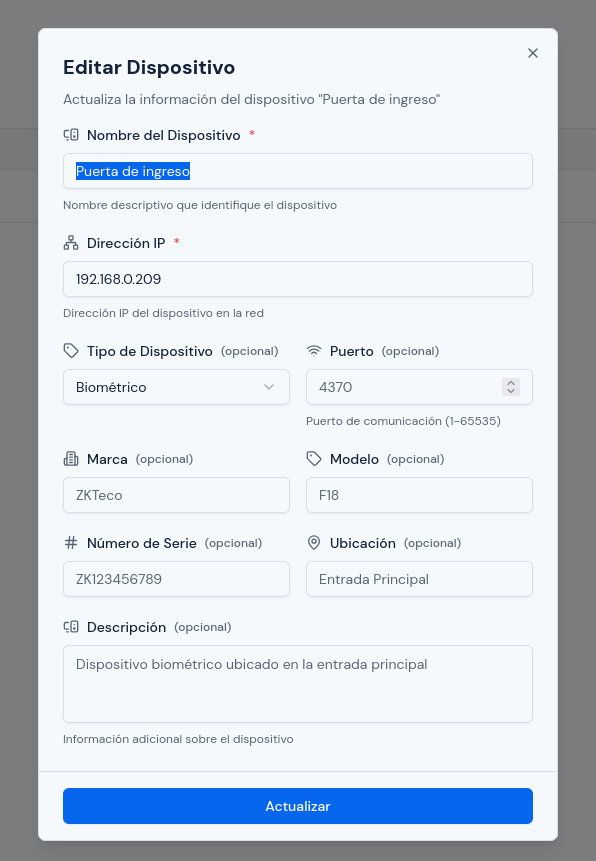
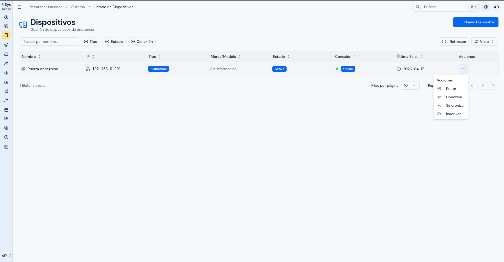
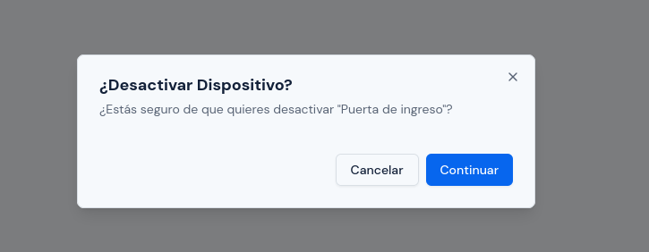
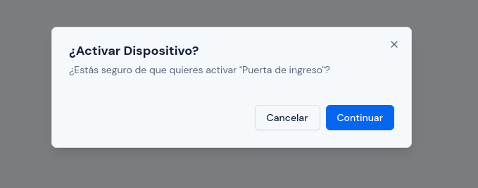
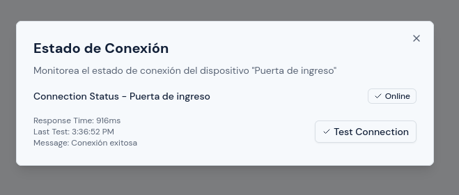
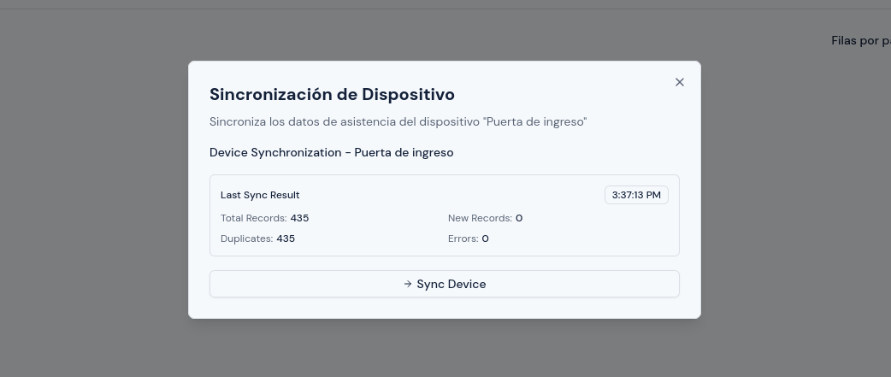

# Gestión de Dispositivos

---

## Objetivo

Explicar cómo registrar, editar, activar, inactivar, probar y sincronizar dispositivos desde el sistema.

---

## A quién aplica

Este manual aplica al personal con rol `Administrador`.

---

## Ruta de acceso

1. Ingresa al sistema.
2. En el menú lateral, abre `Sistema`.
3. Haz clic en `Listado de Dispositivos`.

Ruta habitual: `/hr/devices/list`

---

## Qué verás en esta pantalla

En esta pantalla verás un listado de dispositivos registrados en el sistema.

Normalmente la tabla muestra:

- `Nombre`;
- `IP`;
- `Tipo`;
- `Marca/Modelo`;
- `Estado`;
- `Conexión`;
- `Última Sinc.`;
- `Acciones`.

También podrás encontrar:

- cuadro de búsqueda;
- filtros por estado;
- botón para crear un dispositivo nuevo.

  

---

## Cómo registrar un dispositivo nuevo

1. Haz clic en `Crear Nuevo Dispositivo`.
2. En `Nombre del Dispositivo`, escribe un nombre claro.
3. En `Dirección IP`, escribe la IP del equipo.
4. Si corresponde, selecciona el `Tipo de Dispositivo`.
5. Si corresponde, completa el `Puerto`.
6. Completa `Marca`, `Modelo`, `Número de serie` y `Ubicación` si esa información está disponible.
7. Si deseas, agrega una `Descripción`.
8. Revisa los datos.
9. Haz clic en `Crear Dispositivo`.

  

---

## Qué revisar antes de guardar

Antes de crear o actualizar un dispositivo:

1. confirma que la IP sea correcta;
2. revisa que el nombre permita identificar el equipo fácilmente;
3. confirma que no estés duplicando un equipo ya registrado;
4. verifica el puerto si la instalación usa uno distinto al habitual.

---

## Cómo editar un dispositivo

1. Busca el dispositivo en la tabla.
2. En la columna `Acciones`, abre el menú del registro.
3. Haz clic en `Editar`.
4. Corrige los campos necesarios.
5. Revisa nuevamente los datos.
6. Haz clic en `Actualizar` o `Guardar cambios`, según lo que muestre la pantalla.

  

---

## Cómo activar o inactivar un dispositivo

1. Busca el dispositivo en la tabla.
2. En la columna `Acciones`, abre el menú del registro.
3. Selecciona `Activar` o `Inactivar`.
4. Lee el mensaje de confirmación.
5. Confirma la acción.

Inactiva un dispositivo cuando ya no deba usarse temporal o permanentemente.

  

  

  

---

## Cómo probar la conexión de un dispositivo

1. Busca el dispositivo en la tabla.
2. En la columna `Acciones`, selecciona la opción de `Conexión`.
3. Espera a que el sistema haga la prueba.
4. Revisa el resultado mostrado por el sistema.

El resultado normalmente indicará:

- si la conexión fue exitosa;
- el tiempo de respuesta;
- datos básicos del dispositivo consultado.

  

---

## Cómo sincronizar un dispositivo

1. Busca el dispositivo que deseas sincronizar.
2. En la columna `Acciones`, selecciona `Sincronizar`.
3. Lee la descripción de la acción.
4. Confirma la sincronización.
5. Espera a que finalice el proceso.
6. Revisa el resultado.

Al finalizar, el sistema puede mostrar:

- cantidad total de registros leídos;
- registros nuevos;
- duplicados;
- errores detectados.

  

---

## Cuándo usar la sincronización

Usa la sincronización cuando:

- acabas de registrar un dispositivo y quieres validar su funcionamiento;
- faltan marcaciones recientes;
- necesitas actualizar registros antes de revisar reportes;
- soporte o RRHH te reporta diferencias en la asistencia.

---

## Errores o situaciones frecuentes

### La prueba de conexión falla

Revisa:

1. que la IP sea correcta;
2. que el equipo esté encendido;
3. que el puerto configurado sea correcto;
4. que el dispositivo esté accesible en la red.

### La sincronización no trae registros nuevos

Esto puede ocurrir si:

1. no hubo nuevas marcaciones;
2. los registros ya fueron importados antes;
3. el dispositivo no está respondiendo correctamente.

### El dispositivo aparece inactivo

Si un dispositivo está inactivo, revísalo antes de intentar usarlo como fuente principal de datos.

---

## Resultado esperado

Al finalizar este proceso, debes poder:

- registrar correctamente un nuevo equipo;
- corregir datos de un dispositivo existente;
- validar la conexión;
- sincronizar registros cuando sea necesario.

---
