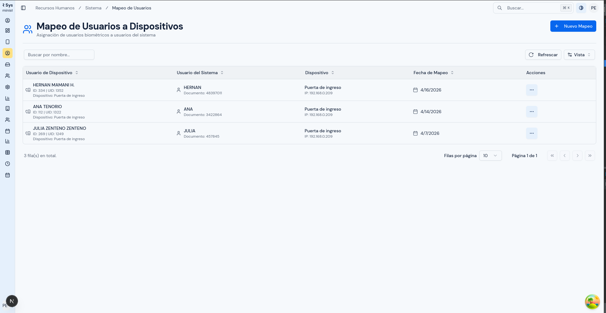
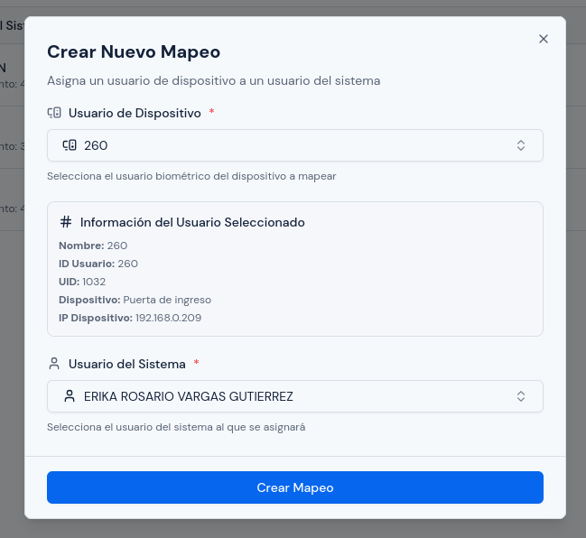
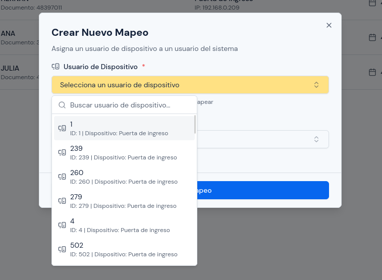
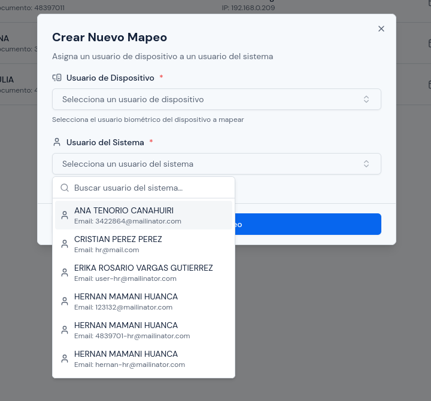
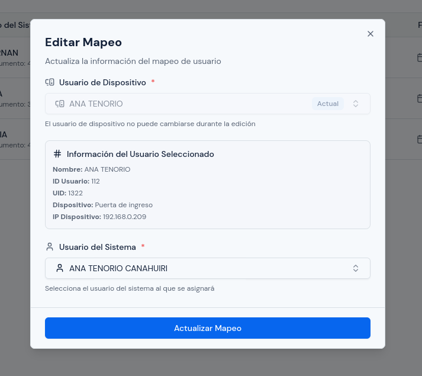
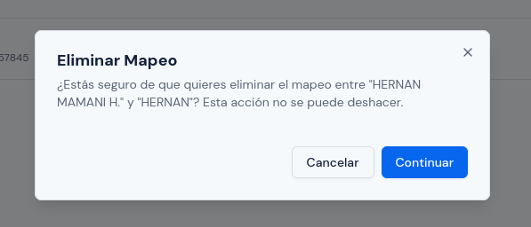

# Mapeo de Usuarios a Dispositivos

---

## Objetivo

Explicar cómo relacionar un usuario registrado en un dispositivo biométrico con la persona correcta dentro del sistema.

Este proceso es importante para que las marcaciones importadas desde los equipos puedan asociarse correctamente a cada trabajador.

---

## A quién aplica

Este manual aplica principalmente al personal con rol `Administrador`.

---

## Ruta de acceso

1. Ingresa al sistema.
2. En el menú lateral, abre `Sistema`.
3. Haz clic en `Mapeo de Usuarios`.

Ruta habitual: `/hr/devices/mappings`

---

## Para qué sirve este módulo

Este módulo permite indicar qué registro del biométrico corresponde a qué usuario del sistema.

Esto se usa cuando:

- ya existe un usuario en el dispositivo;
- ya existe un usuario en el sistema;
- necesitas unir ambos registros;
- las marcaciones del equipo todavía no se reflejan correctamente en la asistencia.

Si un usuario del biométrico no está relacionado con la persona correcta, el sistema puede tener dificultades para asociar sus marcaciones.

---

## Qué verás en esta pantalla

En esta pantalla verás un listado de mapeos activos.

  

Normalmente encontrarás:

- tabla principal;
- cuadro de búsqueda;
- botón `Nuevo Mapeo`;
- menú de acciones por cada registro.

La tabla puede mostrar columnas como:

- `Usuario de Dispositivo`;
- `Usuario del Sistema`;
- `Dispositivo`;
- `Fecha de Mapeo`;
- `Acciones`.

En la parte de `Usuario de Dispositivo` normalmente se muestra:

- nombre registrado en el biométrico;
- `ID` del usuario en el equipo;
- `UID`;
- nombre del dispositivo.

En la parte de `Usuario del Sistema` normalmente se muestra:

- nombre de la persona;
- documento de identidad.

---

## Qué puedes hacer realmente en este módulo

Con la implementación actual, este módulo se usa principalmente para:

- buscar mapeos existentes;
- crear un nuevo mapeo;
- editar un mapeo existente;
- desactivar un mapeo desde la opción de eliminación.

### Importante

En la pantalla actual:

- el flujo visible es individual, no masivo;
- solo se listan los mapeos activos;
- cuando eliminas un mapeo desde la tabla, en realidad el sistema lo desactiva;
- no existe en esta pantalla un botón visible para reactivar mapeos desactivados.

---

## Antes de crear un mapeo

Antes de iniciar, confirma estas condiciones:

1. el dispositivo ya fue registrado en el sistema;
2. el usuario biométrico ya existe en el dispositivo;
3. el usuario ya existe en el módulo `Usuarios`;
4. estás seguro de que ambos registros pertenecen a la misma persona.

Si todavía no existe el usuario en el sistema, primero debes crearlo o importarlo desde el módulo `Usuarios`.

---

## Cómo buscar un mapeo existente

1. Abre la pantalla `Mapeo de Usuarios`.
2. En el cuadro de búsqueda, escribe uno de estos datos:
   - nombre del usuario biométrico;
   - documento del usuario del sistema;
   - nombre del usuario del sistema;
   - nombre del dispositivo;
   - identificador del usuario del biométrico.
3. Espera a que el listado se actualice.
4. Revisa si el mapeo ya existe.

Usa siempre la búsqueda antes de crear un mapeo nuevo. Esto ayuda a evitar duplicaciones o confusiones.

---

## Cómo crear un nuevo mapeo

1. Haz clic en `Nuevo Mapeo`.
2. En el campo `Usuario de Dispositivo`, abre el selector.
3. Busca el registro del biométrico correspondiente.
4. Selecciona el usuario correcto.
5. Revisa la información adicional mostrada por el sistema.
6. En el campo `Usuario del Sistema`, abre el selector.
7. Busca a la persona correcta dentro del sistema.
8. Selecciona el usuario correcto.
9. Revisa nuevamente que ambos registros correspondan a la misma persona.
10. Haz clic en `Crear Mapeo`.

  

---

## Qué información muestra el selector del usuario de dispositivo

Cuando seleccionas un `Usuario de Dispositivo`, el sistema muestra una tarjeta de apoyo con datos como:

- nombre del usuario registrado en el equipo;
- `ID Usuario`;
- `UID`;
- nombre del dispositivo;
- IP del dispositivo.

  

Revisa esa tarjeta con cuidado antes de continuar. Sirve para confirmar que no estás usando un registro del equipo equivocado.

---

## Qué información muestra el selector del usuario del sistema

Cuando eliges un `Usuario del Sistema`, el selector te ayuda a ubicar a la persona por:

- nombre completo;
- correo electrónico, si está registrado.

  

No selecciones a una persona solo por coincidencia parcial de nombre. Si tienes dudas, valida el documento o revisa el módulo `Usuarios`.

---

## Qué revisar antes de guardar

Antes de crear un mapeo:

1. confirma que el nombre del biométrico corresponde a la persona correcta;
2. revisa el `ID Usuario` o `UID` si el equipo usa varios registros parecidos;
3. confirma que el usuario del sistema es la persona correcta;
4. verifica que no exista ya un mapeo activo para ese registro del biométrico;
5. guarda solo cuando estés seguro de la relación.

---

## Cómo editar un mapeo existente

1. Busca el mapeo en la tabla.
2. En la columna `Acciones`, selecciona `Editar`.
3. Revisa la información mostrada en la ventana de edición.
4. Cambia el `Usuario del Sistema` si necesitas corregir la asociación.
5. Haz clic en `Actualizar Mapeo`.

  

### Importante

Durante la edición, el `Usuario de Dispositivo` no puede cambiarse.

Eso significa que:

- sí puedes corregir a qué persona del sistema está asociado;
- no puedes reemplazar el registro biométrico seleccionado originalmente.

Si el usuario biométrico fue elegido mal desde el inicio, el procedimiento correcto es:

1. desactivar el mapeo incorrecto;
2. crear un mapeo nuevo con el usuario biométrico correcto.

---

## Cómo desactivar un mapeo

1. Busca el registro en la tabla.
2. Abre `Acciones`.
3. Selecciona la opción de eliminar el mapeo.
4. Lee el mensaje de confirmación.
5. Confirma solo si estás seguro.

  

### Qué ocurre realmente al eliminar

Después de confirmar esta acción:

- dejará de mostrarse en el listado principal;
- ya no contará como mapeo activo;
- será necesario crear uno nuevo si quieres reemplazarlo desde la interfaz actual.

---

## Cuándo conviene crear o corregir un mapeo

Usa este módulo cuando:

- se registró un dispositivo nuevo;
- se importaron usuarios nuevos desde el biométrico;
- un trabajador aparece en el equipo pero sus marcaciones no se asocian correctamente;
- detectaste que un usuario del sistema fue vinculado con la persona equivocada;
- necesitas corregir una asociación anterior.

---

## Errores o situaciones frecuentes

### No encuentras el usuario del dispositivo

Revisa:

1. si el dispositivo ya fue sincronizado;
2. si la persona realmente existe dentro del equipo;
3. si estás buscando por el nombre correcto;
4. si el usuario ya está asociado y no aparece como disponible en el flujo esperado.

### No encuentras el usuario del sistema

Revisa:

1. si la persona ya fue creada o importada en `Usuarios`;
2. si el nombre fue escrito correctamente;
3. si el correo o documento coinciden con lo que estás buscando;
4. si la cuenta está disponible en el sistema.

### El sistema no te deja crear el mapeo

Revisa:

1. si ya existe un mapeo activo para ese usuario del biométrico;
2. si el usuario del sistema sigue activo;
3. si el registro biométrico sigue activo y disponible;
4. si ambos campos obligatorios fueron seleccionados.

### El mapeo quedó asociado a la persona equivocada

Si el problema está en la persona del sistema:

1. abre `Editar`;
2. corrige el `Usuario del Sistema`;
3. guarda el cambio.

Si el problema está en el usuario biométrico seleccionado:

1. desactiva el mapeo incorrecto;
2. crea un mapeo nuevo;
3. valida nuevamente la información antes de guardar.

### Había marcaciones antes del mapeo

En este caso, el sistema puede empezar a resolver correctamente marcaciones que antes no estaban asociadas, especialmente después de crear el mapeo correcto.

De todas formas, conviene revisar posteriormente:

1. `Registros de Dispositivos`;
2. reportes de asistencia;
3. cualquier caso puntual reportado por RRHH.

---

## Resultado esperado

Al finalizar este proceso, debes poder:

- identificar qué usuario biométrico corresponde a cada persona;
- crear relaciones correctas entre el equipo y el sistema;
- corregir asociaciones equivocadas;
- dejar listo el sistema para que las marcaciones puedan asociarse con la persona correcta.
