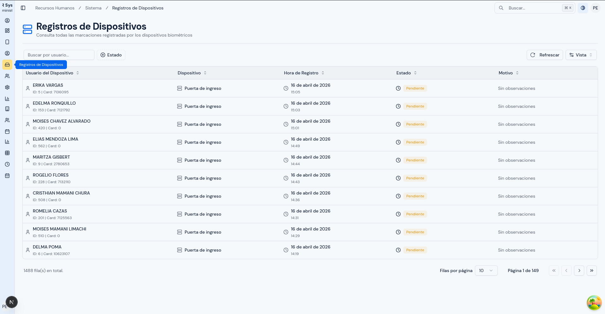
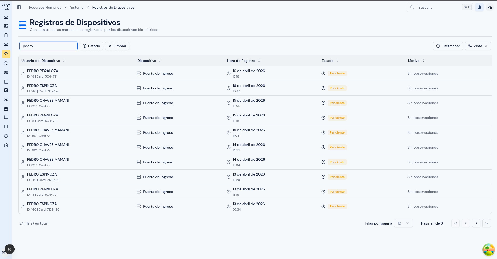
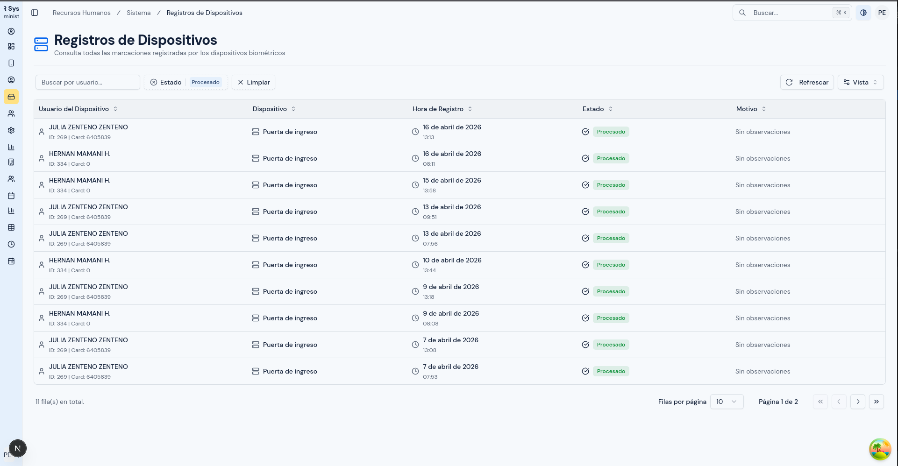
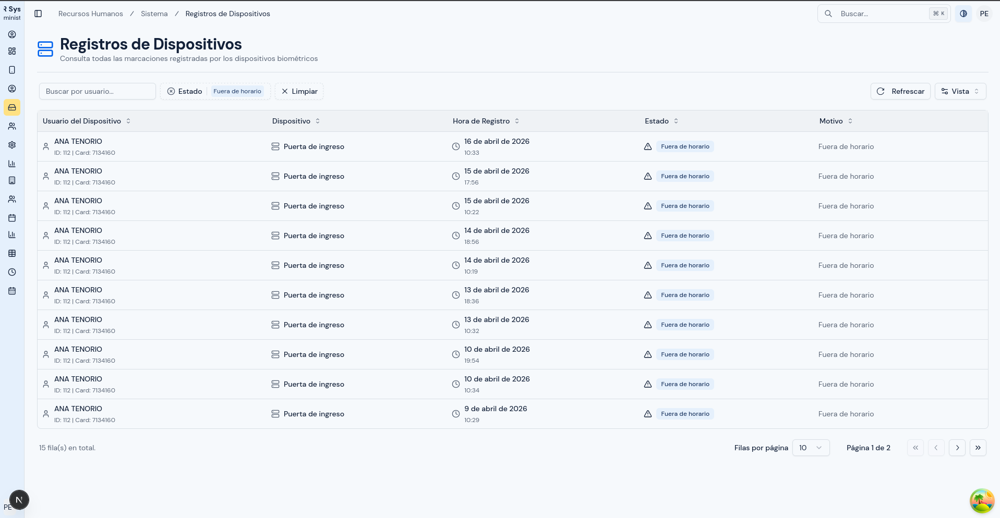

# Registros de Dispositivos

---

## Objetivo

Explicar cómo revisar las marcaciones recibidas desde los dispositivos biométricos para confirmar si un registro llegó al sistema y en qué estado se encuentra.

---

## A quién aplica

Este manual aplica al personal con rol `Administrador` y, cuando corresponda, al personal de `RRHH` con acceso autorizado.

---

## Ruta de acceso

1. Ingresa al sistema.
2. En el menú lateral, abre `Sistema`.
3. Haz clic en `Registros de Dispositivos`.

Ruta habitual: `/hr/devices/raw-records`

---

## Para qué sirve esta pantalla

Esta pantalla sirve para revisar las marcaciones que llegaron desde los equipos biométricos.

Úsala cuando necesites confirmar:

- si una marcación fue recibida por el sistema;
- desde qué dispositivo llegó;
- a qué usuario del biométrico corresponde;
- si el registro ya fue procesado;
- si existe alguna observación o problema con ese registro.

Esta pantalla te ayuda a revisar el dato de origen. No reemplaza la revisión de asistencia, horarios o mapeos.

---

## Qué verás en esta pantalla

En esta pantalla verás un listado de registros de dispositivos.

  

Normalmente encontrarás:

- tabla principal;
- cuadro de búsqueda;
- filtro por estado;
- opción de refrescar la información.

La tabla puede mostrar columnas como:

- `Usuario del Dispositivo`;
- `Dispositivo`;
- `Hora de Registro`;
- `Estado`;
- `Motivo`.

### Qué muestra cada columna

#### `Usuario del Dispositivo`

Puede mostrar:

- nombre registrado en el biométrico;
- `ID` del usuario en el equipo;
- número de tarjeta, si existe;
- mensaje de referencia cuando el usuario no está identificado o no está mapeado.

#### `Dispositivo`

Muestra el nombre del equipo desde el cual llegó la marcación.

#### `Hora de Registro`

Muestra:

- la fecha del registro;
- la hora exacta en que se recibió o se generó la marcación.

#### `Estado`

Muestra la situación del registro dentro del sistema.

Los estados visibles son:

- `Pendiente`
- `Procesado`
- `Fuera de horario`
- `Error`

#### `Motivo`

Muestra una observación adicional cuando corresponde. Si no existe observación, puede mostrarse como `Sin observaciones`.

---

## Qué significa cada estado

### `Pendiente`

Significa que el registro llegó y todavía está esperando su procesamiento o resolución.

### `Procesado`

Significa que el registro ya fue tratado correctamente por el sistema.

### `Fuera de horario`

Significa que el registro fue recibido, pero quedó marcado con una observación relacionada con horario o ventana de tiempo.

### `Error`

Significa que el sistema detectó un problema al intentar procesar el registro y conviene revisarlo con más cuidado.

---

## Cómo buscar un registro

1. Abre la pantalla `Registros de Dispositivos`.
2. En el cuadro de búsqueda, escribe un dato que te ayude a ubicar el registro.
3. Puedes buscar, por ejemplo:
   - nombre del usuario del biométrico;
   - identificador del usuario del equipo;
   - nombre del dispositivo.
4. Espera a que la tabla se actualice.
5. Revisa los resultados.

  

Usa la búsqueda cuando ya tengas una persona o un equipo concreto que quieras revisar.

---

## Cómo filtrar por estado

1. Abre el filtro de `Estado`.
2. Selecciona uno o varios estados según lo que necesites revisar.
3. Espera a que la tabla muestre solo los registros coincidentes.

Este filtro es útil cuando necesitas:

- revisar registros aún `Pendientes`;
- confirmar registros ya `Procesados`;
- identificar registros `Fuera de horario`;
- revisar casos con `Error`.

  

  

---

## Cómo refrescar la información

1. Ubica el botón `Refrescar`.
2. Haz clic cuando necesites volver a consultar la información más reciente.

Usa esta acción cuando sospeches que ingresaron nuevos registros o después de una sincronización reciente.

---

## Cómo revisar una marcación reportada por un usuario

Si te informan que una marcación no aparece correctamente, sigue este orden:

1. identifica el nombre de la persona o el identificador usado en el biométrico;
2. ubica el dispositivo donde realizó la marcación, si lo conoces;
3. busca el registro en esta pantalla;
4. revisa la fecha y hora del evento;
5. revisa el estado del registro;
6. lee el motivo, si existe;
7. confirma si el dato llegó al sistema o si el problema debe revisarse en otro módulo.

---

## Cómo interpretar lo que ves

### El registro aparece como `Procesado`

Esto indica que la marcación sí llegó y fue tratada correctamente. Si aun así no ves el resultado esperado, conviene revisar asistencia, horario o reglas del proceso.

### El registro aparece como `Pendiente`

Esto indica que la marcación llegó, pero todavía no quedó resuelta por completo. Puede requerir una nueva revisión posterior.

### El registro aparece como `Fuera de horario`

Esto indica que la marcación existe, pero el sistema la identificó con una observación relacionada con horario. En este caso conviene revisar también el horario asignado.

### El registro aparece como `Error`

Esto indica que la marcación llegó, pero hubo un problema al procesarla. Conviene revisar:

1. el usuario del biométrico;
2. el dispositivo;
3. el mapeo del usuario;
4. la consistencia del dato recibido.

### El registro no aparece

Si no encuentras el registro, revisa:

1. si estás buscando el nombre o identificador correcto;
2. si la marcación realmente se hizo en ese dispositivo;
3. si el equipo ya sincronizó información;
4. si el problema corresponde al origen y no al procesamiento.

---

## Diferencia entre registro y asistencia

Es importante no confundir ambos conceptos:

- el `registro de dispositivo` es la marcación original recibida desde el equipo;
- la `asistencia` es el resultado que el sistema calcula después de procesar esos datos.

Por eso, puede ocurrir que:

- el registro exista en esta pantalla;
- pero el resultado esperado todavía no se vea en asistencia.

En esos casos, conviene revisar también:

- `Mapeo de Usuarios`;
- `Horarios`;
- `Reportes de Asistencia`.

---

## Qué revisar antes de reportar un problema

Antes de escalar un caso, revisa:

1. si la marcación aparece o no aparece;
2. qué estado muestra;
3. qué motivo aparece, si existe;
4. si el usuario del biométrico está claramente identificado;
5. si el dispositivo mostrado es el correcto;
6. si el usuario tiene su mapeo correctamente definido.

---

## Errores o situaciones frecuentes

### No aparecen registros

Revisa:

1. si el término de búsqueda está bien escrito;
2. si estás buscando por el dispositivo correcto;
3. si la sincronización del equipo ya ocurrió;
4. si el caso corresponde realmente a otra pantalla.

### El usuario aparece como no identificado o no mapeado

Revisa:

1. si el usuario biométrico existe en el sistema;
2. si ya fue relacionado en `Mapeo de Usuarios a Dispositivos`;
3. si estás viendo una marcación previa al mapeo.

### Hay registros, pero no aparecen correctamente en asistencia

En ese caso revisa:

1. el estado del registro;
2. el motivo mostrado;
3. el mapeo del usuario;
4. el horario asignado;
5. la asistencia del período.

### Hay muchos registros con `Error`

Si observas varios errores seguidos:

1. revisa si pertenecen al mismo dispositivo;
2. verifica si el problema afecta a un mismo usuario o a varios;
3. documenta ejemplos concretos antes de escalar el caso.

---

## Resultado esperado

Al finalizar la revisión, debes poder:

- confirmar si una marcación llegó al sistema;
- identificar desde qué equipo llegó;
- ver el estado del registro;
- distinguir si el problema está en el origen, en el mapeo o en el procesamiento posterior.
