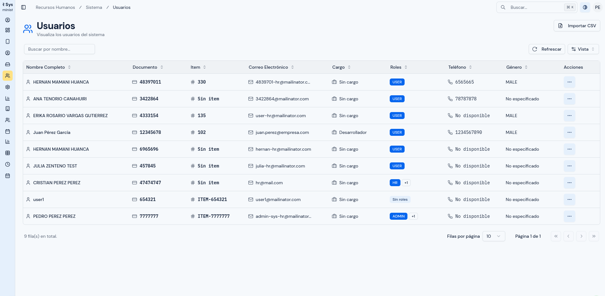
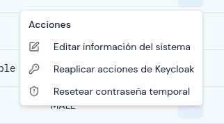
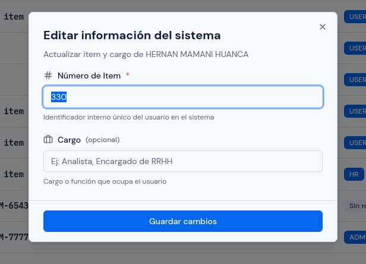
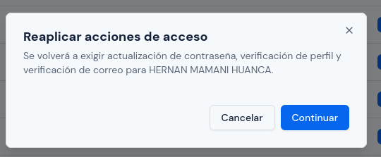
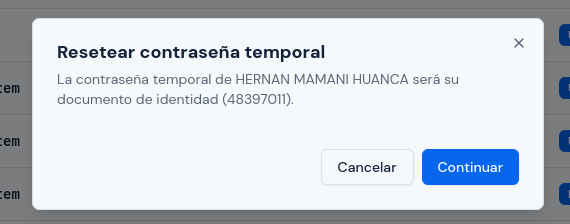
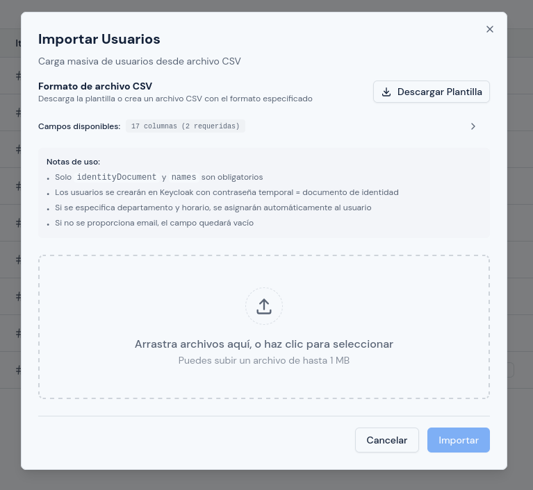
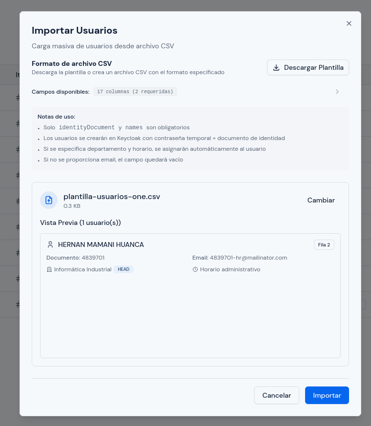
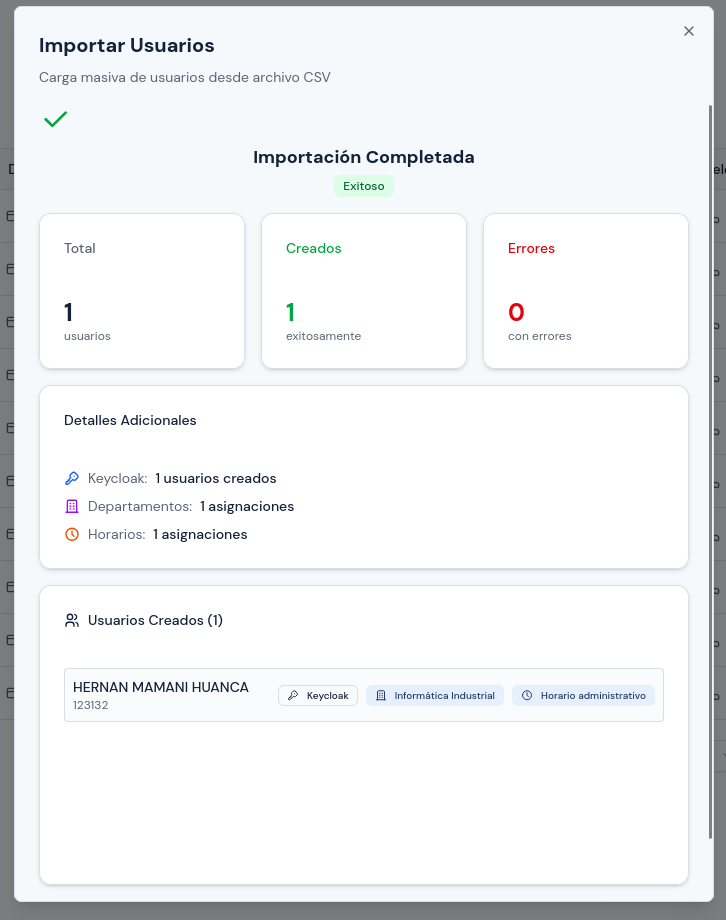
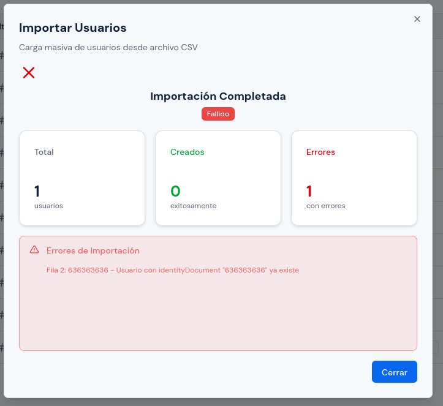

# Gestión de Usuarios

---

## Objetivo

Explicar cómo consultar usuarios, editar información del sistema, reaplicar acciones de acceso, resetear contraseñas temporales y realizar importaciones masivas por archivo CSV.

---

## A quién aplica

Este manual aplica principalmente al personal con rol `Administrador`.

Algunas acciones de consulta y mantenimiento también pueden estar disponibles para `RRHH`, según los permisos asignados.

---

## Ruta de acceso

1. Ingresa al sistema.
2. En el menú lateral, abre `Sistema`.
3. Haz clic en `Usuarios`.

Ruta habitual: `/hr/admin/users`

---

## Qué verás en esta pantalla

En esta pantalla verás el listado de usuarios del sistema.

  

Normalmente encontrarás:

- tabla de usuarios;
- búsqueda por texto;
- acciones por registro;
- botón `Importar CSV`.

La tabla puede mostrar columnas como:

- `Nombre Completo`;
- `Documento`;
- `Item`;
- `Correo Electrónico`;
- `Cargo`;
- `Roles`;
- `Teléfono`;
- `Género`;
- `Acciones`.

---

## Qué puedes hacer realmente en este módulo

Con la implementación actual, este módulo se usa principalmente para:

- buscar y revisar usuarios existentes;
- editar información del sistema;
- reaplicar acciones de acceso;
- resetear la contraseña temporal;
- importar usuarios por archivo CSV.

En la versión actual no existe un botón operativo para crear un usuario individualmente desde esta pantalla.

---

## Cómo buscar un usuario

1. Abre la pantalla `Usuarios`.
2. En el cuadro de búsqueda, escribe nombre, apellido, correo, documento u otro dato disponible.
3. Espera a que la tabla se actualice.
4. Revisa si el usuario aparece en el listado.

Usa la búsqueda antes de editar o importar, para evitar duplicaciones o revisiones innecesarias.

---

## Cómo editar información del sistema

En este módulo no estás corrigiendo todos los datos personales del empleado.

Aquí se edita principalmente:

- `Número de Item`;
- `Cargo`.

  

### Pasos

1. Busca el usuario en la tabla.
2. En la columna `Acciones`, selecciona `Editar información del sistema`.
3. Revisa la información cargada en el formulario.
4. Corrige los campos necesarios.
5. Haz clic en `Guardar cambios`.

  

### Qué revisar antes de guardar

1. confirma que estás editando a la persona correcta;
2. verifica que el `Número de Item` sea único;
3. revisa que el cargo esté correctamente escrito;
4. confirma que el cambio corresponde realmente a información del sistema.

Si el sistema muestra un mensaje indicando que un dato ya existe, revisa si otro usuario ya usa ese valor.

---

## Cómo reaplicar acciones de acceso

Esta acción sirve para volver a exigir al usuario ciertas tareas en su próximo ingreso.

Según la implementación actual, se pueden reaplicar estas acciones:

- actualización de contraseña;
- actualización de perfil;
- verificación de correo.

### Cuándo usar esta opción

Usa esta acción cuando:

- la persona no completó correctamente su primer acceso;
- necesitas forzar que vuelva a revisar sus datos;
- el usuario debe volver a verificar correo o contraseña.

### Pasos

1. Busca el usuario en la tabla.
2. Abre `Acciones`.
3. Selecciona `Reaplicar acciones de Keycloak`.
4. Lee el mensaje de confirmación.
5. Confirma la acción.

  

Después de eso, en el siguiente acceso el usuario deberá completar nuevamente esas acciones.

---

## Cómo resetear la contraseña temporal

Esta acción restablece la contraseña temporal del usuario.

Según la implementación actual, la contraseña temporal se restablece usando el `documento de identidad` del usuario.

### Cuándo usar esta opción

Usa esta acción cuando:

- la persona olvidó la contraseña;
- el acceso inicial quedó bloqueado;
- necesitas devolver la cuenta a un estado inicial controlado.

### Pasos

1. Busca el usuario en la tabla.
2. Abre `Acciones`.
3. Selecciona `Resetear contraseña temporal`.
4. Lee el mensaje de confirmación.
5. Confirma la acción.

  

Después de realizar esta acción, informa al usuario cuál será su contraseña temporal y pídele que la cambie al ingresar.

---

## Cómo importar usuarios desde CSV

1. Haz clic en `Importar CSV`.
2. Lee las instrucciones del cuadro de importación.
3. Descarga la plantilla si la necesitas.
4. Selecciona el archivo CSV correcto.
5. Revisa la vista previa, si la pantalla la muestra.
6. Confirma la importación.
7. Espera a que finalice el proceso.
8. Revisa el resultado de la importación.

  

  

### Reglas generales del archivo CSV

Antes de importar, toma en cuenta estas reglas:

1. el archivo debe estar en formato `.csv`;
2. el archivo no debe superar `1 MB`;
3. el archivo no debe superar `1000` filas;
4. el archivo no debe superar `1000` usuarios;
5. las columnas obligatorias son `identityDocument` y `names`;
6. si falta una columna obligatoria, la importación no podrá continuar.

### Orden de columnas de la plantilla

La plantilla del sistema usa este orden:

`identityDocument,names,firstSurname,secondSurname,email,itemNumber,birthDate,gender,phoneNumber,address,position,dailySalary,roles,departmentName,departmentRole,scheduleName,scheduleStartDate`

### Qué significa cada columna

#### 1. `identityDocument`

- Es el documento de identidad de la persona.
- Es obligatorio.
- Debe ser único.
- El sistema lo usa como identificador principal del usuario.
- También se usa como base para el acceso inicial.
- Ejemplo: `12345678`

#### 2. `names`

- Corresponde a los nombres de la persona.
- Es obligatorio.
- Debe contener al menos el nombre principal.
- Ejemplo: `Juan Carlos`

#### 3. `firstSurname`

- Corresponde al primer apellido.
- Es opcional.
- Ejemplo: `Pérez`

#### 4. `secondSurname`

- Corresponde al segundo apellido.
- Es opcional.
- Ejemplo: `García`

#### 5. `email`

- Corresponde al correo electrónico.
- Es opcional.
- Si se registra, conviene verificar que esté bien escrito para evitar problemas en procesos de acceso y verificación.
- Ejemplo: `juan.perez@empresa.com`

#### 6. `itemNumber`

- Corresponde al número de ítem o código interno del empleado.
- Es opcional.
- Si tu institución usa ítems, conviene que el valor sea consistente con RRHH o planillas.
- Ejemplo: `EMP001`

#### 7. `birthDate`

- Corresponde a la fecha de nacimiento.
- Es opcional.
- Debe escribirse en formato `YYYY-MM-DD`.
- Ejemplo: `1990-05-15`

#### 8. `gender`

- Corresponde al género registrado en el sistema.
- Es opcional.
- Si se usa, debe escribirse exactamente como `MALE` o `FEMALE`.
- Ejemplo: `MALE`

#### 9. `phoneNumber`

- Corresponde al teléfono de contacto.
- Es opcional.
- Ejemplo: `+59177777777`

#### 10. `address`

- Corresponde a la dirección.
- Es opcional.
- Si la dirección contiene comas, conviene conservarla entre comillas en el CSV.
- Ejemplo: `"Av. Siempre Viva 123, La Paz"`

#### 11. `position`

- Corresponde al cargo o puesto de trabajo.
- Es opcional.
- Ejemplo: `Analista de RRHH`

#### 12. `dailySalary`

- Corresponde al salario diario.
- Es opcional.
- Debe colocarse como número.
- Puede incluir decimales.
- Ejemplo: `100.50`

#### 13. `roles`

- Corresponde a los roles del usuario dentro del sistema.
- Es opcional.
- Si se usa más de un rol, deben escribirse separados por coma.
- Los valores admitidos son `USER`, `ADMIN`, `HR` y `DEPARTMENT_HEAD`.
- Si el archivo incluye varios roles en una sola celda, conviene escribirlos entre comillas.
- Ejemplo: `"USER,DEPARTMENT_HEAD"`

#### 14. `departmentName`

- Corresponde al nombre del departamento al que será asignada la persona.
- Es opcional.
- Debe coincidir con un departamento válido en el sistema.
- Ejemplo: `Informática Industrial`

#### 15. `departmentRole`

- Corresponde al rol de la persona dentro del departamento.
- Es opcional.
- Los valores admitidos son `MEMBER` o `HEAD`.
- Ejemplo: `MEMBER`

#### 16. `scheduleName`

- Corresponde al nombre del horario que se asignará.
- Es opcional.
- Debe coincidir con un horario existente.
- Ejemplo: `Horario administrativo`

#### 17. `scheduleStartDate`

- Corresponde a la fecha desde la cual empezará a aplicarse el horario asignado.
- Es opcional.
- Debe escribirse en formato `YYYY-MM-DD`.
- Ejemplo: `2026-04-08`

### Recomendaciones para preparar el archivo

1. usa la plantilla descargable del sistema siempre que sea posible;
2. no cambies el nombre de las columnas obligatorias;
3. evita espacios innecesarios al inicio o al final de cada valor;
4. revisa que los departamentos y horarios ya existan antes de importarlos;
5. si un usuario tendrá varios roles, sepáralos con coma;
6. si un campo no aplica, déjalo vacío en lugar de inventar un valor.

El sistema puede informar:

- usuarios creados;
- usuarios omitidos;
- errores de validación;
- conflictos de datos;
- usuarios creados en el sistema de acceso;
- asignaciones a departamentos;
- asignaciones de horario.

---

## Cuándo conviene usar la importación

Usa la importación cuando:

- debas cargar varios usuarios;
- estés incorporando personal nuevo en volumen;
- necesites actualizar datos desde una estructura previamente preparada.

Evita usar importación para corregir un solo caso aislado si puedes resolverlo por edición directa.

---

## Qué revisar antes de importar

1. confirma que el archivo sea realmente `.csv`;
2. revisa que el archivo tenga la estructura esperada;
3. valida que no existan filas incompletas;
4. revisa que el documento de identidad y los nombres obligatorios estén completos;
5. confirma que no estás reimportando datos erróneos.

### Cómo interpretar el resultado de la importación

Cuando el proceso termina, el sistema mostrará un resumen con el total procesado, la cantidad de usuarios creados y la cantidad de errores encontrados.

Si la importación fue correcta, verás un resumen exitoso con el detalle de usuarios creados y, cuando corresponda, asignaciones a departamentos y horarios.

  

Si la importación falla total o parcialmente, verás un resumen con errores. Debes leer el mensaje mostrado, identificar la fila afectada y corregir el archivo antes de volver a importar.

  

---

## Errores o situaciones frecuentes

### El usuario no aparece en la búsqueda

Revisa:

1. si el texto fue escrito correctamente;
2. si el usuario realmente fue cargado;
3. si el dato que usas para buscar coincide con el que está guardado.

### La importación falla

Revisa:

1. el formato del archivo;
2. columnas faltantes o datos inválidos;
3. duplicados;
4. documento de identidad vacío;
5. errores de validación en filas concretas;
6. mensajes de error devueltos por el sistema.

### Se importaron algunos usuarios y otros no

Eso significa que el sistema procesó parcialmente el archivo.

En ese caso:

1. revisa el detalle del resultado;
2. corrige solo las filas con error;
3. vuelve a importar el archivo corregido.

### El usuario no puede ingresar después del alta

Revisa:

1. si el usuario fue creado correctamente;
2. si se generó la cuenta correspondiente;
3. si necesitas reaplicar acciones de acceso;
4. si corresponde resetear la contraseña temporal.

---

## Resultado esperado

Al finalizar, debes poder:

- encontrar rápidamente un usuario;
- corregir datos del sistema cuando corresponda;
- reaplicar acciones de acceso cuando sea necesario;
- resetear contraseñas temporales;
- cargar usuarios de forma masiva con archivo CSV.
