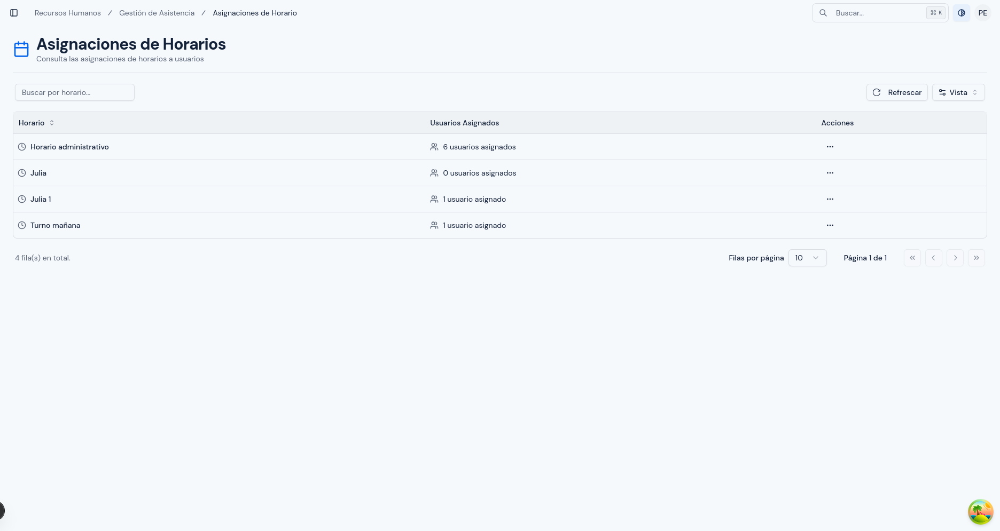
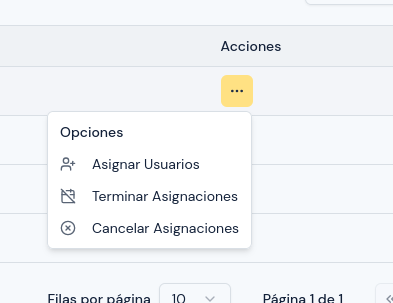
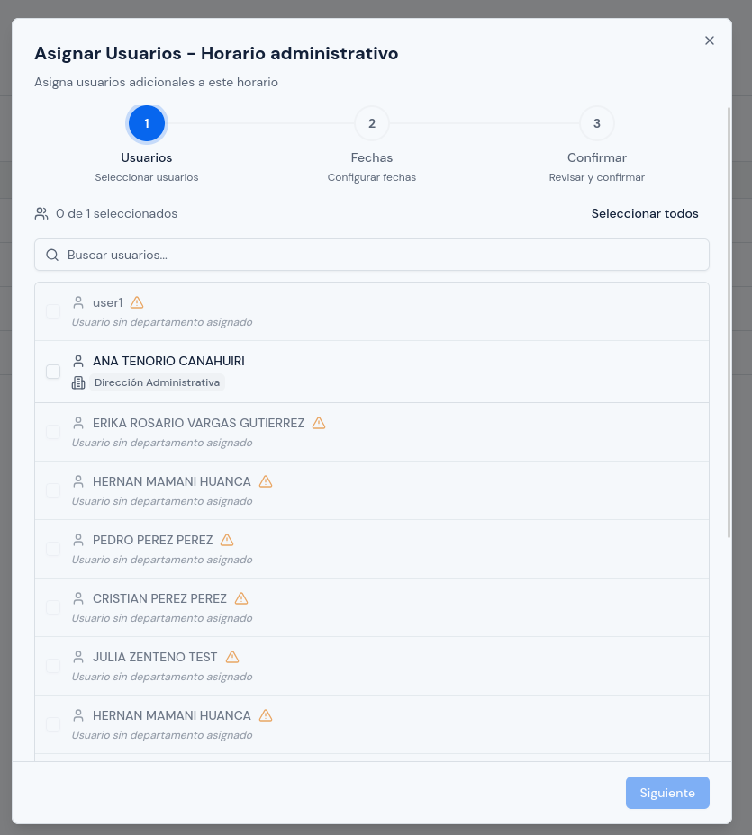
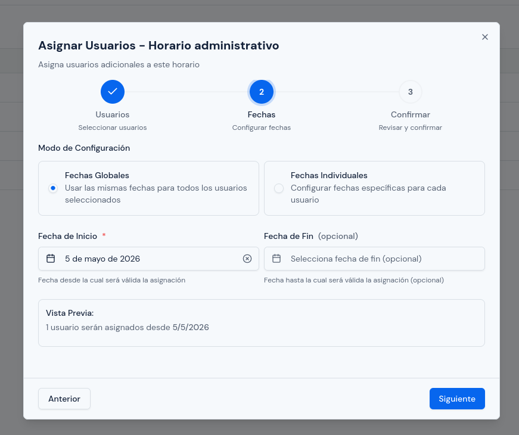
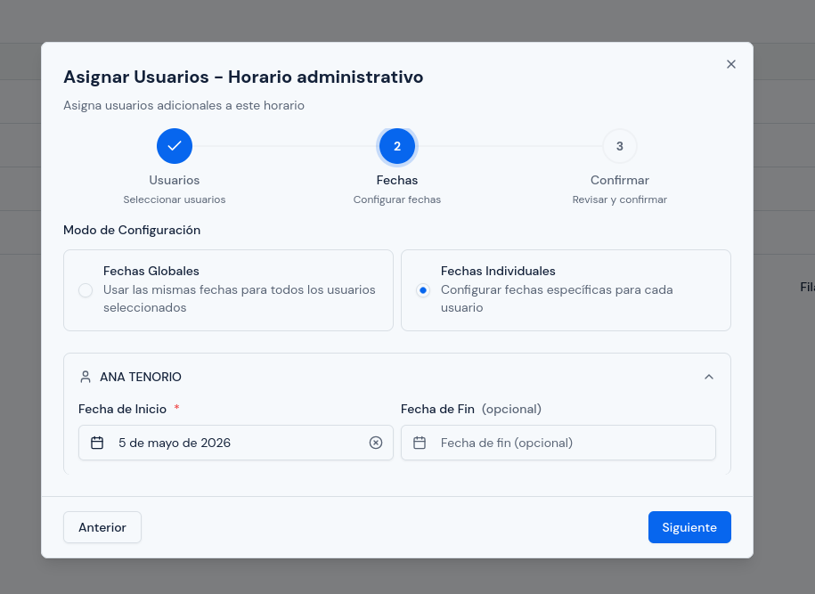
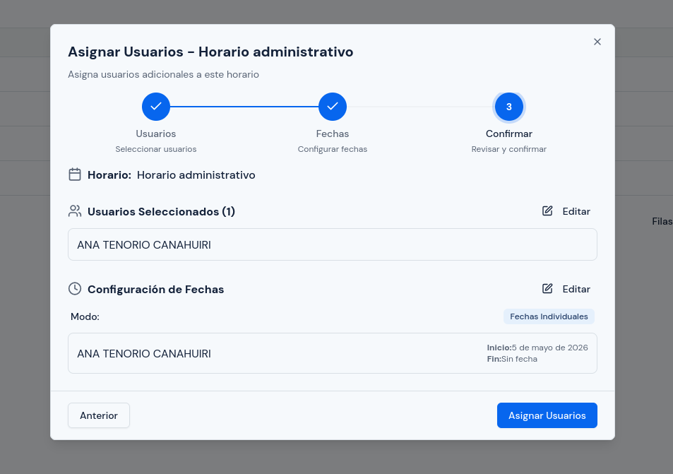
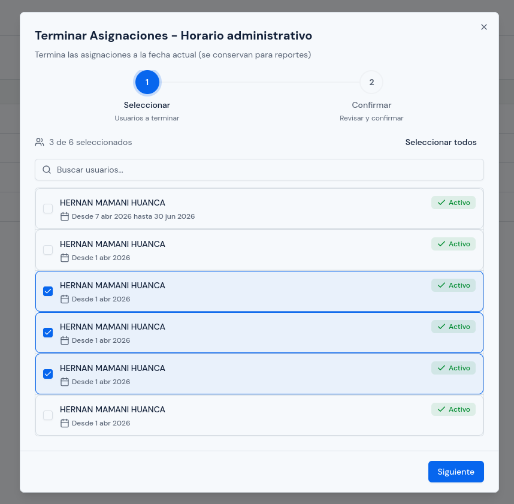
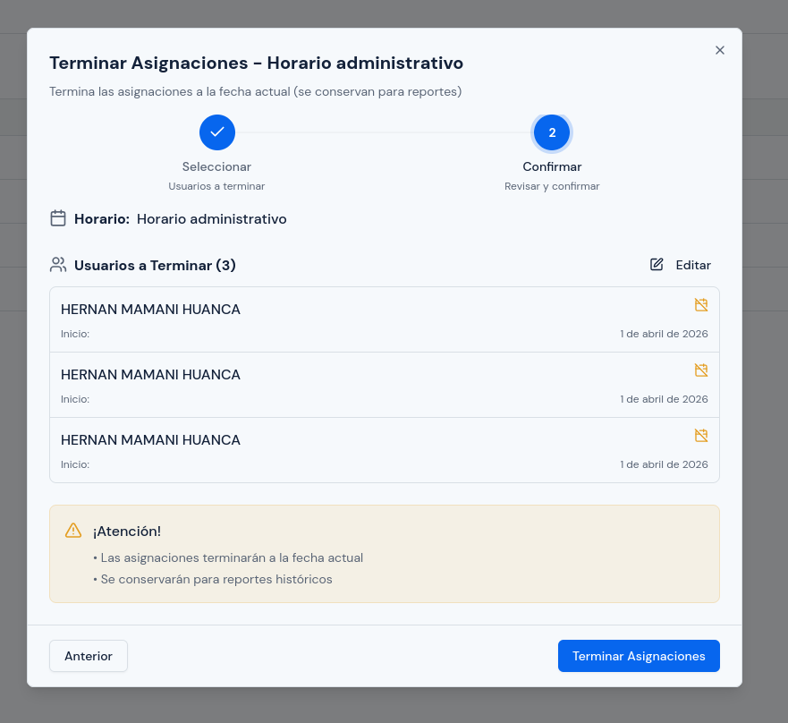
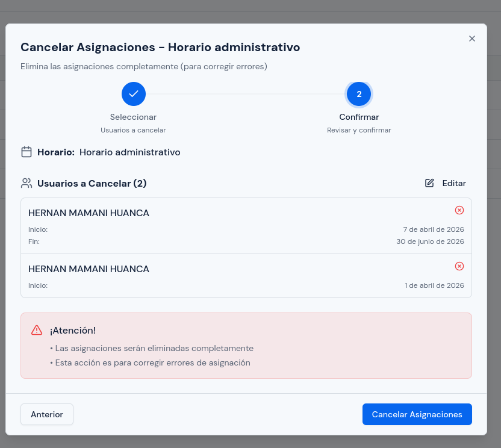

# Asignaciones de Horario

---

## Objetivo

Explicar cómo asignar un horario a una o varias personas, cómo cerrar una asignación vigente y cómo corregir una asignación creada por error.

Este módulo debe usarse con cuidado porque define desde cuándo una persona trabajará con un horario determinado y, por lo tanto, afecta la lectura posterior de asistencia.

---

## A quién aplica

Este manual aplica principalmente al personal con rol `RRHH` y, cuando corresponda, al rol `Administrador`.

---

## Ruta de acceso

1. Ingresa al sistema.
2. En el menú lateral, abre `Gestión de Asistencia`.
3. Haz clic en `Asignaciones`.

Ruta habitual: `/hr/scheduling/assignments`

---

## Para qué sirve este módulo

Este módulo permite:

- ver qué horarios ya tienen personas asignadas;
- asignar personas adicionales a un horario;
- cerrar asignaciones que ya no deben seguir vigentes;
- corregir asignaciones registradas por error.

---

## Qué verás en esta pantalla

En esta pantalla verás una lista de horarios activos.

Por cada horario normalmente encontrarás:

- el nombre del horario;
- la descripción, si fue registrada;
- la cantidad de personas asignadas;
- un menú de acciones.

Desde ese menú podrás ver estas opciones:

- `Asignar Usuarios`;
- `Terminar Asignaciones`;
- `Cancelar Asignaciones`.

`Terminar Asignaciones` y `Cancelar Asignaciones` solo aparecen cuando el horario ya tiene personas asignadas.

  

---

## Diferencia entre `Terminar` y `Cancelar`

Antes de usar estas opciones, debes distinguirlas bien:

- `Terminar` se usa cuando la asignación sí existió y debe cerrarse a partir de ahora.
- `Cancelar` se usa cuando la asignación fue un error y debe corregirse.

Usa `Cancelar` solo cuando tengas claro que no debe mantenerse esa asignación como vigente.

---

## Cómo está organizado el proceso

### Cuando asignas usuarios

El sistema usa tres pasos:

1. `Usuarios`
2. `Fechas`
3. `Confirmar`

### Cuando terminas o cancelas asignaciones

El sistema usa dos pasos:

1. `Seleccionar`
2. `Confirmar`

---

## Cómo asignar un horario

### Paso 1. Elegir el horario correcto

1. Busca el horario al que quieres agregar personas.
2. Revisa el nombre y la descripción.
3. Confirma que sea el horario correcto antes de abrir el menú de acciones.

### Paso 2. Abrir la opción `Asignar Usuarios`

1. En la fila del horario, abre `Acciones`.
2. Haz clic en `Asignar Usuarios`.

Se abrirá una ventana por pasos.

  

### Paso 3. Seleccionar personas

En el paso `Usuarios` verás la lista de personas disponibles para ese horario.

Aquí puedes:

- buscar por nombre o correo;
- marcar una o varias personas;
- usar `Seleccionar todos` si corresponde.

Qué debes tener en cuenta:

- una persona no podrá seleccionarse si no tiene departamento asignado;
- una persona no podrá seleccionarse si ya tiene otro horario activo que se cruza con el período vigente;
- una persona inactiva tampoco estará disponible.

Si una persona no puede seleccionarse, el sistema mostrará el motivo directamente en la lista.

  

### Paso 4. Definir las fechas

Después de seleccionar las personas, haz clic en `Siguiente`.

En el paso `Fechas` verás dos formas de trabajar:

- `Fechas Globales`
- `Fechas Individuales`

#### Opción `Fechas Globales`

Usa esta opción cuando todas las personas deben empezar y terminar el horario en las mismas fechas.

Debes completar:

- `Fecha de Inicio`
- `Fecha de Fin`, si corresponde

La `Fecha de Fin` es opcional. Si no la registras, el horario seguirá vigente hasta que luego se cierre o se cambie.

  

#### Opción `Fechas Individuales`

Usa esta opción cuando cada persona debe tener fechas distintas.

En este modo el sistema te mostrará cada persona por separado para que registres:

- `Fecha de Inicio`
- `Fecha de Fin`, si corresponde

Este modo es útil cuando:

- varias personas entran en días distintos;
- una persona tendrá una vigencia temporal;
- no todas las asignaciones empiezan el mismo día.

  

### Paso 5. Confirmar la asignación

En el paso `Confirmar`, revisa:

1. el nombre del horario;
2. la lista de personas seleccionadas;
3. el modo de fechas usado;
4. las fechas de inicio;
5. las fechas de fin, si existen.

Si encuentras un error, vuelve al paso anterior y corrígelo.

Si todo está correcto, haz clic en el botón final para crear la asignación.

  

---

## Cómo terminar una asignación

Usa esta opción cuando una persona ya no debe seguir con ese horario desde este momento en adelante.

### Paso 1. Abrir la opción `Terminar Asignaciones`

1. Ubica el horario correcto.
2. Abre `Acciones`.
3. Haz clic en `Terminar Asignaciones`.

### Paso 2. Seleccionar a las personas

1. Marca una o varias personas.
2. Revisa la fecha desde la que cada una estaba asignada.
3. Confirma que realmente deseas cerrar esas asignaciones.

  

### Paso 3. Confirmar

En la pantalla de confirmación, revisa:

1. el nombre de cada persona;
2. la fecha de inicio de su asignación;
3. la fecha de fin, si ya existiera;
4. que se trate del horario correcto.

Después confirma la acción.

En uso normal, `Terminar` se utiliza para cerrar una asignación vigente sin borrar la relación de trabajo que ya existió.

  

---

## Cómo cancelar una asignación

Usa esta opción cuando la asignación se registró por error y debe corregirse.

### Paso 1. Abrir la opción `Cancelar Asignaciones`

1. Ubica el horario correspondiente.
2. Abre `Acciones`.
3. Haz clic en `Cancelar Asignaciones`.

### Paso 2. Seleccionar la asignación correcta

1. Marca la persona o las personas que deseas corregir.
2. Revisa con cuidado el nombre y la fecha de inicio.
3. No continúes si tienes duda sobre cuál registro debes corregir.

### Paso 3. Confirmar

Antes de confirmar, revisa nuevamente:

1. que sea el horario correcto;
2. que sea la persona correcta;
3. que realmente se trate de una asignación errónea.

Después confirma la acción.

  

---

## Qué revisar antes de confirmar una asignación nueva

Antes de guardar una asignación nueva, revisa:

1. que abriste el horario correcto;
2. que las personas seleccionadas correspondan a ese horario;
3. que la fecha de inicio sea la deseada;
4. que la fecha de fin solo se use cuando realmente deba cerrarse en una fecha concreta;
5. que no estés asignando por error a personas que debían recibir otro horario.

---

## Qué revisar antes de terminar o cancelar

Antes de usar `Terminar` o `Cancelar`, revisa:

1. que elegiste el horario correcto;
2. que marcaste a la persona correcta;
3. que comprendes la diferencia entre cerrar una asignación y corregir una asignación errónea;
4. que no estás afectando una asignación que todavía debe seguir vigente.

---

## Errores o situaciones frecuentes

### La persona no aparece disponible para asignación

Revisa si ocurre alguna de estas situaciones:

1. la persona no tiene departamento asignado;
2. la persona ya tiene otro horario activo;
3. la persona no está activa en el sistema.

Si el sistema bloquea la selección, normalmente mostrará la causa en la misma lista.

### La persona aparece con otro horario asignado

Eso significa que ya tiene una asignación vigente que se cruza con el período actual.

Antes de crear una nueva asignación:

1. revisa cuál es el horario vigente;
2. confirma si primero debes terminar la asignación anterior;
3. evita dejar dos horarios activos para el mismo período.

### Se registró una fecha equivocada

Si la asignación ya fue creada:

1. identifica si se trata de una asignación que debe cerrarse o de una asignación hecha por error;
2. usa `Terminar` si la asignación sí correspondía pero ya debe cerrarse;
3. usa `Cancelar` si la asignación fue equivocada.

### No sabes si usar `Terminar` o `Cancelar`

Usa esta regla práctica:

- si la asignación sí debía existir y solo debe dejar de aplicarse, usa `Terminar`;
- si la asignación fue un error, usa `Cancelar`.

---

## Resultado esperado

Al finalizar, cada persona debe quedar vinculada al horario correcto, con la fecha de inicio adecuada y, si corresponde, con una fecha de cierre bien definida.
