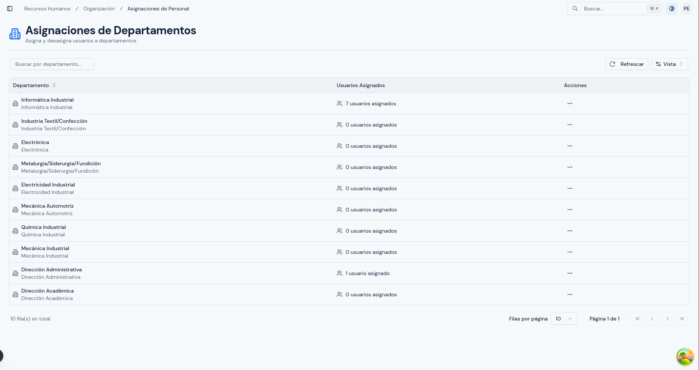
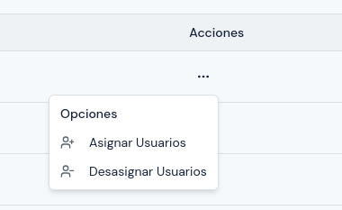
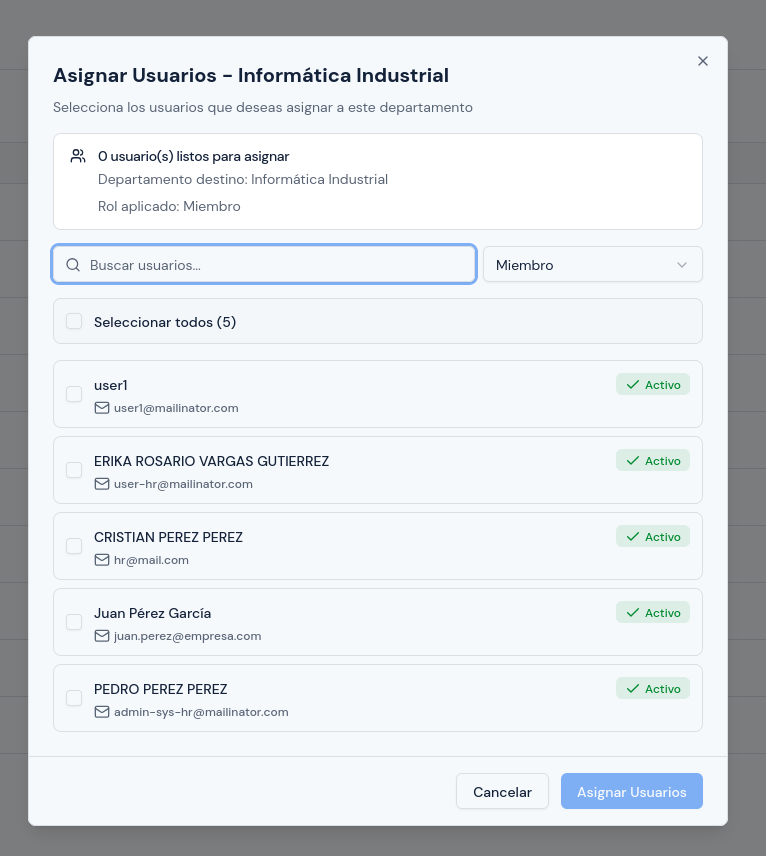
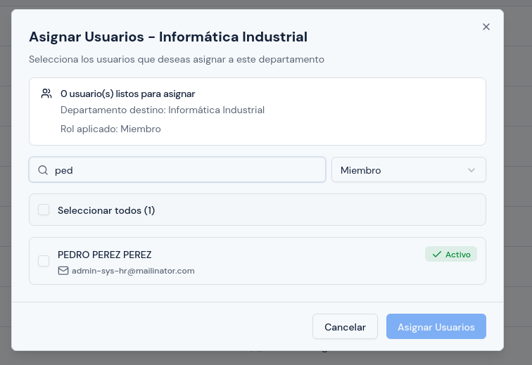
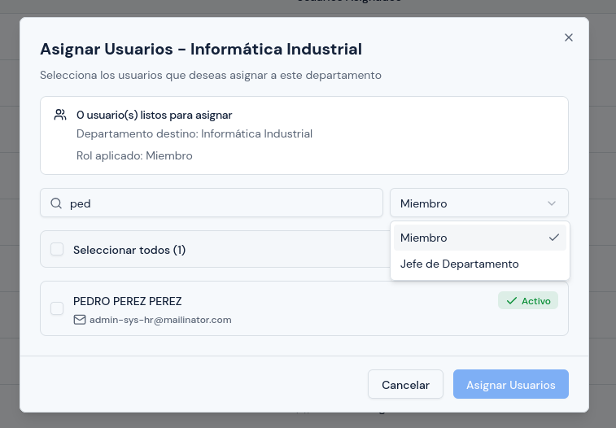
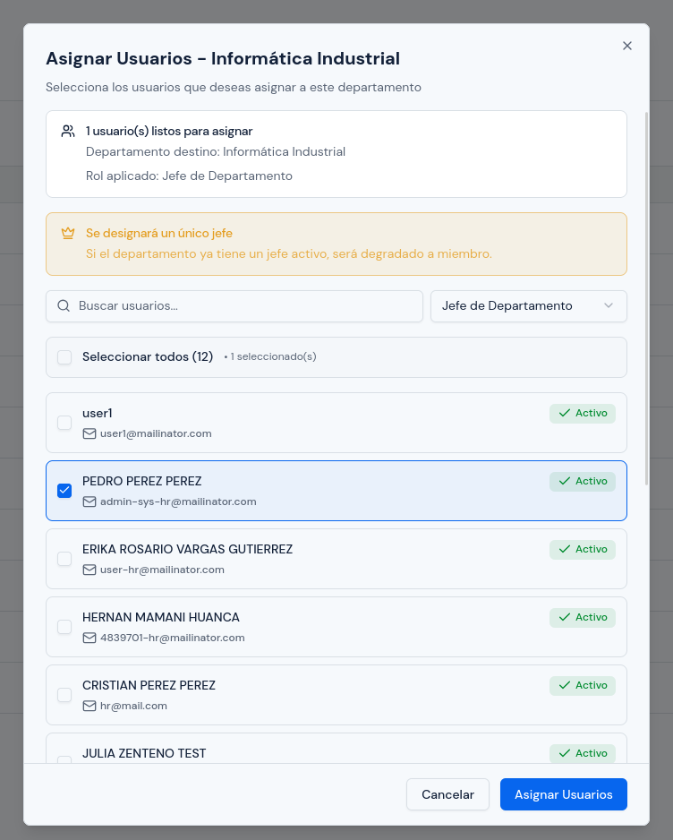
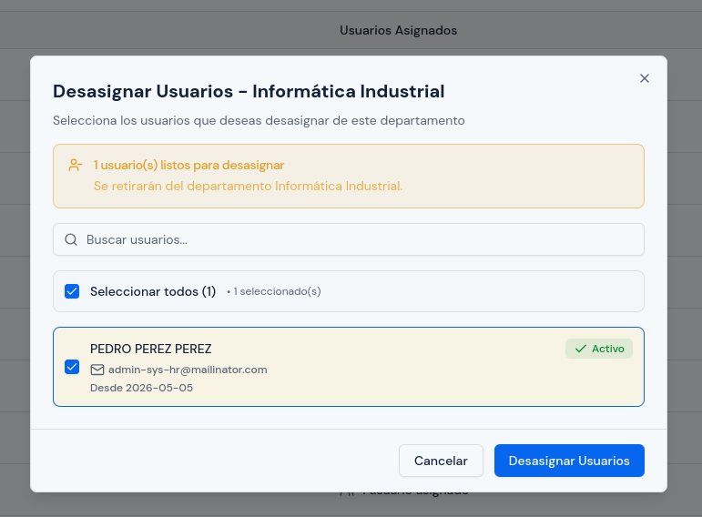

# Asignaciones de Personal

---

## Objetivo

Explicar cómo asignar y desasignar usuarios a un departamento dentro del sistema.

---

## A quién aplica

Este manual aplica principalmente al personal con rol `RRHH` y, cuando corresponda, al rol `Administrador`.

---

## Ruta de acceso

1. Ingresa al sistema.
2. En el menú lateral, abre `Organización`.
3. Haz clic en `Asignaciones de Personal`.

Ruta habitual: `/hr/organizational/assignments`

---

## Para qué sirve este módulo

Este módulo permite definir a qué departamento pertenece cada persona dentro de la estructura organizacional.

Se usa para:

- asignar usuarios a un departamento;
- retirar usuarios de un departamento;
- revisar cuántas personas tiene cada área;
- definir si una persona será `Miembro` o `Jefe de Departamento`;
- ordenar correctamente la estructura de personal por área.

---

## Qué verás en esta pantalla

En esta pantalla verás los departamentos agrupados con sus usuarios asignados.

  

Normalmente encontrarás:

- tabla principal;
- búsqueda;
- opción de refrescar;
- acciones por cada departamento.

La tabla puede mostrar columnas como:

- `Departamento`;
- `Usuarios Asignados`;
- `Acciones`.

### Qué muestra cada columna

#### `Departamento`

Muestra:

- nombre del departamento;
- descripción, cuando esté registrada.

#### `Usuarios Asignados`

Muestra cuántas personas están actualmente relacionadas con ese departamento.

#### `Acciones`

Desde aquí normalmente podrás ver opciones como:

- `Asignar Usuarios`;
- `Desasignar Usuarios`, cuando el departamento ya tiene personal asignado.

  

---

## Qué puedes hacer realmente en este módulo

Con la implementación actual, este módulo se usa principalmente para:

- asignar usuarios a un departamento;
- desasignar usuarios de un departamento;
- elegir el rol con el que una persona entra al departamento durante la asignación.

### Importante

En la pantalla actual:

- la asignación se realiza por departamento, no desde la ficha individual de cada usuario;
- el rol se define durante la asignación;
- no se muestra en esta pantalla una acción visible separada para editar el rol de una asignación ya creada;
- si una persona ya pertenece a otro departamento, el sistema puede trasladarla al nuevo departamento durante la asignación.

---

## Qué roles existen dentro del departamento

En este módulo se usan principalmente estos roles:

- `Miembro`
- `Jefe de Departamento`

### Qué debes tomar en cuenta

- `Miembro` es el rol regular para la mayoría del personal.
- `Jefe de Departamento` debe asignarse con cuidado.
- Solo se puede designar un `Jefe de Departamento` a la vez por cada departamento.
- Si asignas como jefe a una nueva persona, el jefe anterior pasará a `Miembro`.

---

## Cómo asignar usuarios a un departamento

1. Ubica el departamento correcto en la tabla.
2. Abre `Acciones`.
3. Selecciona `Asignar Usuarios`.
4. Revisa el nombre del departamento destino en la ventana que se abre.
5. Busca a la persona o personas que deseas asignar.
6. Marca las casillas de selección.
7. Si corresponde, define el rol.
8. Revisa el resumen mostrado por la ventana.
9. Haz clic en `Asignar Usuarios`.

  

---

## Cómo buscar personas para asignar

Dentro de la ventana de asignación:

1. usa el buscador para ubicar a la persona;
2. escribe nombre, apellido o correo, según corresponda;
3. revisa la lista filtrada;
4. marca la persona correcta.

  

Si necesitas asignar a varias personas, puedes marcar varias casillas.

---

## Cómo seleccionar el rol al asignar

Durante la asignación verás un selector de rol.

  

### Si eliges `Miembro`

La persona será incorporada al departamento como integrante regular.

### Si eliges `Jefe de Departamento`

Debes tomar en cuenta estas reglas:

1. solo puedes seleccionar una persona a la vez;
2. si eliges más de una persona, el sistema limitará esa opción;
3. si el departamento ya tiene jefe activo, ese jefe anterior será reemplazado como jefe y pasará a `Miembro`.

  

---

## Qué revisar antes de confirmar una asignación

Antes de hacer clic en `Asignar Usuarios`:

1. confirma que el departamento destino sea el correcto;
2. revisa que las personas seleccionadas sean las correctas;
3. verifica si la asignación será como `Miembro` o como `Jefe de Departamento`;
4. si estás nombrando un jefe, confirma que realmente deba asumir ese rol;
5. si la persona ya pertenece a otra área, confirma que el traslado sea correcto.

---

## Cómo desasignar usuarios de un departamento

1. Ubica el departamento correspondiente en la tabla.
2. Abre `Acciones`.
3. Selecciona `Desasignar Usuarios`.
4. Revisa la lista de personas actualmente asignadas.
5. Marca a la persona o personas que deseas retirar.
6. Revisa el resumen mostrado por la ventana.
7. Haz clic en `Desasignar Usuarios`.

  

---

## Qué revisar antes de desasignar

Antes de confirmar:

1. verifica que estás en el departamento correcto;
2. confirma que la persona realmente debe salir de esa área;
3. si se trata del jefe del departamento, valida el impacto antes de retirarlo;
4. si solo necesitas mover a la persona a otra área, confirma que el cambio sea coherente con la nueva asignación.

---

## Cómo interpretar el comportamiento del sistema

### Si una persona ya estaba en otro departamento

Cuando asignas a una persona que ya pertenece a otro departamento, el sistema puede moverla al nuevo departamento.

Eso significa que:

- no quedará activa en dos departamentos al mismo tiempo;
- su relación anterior puede dejar de estar vigente;
- conviene revisar bien el destino antes de confirmar.

### Si asignas un nuevo jefe

El sistema mantendrá un único jefe activo por departamento.

Si nombras a otra persona como jefe:

- la nueva persona quedará como `Jefe de Departamento`;
- la anterior dejará de tener ese rol y pasará a `Miembro`.

---

## Errores o situaciones frecuentes

### No encuentras una persona para asignar

Revisa:

1. si la persona ya está asignada a algún departamento;
2. si la cuenta ya existe en el sistema;
3. si el nombre, apellido o correo fueron escritos correctamente;
4. si la persona está activa.

### El sistema no te deja poner jefe a varias personas

Eso es normal.

El rol `Jefe de Departamento` solo puede asignarse a una persona a la vez.

### El departamento ya tenía jefe

Si asignas un nuevo jefe:

1. revisa el resumen antes de confirmar;
2. confirma que el cambio de responsable es correcto;
3. ten presente que el jefe anterior dejará de tener ese rol.

### La persona desapareció de su departamento anterior

Eso puede pasar si fue trasladada al nuevo departamento durante la asignación.

En ese caso:

1. revisa el departamento destino;
2. confirma que el traslado era el esperado;
3. si fue un error, corrige la asignación correspondiente.

### No puedes desasignar a nadie

Revisa:

1. si el departamento realmente tiene personal asignado;
2. si marcaste al menos una persona;
3. si estás en la acción correcta de `Desasignar Usuarios`.

---

## Resultado esperado

Al finalizar, debes poder:

- asignar personas al departamento correcto;
- retirar personas de un departamento cuando corresponda;
- definir correctamente si una persona será `Miembro` o `Jefe de Departamento`;
- mantener actualizada la relación entre usuarios y departamentos.
