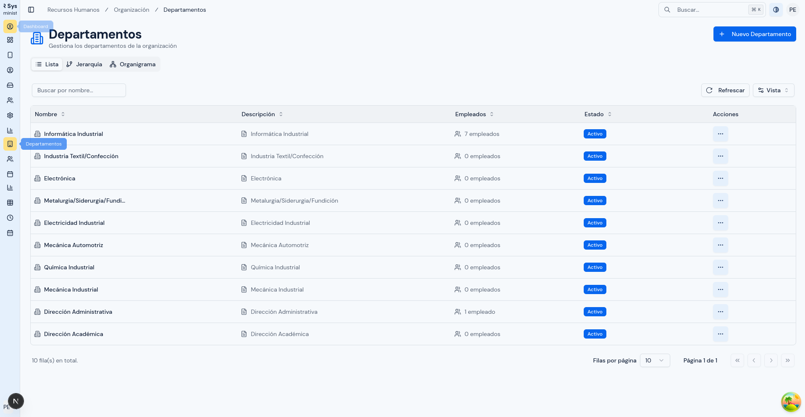
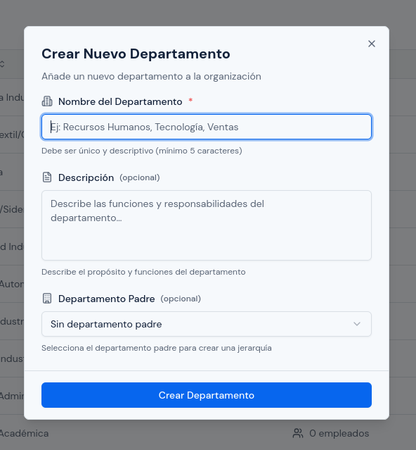
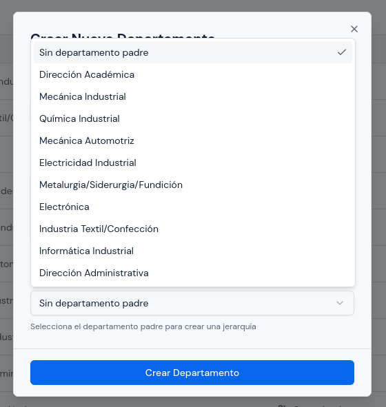
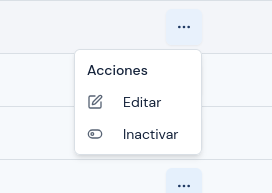
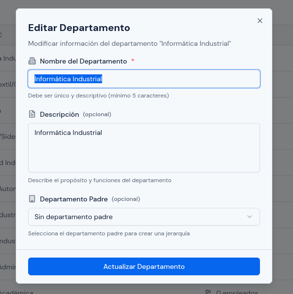
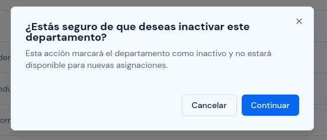
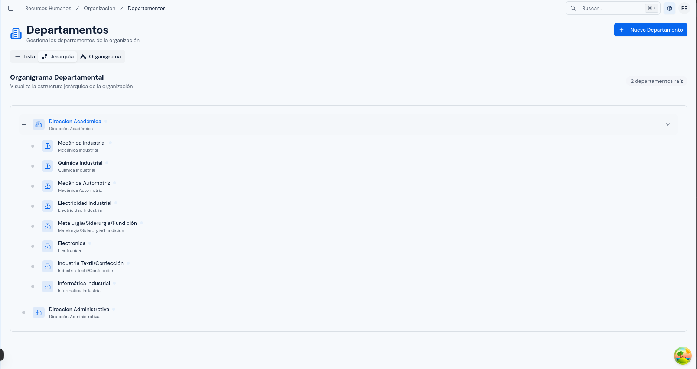
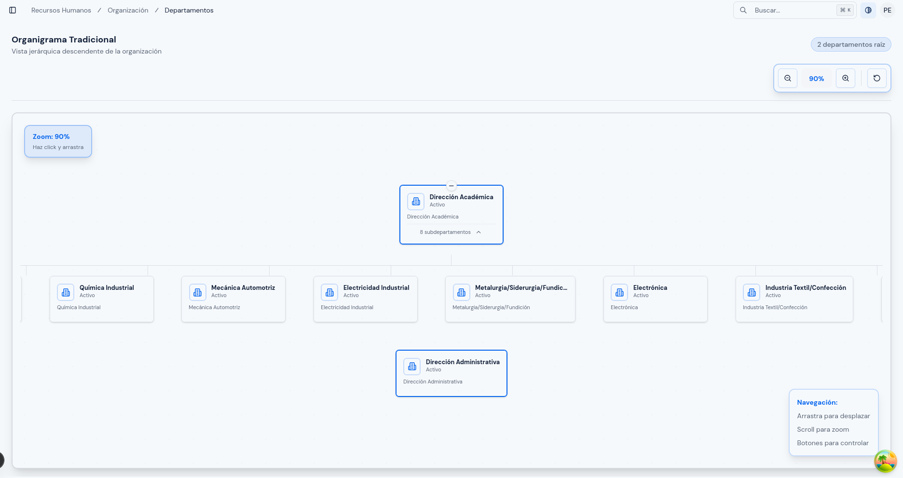

# Departamentos

---

## Objetivo

Explicar cómo registrar, actualizar, activar e inactivar departamentos dentro del sistema, así como revisar su estructura en forma de lista, jerarquía y organigrama.

---

## A quién aplica

Este manual aplica principalmente al personal con rol `RRHH` y, cuando corresponda, al rol `Administrador`.

---

## Ruta de acceso

1. Ingresa al sistema.
2. En el menú lateral, abre `Organización`.
3. Haz clic en `Departamentos`.

Ruta habitual: `/hr/organizational/departments`

---

## Para qué sirve este módulo

Este módulo permite organizar la estructura interna de la institución o empresa.

Se usa para:

- registrar departamentos;
- mantener sus nombres y descripciones actualizados;
- definir relaciones entre un departamento y otro;
- revisar la estructura organizacional;
- dejar departamentos activos o inactivos según corresponda.

---

## Qué verás en esta pantalla

En esta pantalla normalmente encontrarás:

- botón `Nuevo Departamento`;
- pestaña `Lista`;
- pestaña `Jerarquía`;
- pestaña `Organigrama`.

  

### Vista `Lista`

La vista `Lista` muestra el detalle de los departamentos registrados.

Normalmente encontrarás:

- tabla principal;
- búsqueda;
- opción de refrescar;
- acciones por registro.

La tabla puede mostrar columnas como:

- `Nombre`;
- `Descripción`;
- `Empleados`;
- `Estado`;
- `Acciones`.

### Vista `Jerarquía`

La vista `Jerarquía` permite revisar cómo se relacionan los departamentos entre sí en una estructura escalonada.

### Vista `Organigrama`

La vista `Organigrama` permite revisar la estructura organizacional de forma visual.

---

## Qué significa departamento padre

El `Departamento Padre` sirve para indicar que un departamento depende de otro dentro de la estructura organizacional.

Por ejemplo:

- `Recursos Humanos` puede no tener departamento padre;
- `Capacitación` puede depender de `Recursos Humanos`.

Si no necesitas jerarquía, puedes dejar la opción `Sin departamento padre`.

---

## Cómo crear un departamento

1. Haz clic en `Nuevo Departamento`.
2. En `Nombre del Departamento`, escribe el nombre.
3. Si corresponde, escribe una `Descripción`.
4. Si el departamento depende de otro, selecciona un `Departamento Padre`.
5. Revisa la información.
6. Haz clic en `Crear Departamento`.

  

---

## Qué revisar antes de crear un departamento

Antes de guardar:

1. confirma que el nombre sea claro;
2. verifica que el nombre no esté repetido;
3. revisa que la descripción sea útil y breve;
4. confirma que el `Departamento Padre` sea el correcto;
5. si no debe depender de otro, deja `Sin departamento padre`.

  

---

## Cómo editar un departamento

1. Busca el departamento en la vista `Lista`.
2. En `Acciones`, selecciona `Editar`.
3. Corrige el nombre, la descripción o el departamento padre, según corresponda.
4. Revisa nuevamente la información.
5. Haz clic en `Actualizar Departamento`.

  

  

---

## Qué revisar antes de guardar un cambio

Antes de actualizar un departamento:

1. confirma que no estás duplicando el nombre de otro departamento activo;
2. revisa que el nuevo departamento padre sea correcto;
3. verifica que no estás generando una estructura equivocada;
4. si el departamento ya tiene personal relacionado, confirma el impacto del cambio.

---

## Cómo activar o inactivar un departamento

1. Busca el registro en la vista `Lista`.
2. En `Acciones`, selecciona `Activar` o `Inactivar`, según corresponda.
3. Lee el mensaje de confirmación.
4. Confirma la acción.

  

### Cuándo conviene inactivar

Conviene inactivar un departamento cuando:

- ya no debe usarse para nuevas asignaciones;
- dejó de formar parte de la estructura vigente;
- necesitas conservar el historial, pero evitar su uso operativo.

### Qué ocurre cuando se inactiva

Después de inactivar un departamento:

- dejará de estar disponible para nuevas asignaciones;
- dejará de aparecer como opción activa en procesos relacionados;
- su información seguirá formando parte del historial del sistema.

---

## Cómo usar la vista `Jerarquía`

Usa la vista `Jerarquía` cuando necesites revisar la relación entre departamentos de forma ordenada.

Te ayuda a validar:

- qué departamentos son principales;
- qué departamentos dependen de otros;
- si la estructura está organizada correctamente.

  

Si observas una relación equivocada, vuelve a la vista `Lista`, edita el departamento y corrige su `Departamento Padre`.

---

## Cómo usar la vista `Organigrama`

Usa la vista `Organigrama` cuando necesites una lectura visual de la estructura.

Esta vista es útil para:

- presentar la organización de forma más clara;
- validar rápidamente la estructura general;
- detectar relaciones incorrectas entre áreas.

  

Si detectas un error, la corrección también se realiza desde la vista `Lista`.

---

## Errores o situaciones frecuentes

### El departamento no aparece

Revisa:

1. si el nombre fue escrito correctamente;
2. si el departamento está inactivo;
3. si estás buscando en la vista correcta;
4. si realmente fue creado.

### El sistema no deja guardar el nombre

Revisa:

1. si ya existe otro departamento activo con ese nombre;
2. si el nombre tiene pocos caracteres;
3. si el nombre incluye espacios o texto innecesario.

### La jerarquía quedó mal

Si un departamento depende del área equivocada:

1. abre la vista `Lista`;
2. busca el departamento;
3. selecciona `Editar`;
4. corrige el `Departamento Padre`;
5. guarda nuevamente.

### Se intentó dejar un departamento dentro de sí mismo

Esa relación no es válida.

El departamento no puede:

- depender de sí mismo;
- quedar dentro de una cadena jerárquica circular.

Si eso ocurre, revisa cuidadosamente qué departamento debe quedar como padre.

### Un departamento inactivo ya no aparece para nuevas operaciones

Eso es normal.

Si necesitas volver a usarlo:

1. búscalo en la lista;
2. usa la acción `Activar`;
3. confirma la acción.

---

## Resultado esperado

Al finalizar, debes poder:

- registrar departamentos correctamente;
- mantener sus datos actualizados;
- organizar su jerarquía;
- identificar departamentos activos e inactivos;
- revisar la estructura en lista, jerarquía y organigrama.
