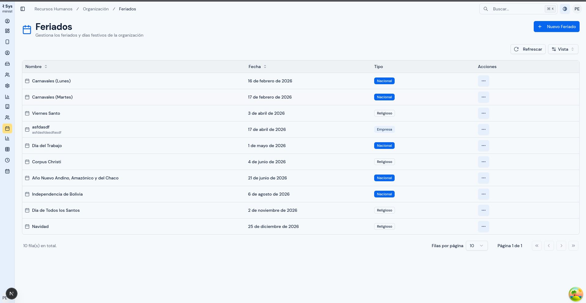
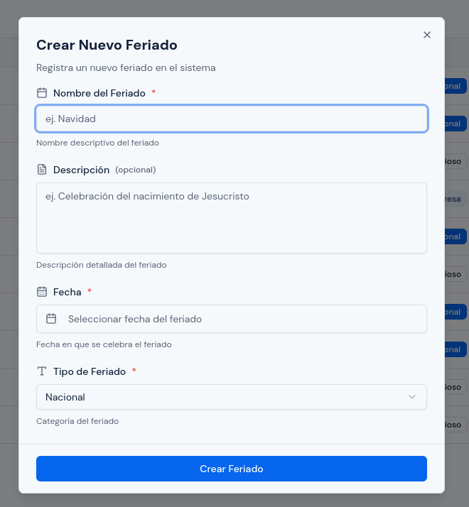
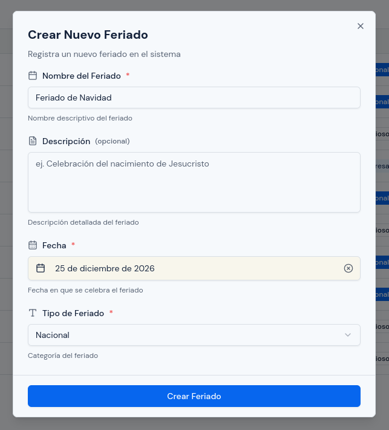
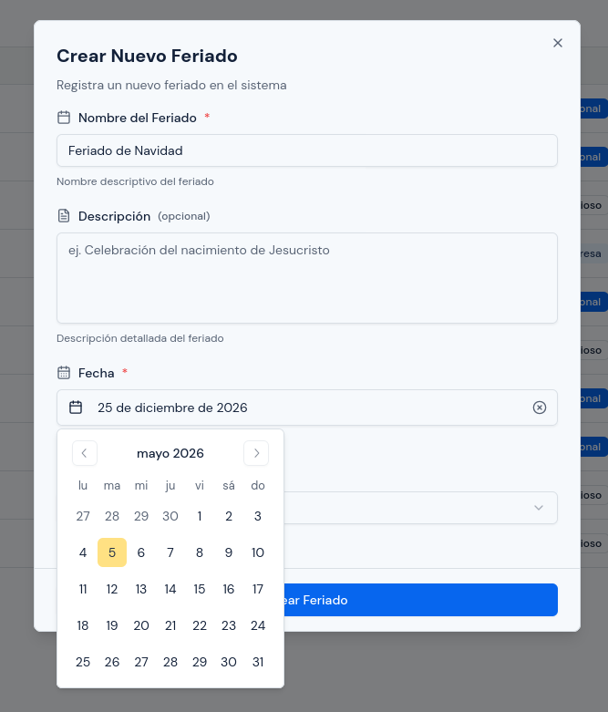
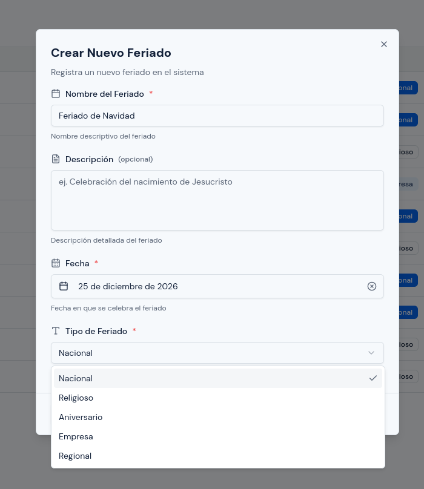
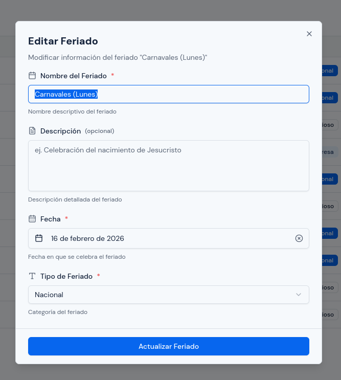
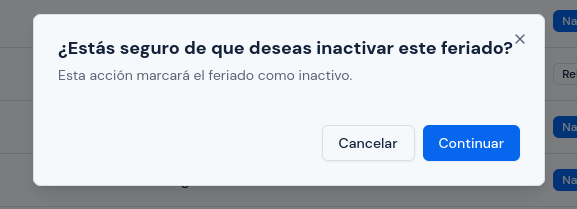

# Feriados

---

## Objetivo

Explicar cómo registrar, revisar, editar e inactivar feriados dentro del sistema.

Este módulo es importante porque los feriados influyen en la interpretación de la asistencia y en la lectura correcta de días laborables.

---

## A quién aplica

Este manual aplica principalmente al personal con rol `RRHH` y, cuando corresponda, al rol `Administrador`.

---

## Ruta de acceso

1. Ingresa al sistema.
2. En el menú lateral, abre `Organización`.
3. Haz clic en `Feriados`.

Ruta habitual: `/hr/organizational/holidays`

---

## Para qué sirve este módulo

Este módulo permite:

- registrar fechas festivas que deben ser consideradas por el sistema;
- clasificar cada feriado según su tipo;
- mantener actualizada la lista de feriados activos;
- corregir registros cuando exista un error de nombre, fecha o categoría.

---

## Qué verás en esta pantalla

En esta pantalla normalmente encontrarás:

- un listado de feriados;
- el nombre de cada feriado;
- la fecha registrada;
- el tipo de feriado;
- un menú de acciones por cada registro;
- la opción para crear un nuevo feriado.

En el listado también podrás usar búsqueda y, según la vista disponible, revisar el estado del registro.

  

---

## Información que se registra en un feriado

Cada feriado puede incluir estos datos:

- `Nombre del Feriado`
- `Descripción`
- `Fecha`
- `Tipo de Feriado`

### `Nombre del Feriado`

Es el nombre con el que identificarás la fecha festiva.

Usa nombres claros, por ejemplo:

- `Año Nuevo`
- `Navidad`
- `Aniversario de la Empresa`

### `Descripción`

Es un texto opcional para aclarar mejor el motivo o alcance del feriado.

Puedes usarla para añadir contexto cuando el nombre por sí solo no sea suficiente.

### `Fecha`

Es el día exacto en que el sistema considerará ese feriado.

Debes revisarla con cuidado porque una fecha incorrecta afecta reportes y controles posteriores.

### `Tipo de Feriado`

El sistema permite estas categorías:

- `Nacional`
- `Religioso`
- `Aniversario`
- `Empresa`
- `Regional`

Selecciona la categoría que mejor corresponda al caso real.

---

## Cómo crear un feriado

### Paso 1. Abrir el formulario

1. Haz clic en `Crear Nuevo Feriado`.
2. Espera a que se abra la ventana de registro.

  

### Paso 2. Completar la información

1. En `Nombre del Feriado`, escribe el nombre.
2. Si corresponde, registra una `Descripción`.
3. En `Fecha`, selecciona el día correcto.
4. En `Tipo de Feriado`, elige la categoría adecuada.

  

  

  

### Paso 3. Revisar antes de guardar

Antes de confirmar, revisa:

1. que el nombre esté bien escrito;
2. que la fecha sea exactamente la correcta;
3. que el tipo elegido corresponda al feriado;
4. que no estés registrando nuevamente un feriado que ya existe.

### Paso 4. Guardar

1. Haz clic en `Crear Feriado`.
2. Verifica que el registro aparezca en la lista.

---

## Cómo editar un feriado

Usa esta opción cuando necesites corregir el nombre, la descripción, la fecha o el tipo.

1. Busca el feriado en la tabla.
2. Abre `Acciones`.
3. Haz clic en `Editar`.
4. Corrige solo los campos necesarios.
5. Revisa nuevamente la fecha y el tipo.
6. Guarda los cambios.

  

---

## Cómo inactivar un feriado

Usa esta opción cuando un feriado ya no deba seguir considerándose como vigente, pero quieras conservar el registro.

1. Busca el feriado en la tabla.
2. Abre `Acciones`.
3. Haz clic en `Inactivar`.
4. Lee el mensaje de confirmación.
5. Confirma la acción.

Antes de inactivar, revisa con cuidado si ese feriado ya fue usado como referencia en controles o revisiones recientes.

  

---

## Nota sobre esta pantalla

En la vista actual se trabajan feriados activos. Por eso, la acción visible en esta pantalla es `Inactivar`.

---

## Qué revisar antes de guardar o actualizar

Antes de guardar un registro nuevo o editar uno existente, revisa:

1. que el nombre sea claro;
2. que la fecha esté correcta;
3. que el tipo corresponda al caso;
4. que la descripción, si se usa, ayude realmente a identificar el feriado;
5. que no estés duplicando un feriado con el mismo nombre y la misma fecha.

---

## Cuándo conviene revisar este módulo

Conviene revisar este módulo cuando:

- comienza una nueva gestión;
- se incorpora un feriado extraordinario;
- se detecta que una fecha festiva no fue tomada en cuenta;
- se necesita corregir una fecha registrada de manera equivocada.

---

## Errores o situaciones frecuentes

### El sistema no permite guardar el feriado

Revisa si ocurre alguna de estas situaciones:

1. falta completar el nombre;
2. falta seleccionar la fecha;
3. falta seleccionar el tipo;
4. el nombre o la descripción superan la longitud permitida.

### Ya existe un feriado parecido

Si el sistema detecta que ya existe un feriado activo con el mismo nombre y la misma fecha, no permitirá crear otro igual.

En ese caso:

1. revisa si el registro ya existe;
2. confirma si debes editar el registro existente;
3. evita crear duplicados para la misma fecha.

### El feriado no se refleja como esperabas

Revisa:

1. si la fecha fue registrada correctamente;
2. si el feriado está activo;
3. si estás consultando exactamente el mismo día;
4. si el registro corresponde realmente al tipo de feriado esperado.

### Se registró una fecha incorrecta

Si el registro existe pero la fecha está mal:

1. ubica el feriado;
2. edítalo si corresponde corregirlo;
3. si el registro ya no debe usarse, inactívalo y crea uno nuevo solo si es necesario.

---

## Resultado esperado

Al finalizar, los feriados deben quedar correctamente registrados y clasificados para que el sistema los considere en los procesos de asistencia y consulta.
