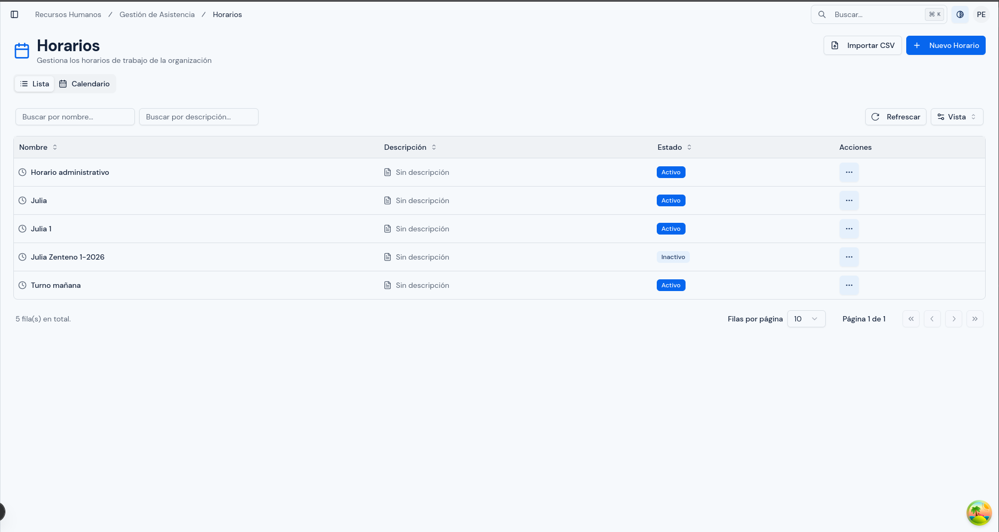
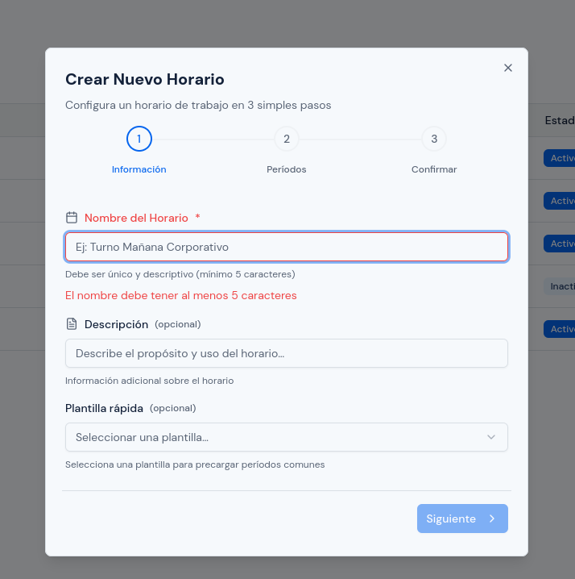
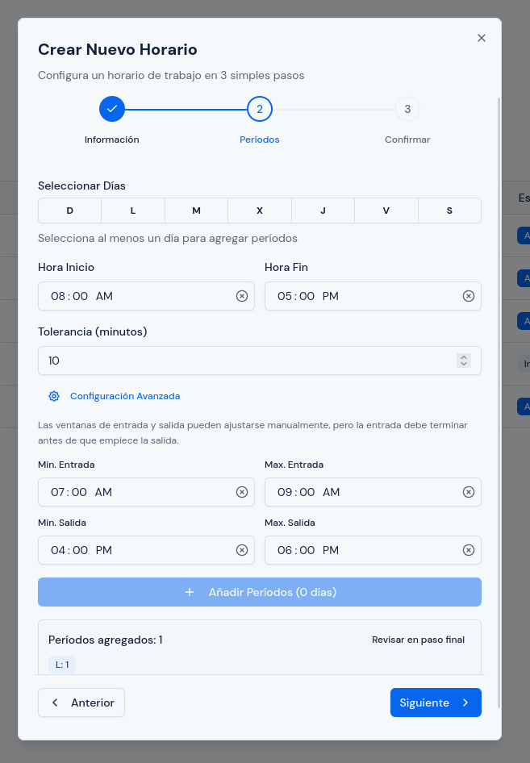
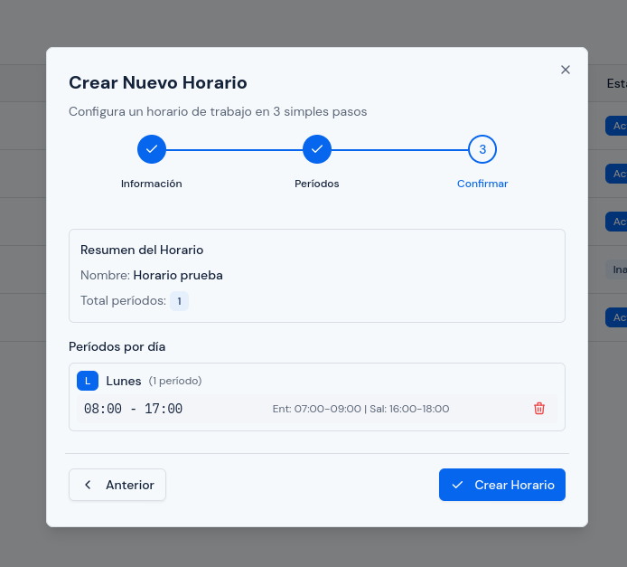
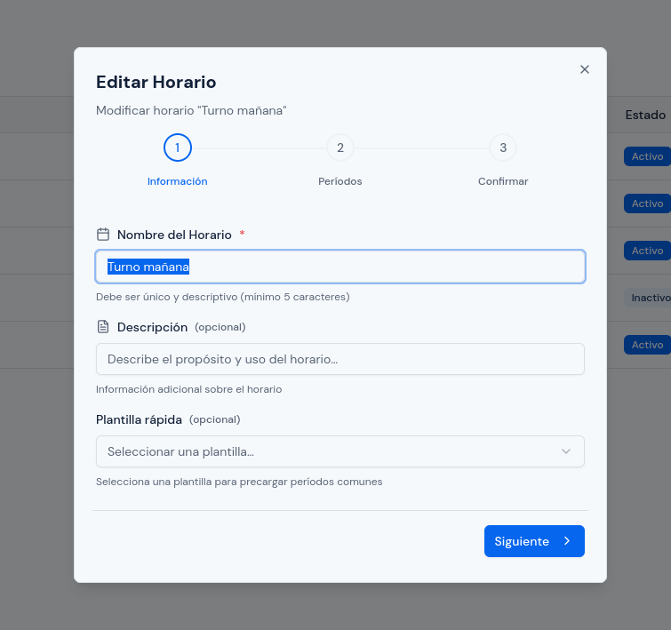
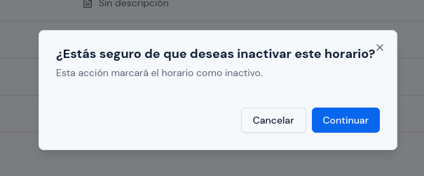
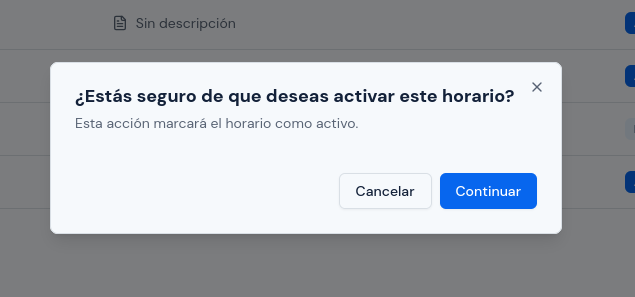
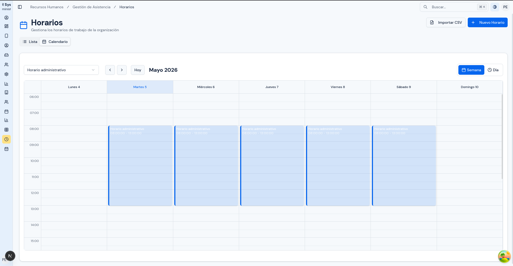
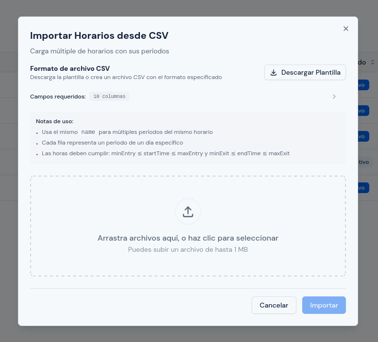
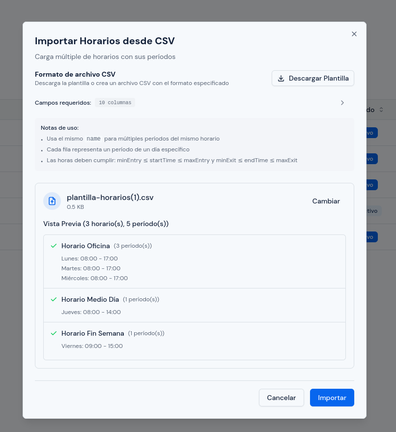

# Horarios

---

## Objetivo

Explicar cómo crear, revisar, editar, activar e inactivar horarios de trabajo dentro del sistema.

Este módulo requiere especial cuidado porque los horarios afectan directamente la lectura de marcaciones, la interpretación de llegadas y salidas, y los resultados posteriores en asistencia.

---

## A quién aplica

Este manual aplica principalmente al personal con rol `RRHH` y, cuando corresponda, al rol `Administrador`.

---

## Ruta de acceso

1. Ingresa al sistema.
2. En el menú lateral, abre `Gestión de Asistencia`.
3. Haz clic en `Horarios`.

Ruta habitual: `/hr/scheduling/schedules`

---

## Para qué sirve este módulo

Este módulo permite definir las jornadas que luego podrán asignarse al personal.

Se usa para:

- crear horarios nuevos;
- definir días y horas de trabajo;
- configurar tolerancia;
- establecer ventanas válidas de entrada y salida;
- revisar horarios existentes;
- activar o inactivar horarios.

---

## Qué verás en esta pantalla

En esta pantalla normalmente encontrarás:

- botón `Nuevo Horario`;
- botón `Importar CSV`;
- pestaña `Lista`;
- pestaña `Calendario`.

  

### Vista `Lista`

La vista `Lista` muestra el detalle de los horarios registrados.

Normalmente verás:

- nombre del horario;
- descripción;
- estado;
- acciones por registro.

### Vista `Calendario`

La vista `Calendario` ayuda a revisar los horarios de una forma más visual, especialmente para entender cómo quedaron distribuidos los períodos por día.

---

## Cómo está organizado el formulario

La creación y edición de horarios se realiza en tres pasos:

1. `Información`
2. `Períodos`
3. `Confirmar`

Esto ayuda a evitar errores, pero aun así debes revisar cada paso con cuidado antes de continuar.

---

## Paso 1. Información

En este paso se registran los datos básicos del horario.

Normalmente deberás completar:

- `Nombre del Horario`
- `Descripción`
- `Plantilla rápida`, si deseas usar una base predefinida

### Qué revisar en este paso

1. que el nombre sea claro y fácil de reconocer;
2. que el nombre no se confunda con otros horarios;
3. que la descripción realmente ayude a identificar el uso del horario;
4. que la plantilla elegida coincida con la jornada que deseas construir.

  

---

## Paso 2. Períodos

Este es el paso más sensible del módulo.

Aquí defines:

- días de la semana;
- hora de inicio;
- hora de fin;
- tolerancia;
- ventanas de entrada;
- ventanas de salida.

También puedes añadir períodos para varios días a la vez.

  

---

## Qué es un período

Un período representa un tramo de trabajo para un día concreto.

Por ejemplo:

- lunes de `08:00` a `17:00`;
- martes de `08:00` a `17:00`;
- miércoles de `08:00` a `17:00`.

Cada uno de esos tramos es un período.

Un mismo horario puede tener uno o varios períodos, según la necesidad.

---

## Qué significa cada campo del período

### `Hora Inicio`

Es la hora esperada de entrada o inicio de jornada para ese período.

### `Hora Fin`

Es la hora esperada de salida o cierre de jornada para ese período.

### `Tolerancia`

Es el margen, en minutos, que se permite alrededor de la hora esperada sin considerar inmediatamente que hubo retraso o desviación operativa.

La tolerancia debe configurarse con criterio institucional. No conviene ampliarla sin necesidad.

### `Min. Entrada`

Es la hora más temprana desde la cual una marcación puede considerarse dentro de la ventana válida de entrada.

### `Max. Entrada`

Es la hora más tardía hasta la cual una marcación todavía puede considerarse dentro de la ventana válida de entrada.

### `Min. Salida`

Es la hora más temprana desde la cual una marcación puede considerarse dentro de la ventana válida de salida.

### `Max. Salida`

Es la hora más tardía hasta la cual una marcación puede considerarse dentro de la ventana válida de salida.

---

## Cómo entender las ventanas de tiempo

Las ventanas de tiempo sirven para indicarle al sistema dentro de qué rango debe interpretar una marcación como entrada o como salida.

### Ejemplo simple

Si un período tiene:

- `Hora Inicio`: `08:00`
- `Hora Fin`: `17:00`
- `Min. Entrada`: `07:00`
- `Max. Entrada`: `09:00`
- `Min. Salida`: `16:00`
- `Max. Salida`: `18:00`

entonces:

- una marcación en la mañana entre `07:00` y `09:00` podrá caer dentro de la ventana de entrada;
- una marcación en la tarde entre `16:00` y `18:00` podrá caer dentro de la ventana de salida.

### Regla importante

La ventana de entrada debe terminar antes de que comience la ventana de salida.

No deben superponerse.

---

## Reglas que debes respetar al configurar ventanas

El sistema valida estas reglas:

1. la `Hora Inicio` debe quedar dentro de la ventana de entrada;
2. la `Hora Fin` debe quedar dentro de la ventana de salida;
3. la `Hora Fin` debe ser mayor que la `Hora Inicio`;
4. `Min. Entrada` no puede ser mayor que `Max. Entrada`;
5. `Min. Salida` no puede ser mayor que `Max. Salida`;
6. la ventana de entrada debe terminar antes de que empiece la de salida;
7. la salida no puede comenzar antes de la hora de inicio;
8. no debe haber solapes entre períodos del mismo día.

Si una de estas reglas falla, el sistema puede impedir el guardado o generar resultados inconsistentes después.

---

## Cómo crear un horario

### Paso 1. Registrar la información general

1. Haz clic en `Nuevo Horario`.
2. Escribe el nombre del horario.
3. Si corresponde, agrega una descripción.
4. Si te ayuda, elige una `Plantilla rápida`.
5. Haz clic en `Siguiente`.

### Paso 2. Configurar los períodos

1. Selecciona uno o varios días.
2. Define `Hora Inicio`.
3. Define `Hora Fin`.
4. Ingresa la `Tolerancia`.
5. Revisa la `Configuración Avanzada`.
6. Ajusta `Min. Entrada`, `Max. Entrada`, `Min. Salida` y `Max. Salida`.
7. Haz clic en `Añadir Períodos`.
8. Revisa que los días queden agregados correctamente.
9. Si necesitas más bloques, repite el proceso.
10. Haz clic en `Siguiente`.

### Paso 3. Confirmar

1. Revisa el resumen del horario.
2. Revisa el total de períodos.
3. Revisa cada día con sus horas y ventanas.
4. Si detectas un error, vuelve al paso anterior.
5. Si todo está correcto, haz clic en `Crear Horario`.

  

---

## Cómo usar una plantilla rápida

Las plantillas rápidas ayudan a cargar una base inicial de períodos comunes.

Pueden servir para:

- jornadas de oficina;
- jornadas de medio tiempo;
- otros esquemas frecuentes definidos en el sistema.

### Recomendación

Usa una plantilla solo como punto de partida.

Después revisa siempre:

- horas de inicio y fin;
- tolerancia;
- ventanas de entrada y salida;
- días realmente aplicables.

No asumas que la plantilla ya está lista para producción sin revisarla.

---

## Qué revisar antes de añadir períodos

Antes de pulsar `Añadir Períodos`:

1. confirma que seleccionaste los días correctos;
2. revisa que `Hora Inicio` y `Hora Fin` no estén invertidas;
3. valida la tolerancia;
4. confirma que la ventana de entrada termine antes de que empiece la de salida;
5. verifica que la hora de inicio esté dentro de la ventana de entrada;
6. verifica que la hora de fin esté dentro de la ventana de salida.

---

## Qué revisar antes de guardar el horario

Antes de confirmar:

1. que el nombre sea correcto;
2. que la descripción ayude a distinguir el horario;
3. que cada día tenga el período correcto;
4. que no haya días repetidos con períodos que se superponen;
5. que las ventanas no sean demasiado amplias;
6. que el horario sea coherente con la jornada real que se aplicará al personal.

---

## Cómo editar un horario

1. Busca el horario en la vista `Lista`.
2. En `Acciones`, selecciona `Editar`.
3. Revisa primero la información general.
4. Revisa después los períodos existentes.
5. Corrige solo lo necesario.
6. Vuelve al paso `Confirmar`.
7. Revisa nuevamente todas las horas y ventanas.
8. Haz clic en `Actualizar Horario`.

  

### Recomendación importante

No modifiques un horario de uso frecuente sin revisar su impacto sobre las asignaciones vigentes y la interpretación de marcaciones futuras.

---

## Cómo activar o inactivar un horario

1. Busca el horario en la vista `Lista`.
2. En `Acciones`, selecciona `Activar` o `Inactivar`.
3. Lee el mensaje de confirmación.
4. Confirma la acción.

  

  

### Antes de inactivar

Revisa si el horario todavía está siendo utilizado por personal activo.

Si todavía se usa, conviene planificar primero el cambio de asignación antes de inactivarlo.

---

## Cómo usar la vista `Calendario`

Usa la vista `Calendario` cuando necesites revisar visualmente cómo quedaron los períodos distribuidos.

Es útil para:

- detectar errores de distribución;
- validar jornadas por día;
- revisar rápidamente si el horario tiene la estructura esperada.

  

---

## Importación por CSV

Este módulo también permite importar horarios desde archivo CSV.

Esa opción es útil cuando:

- necesitas cargar varios horarios a la vez;
- ya tienes una estructura preparada;
- deseas registrar múltiples períodos de forma masiva.

  

  

### Recomendación

No uses importación masiva sin validar antes el formato, los días, las horas y las ventanas.

En horarios, un error pequeño en una ventana puede afectar muchas asignaciones después.

---

## Errores o situaciones frecuentes

### La hora de inicio no entra en la ventana de entrada

Eso significa que configuraste una hora de inicio fuera del rango permitido para entrada.

Revisa:

1. `Min. Entrada`;
2. `Max. Entrada`;
3. `Hora Inicio`.

### La hora de fin no entra en la ventana de salida

Eso significa que configuraste una hora de fin fuera del rango permitido para salida.

Revisa:

1. `Min. Salida`;
2. `Max. Salida`;
3. `Hora Fin`.

### La ventana de entrada se cruza con la de salida

Esto ocurre cuando la entrada termina demasiado tarde o la salida empieza demasiado temprano.

Debes ajustar los valores para que:

- la entrada termine antes;
- la salida comience después.

### Hay períodos superpuestos en un mismo día

Eso significa que dos bloques horarios del mismo día se pisan entre sí.

Debes corregir los períodos para que queden claramente separados.

### El horario no coincide con la jornada real

Revisa:

1. días seleccionados;
2. hora de inicio;
3. hora de fin;
4. tolerancia;
5. ventanas de entrada y salida.

### Las marcaciones luego aparecen fuera de horario

Antes de asumir que el problema está en asistencia, revisa si:

1. el horario fue configurado correctamente;
2. las ventanas son demasiado estrechas;
3. la salida empieza demasiado pronto o demasiado tarde;
4. se asignó el horario correcto al personal correcto.

---

## Resultado esperado

Al finalizar, debes poder:

- crear horarios claros y utilizables;
- definir correctamente días, horas y tolerancias;
- configurar ventanas de entrada y salida sin conflictos;
- dejar listo el horario para su futura asignación al personal.
