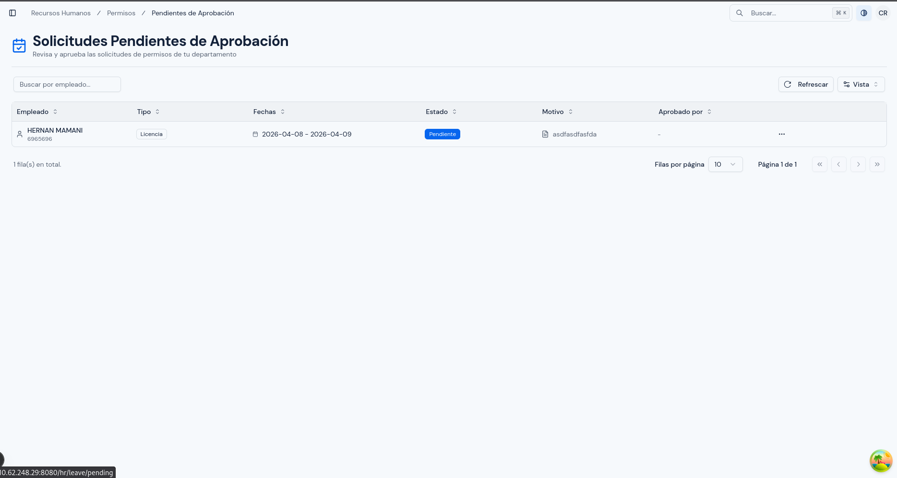
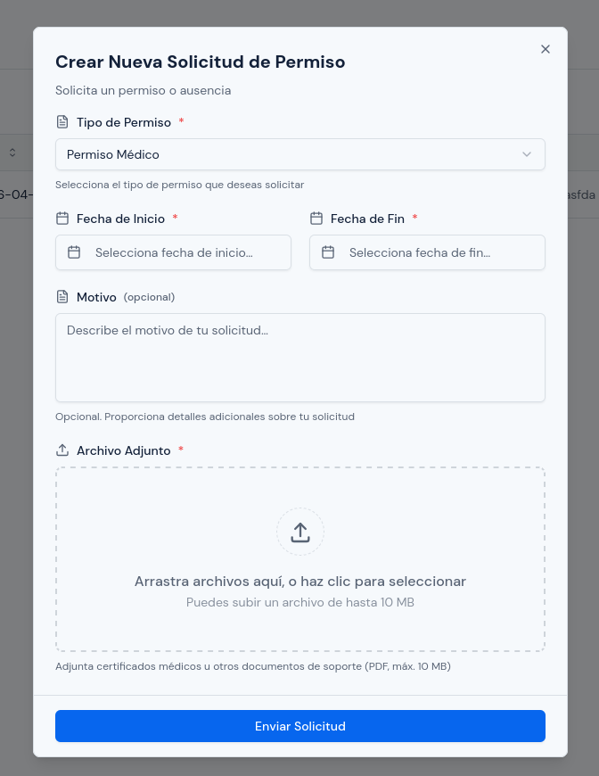
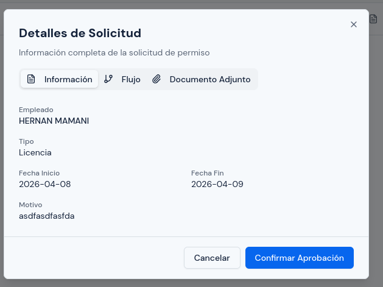
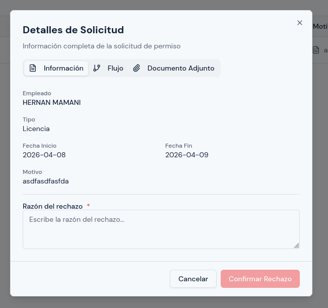
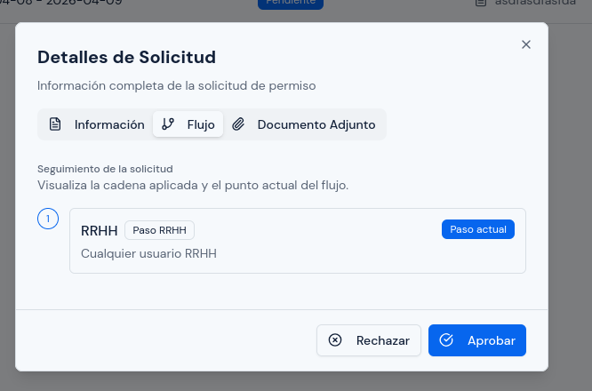

# Pendientes de Aprobación

---

## Objetivo

Explicar cómo revisar y resolver las solicitudes de permiso que todavía esperan una decisión en el nivel de aprobación que le corresponde al usuario.

Este módulo funciona como una bandeja de trabajo. No muestra todo el historial, sino solo los casos pendientes que requieren atención en este momento.

---

## A quién aplica

Este manual aplica principalmente al personal con rol `RRHH`.

También puede aplicar a responsables de jefatura cuando el flujo de aprobación les asigne solicitudes pendientes.

---

## Ruta de acceso

1. Ingresa al sistema.
2. En el menú lateral, abre `Permisos`.
3. Haz clic en `Pendientes de Aprobación`.

Ruta habitual: `/hr/leave/pending`

---

## Para qué sirve este módulo

Este módulo sirve para atender solicitudes que todavía no han sido resueltas en el nivel actual del flujo.

Desde aquí puedes:

- identificar qué solicitudes te toca revisar;
- abrir el detalle del caso;
- revisar el flujo de aprobación;
- revisar documentos adjuntos;
- aprobar una solicitud pendiente;
- rechazar una solicitud pendiente.

---

## Qué verás en esta pantalla

En esta pantalla verás solo solicitudes pendientes.

No aparecerán solicitudes ya aprobadas, rechazadas o canceladas.

La tabla suele mostrar:

- persona solicitante;
- tipo de permiso;
- fechas;
- estado;
- motivo;
- acciones.

En esta bandeja solo deberían aparecer solicitudes que realmente le corresponden al usuario en el punto actual del flujo.

  

---

## Qué diferencia tiene con `Todas las Solicitudes`

`Todas las Solicitudes` sirve para consulta general e historial.

`Pendientes de Aprobación` sirve para trabajo operativo inmediato.

Eso significa que aquí verás únicamente los casos que todavía esperan tu decisión o la del rol que estás usando.

---

## Cómo revisar una solicitud pendiente

1. Abre `Pendientes de Aprobación`.
2. Busca la solicitud que deseas atender.
3. Abre el detalle del registro.
4. Revisa cuidadosamente:
   - tipo de permiso;
   - fechas;
   - horas, si existen;
   - motivo;
   - documento adjunto;
   - flujo de aprobación.

  

---

## Qué revisar antes de aprobar

Antes de aprobar, revisa:

1. que el tipo de permiso sea correcto;
2. que las fechas correspondan al caso;
3. que, si hay horas, tengan sentido y correspondan al mismo día;
4. que el motivo sea claro;
5. que el documento adjunto exista cuando sea obligatorio;
6. que realmente te corresponda actuar en este nivel del flujo.

---

## Cómo aprobar una solicitud

1. Busca la solicitud pendiente.
2. Abre el detalle.
3. Revisa toda la información.
4. Haz clic en `Aprobar`.
5. Si el sistema te permite elegir rol de aprobación, selecciona el rol correcto.
6. Si corresponde, agrega un comentario.
7. Haz clic en `Confirmar Aprobación`.

Después de aprobar, la solicitud debería avanzar al siguiente paso del flujo o quedar resuelta, según corresponda.

  

---

## Cómo rechazar una solicitud

1. Busca la solicitud pendiente.
2. Abre el detalle.
3. Revisa toda la información del caso.
4. Haz clic en `Rechazar`.
5. Escribe la razón del rechazo.
6. Si el sistema te permite elegir rol de aprobación, selecciona el rol correcto.
7. Haz clic en `Confirmar Rechazo`.

El rechazo debe registrar una razón clara y suficiente.

  

---

## Cómo revisar el flujo de aprobación

Dentro del detalle de la solicitud, revisa la pestaña o sección `Flujo` cuando necesites confirmar:

- en qué etapa se encuentra la solicitud;
- si ya hubo una aprobación previa;
- si todavía falta otro paso antes de llegar a RRHH;
- si el caso realmente está esperando tu intervención.

Esta revisión es importante cuando el flujo tiene más de un responsable.

  

---

## Cómo revisar el documento adjunto

Si la solicitud tiene respaldo:

1. abre el detalle de la solicitud;
2. entra a la sección o pestaña `Documento Adjunto`;
3. visualiza o descarga el archivo;
4. confirma que el documento corresponda realmente al permiso solicitado.

  

---

## Qué revisar después de decidir

Después de aprobar o rechazar:

1. confirma que la solicitud ya no siga apareciendo como pendiente para ese nivel;
2. verifica el nuevo estado si vuelves a consultarla en el historial general;
3. si corresponde, revisa el flujo para confirmar que avanzó o quedó cerrada.

---

## Cuándo conviene usar esta pantalla

Usa `Pendientes de Aprobación` cuando necesites:

- trabajar solo sobre casos pendientes;
- resolver solicitudes del momento;
- evitar revisar todo el historial;
- aprobar o rechazar desde una bandeja enfocada.

Si lo que necesitas es consultar casos históricos o revisar solicitudes ya resueltas, usa `Todas las Solicitudes`.

---

## Errores o situaciones frecuentes

### No puedes aprobar o rechazar la solicitud

Revisa:

1. si la solicitud sigue en estado `Pendiente`;
2. si realmente te corresponde actuar en el nivel actual del flujo;
3. si otro responsable ya realizó una acción antes.

### La solicitud parece incompleta

Antes de decidir:

1. revisa si el tipo de permiso exige documento;
2. revisa si el documento fue adjuntado;
3. confirma que las fechas y horas tengan sentido;
4. revisa el motivo registrado.

### El documento no aparece

Revisa:

1. si la solicitud realmente tiene archivo;
2. si el tipo de permiso lo exigía;
3. si hubo un problema en la carga del adjunto.

### Aprobaste o rechazaste por error

Si ocurre:

1. revisa inmediatamente el flujo y el estado del caso;
2. documenta el incidente;
3. coordina con el responsable funcional o con soporte si hace falta una corrección posterior.

---

## Resultado esperado

Al finalizar, las solicitudes pendientes deben quedar correctamente atendidas y el flujo debe reflejar con claridad si cada caso fue aprobado, rechazado o enviado al siguiente paso correspondiente.
