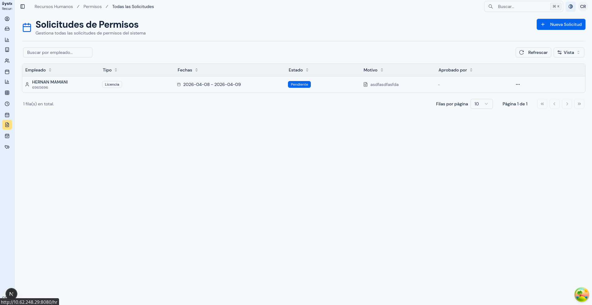
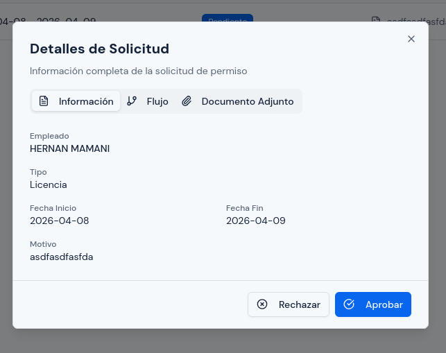

# Solicitudes de Permiso

---

## Objetivo

Explicar cómo revisar, consultar y dar seguimiento a las solicitudes de permiso dentro del sistema.

Este módulo es importante porque reúne la información principal de cada solicitud: tipo de permiso, fechas, motivo, documento adjunto, estado y seguimiento del flujo.

---

## A quién aplica

Este manual aplica principalmente al personal con rol `RRHH`.

---

## Ruta de acceso

1. Ingresa al sistema.
2. En el menú lateral, abre `Permisos`.
3. Haz clic en `Todas las Solicitudes`.

Ruta habitual: `/hr/leave/requests`

---

## Para qué sirve este módulo

Este módulo permite:

- revisar el historial general de solicitudes;
- consultar el detalle completo de una solicitud;
- revisar documentos adjuntos;
- aprobar o rechazar solicitudes pendientes cuando corresponda;
- ver el estado y el seguimiento del flujo.

---

## Qué verás en esta pantalla

En esta pantalla normalmente encontrarás un listado de solicitudes.

La tabla suele mostrar:

- persona solicitante;
- tipo de permiso;
- fechas;
- estado;
- motivo;
- acciones.

Desde el detalle de una solicitud también podrás revisar:

- horas, si la solicitud fue parcial;
- comentarios;
- flujo de aprobación;
- documento adjunto, si existe;
- PDF de resumen cuando la solicitud ya fue aprobada.

  

---

## Información principal de una solicitud

Cada solicitud puede incluir:

- `Tipo de Permiso`
- `Fecha de Inicio`
- `Fecha de Fin`
- `Hora de Inicio`
- `Hora de Fin`
- `Motivo`
- `Documento Adjunto`
- `Estado`

### `Tipo de Permiso`

Define la regla aplicada a la solicitud.

El comportamiento de la solicitud depende del tipo elegido. Por ejemplo:

- algunos tipos exigen documento adjunto;
- algunos tipos permiten solicitar por horas;
- otros solo se manejan por días.

### `Fechas`

Indican el período solicitado.

La fecha de fin no puede ser anterior a la fecha de inicio.

### `Horas`

Solo se usan cuando el tipo de permiso permite solicitudes parciales por horas.

Si la solicitud usa horas:

- debe tener hora de inicio y hora de fin;
- ambas horas deben registrarse el mismo día;
- la hora de fin debe ser posterior a la hora de inicio.

### `Motivo`

Es la explicación registrada para la solicitud.

Ayuda a comprender por qué se está pidiendo el permiso.

### `Documento Adjunto`

Se usa cuando el tipo de permiso exige respaldo.

Si el tipo requiere documento, la solicitud no debe registrarse sin archivo adjunto.

### `Estado`

El sistema maneja estos estados principales:

- `Pendiente`
- `Aprobado`
- `Rechazado`
- `Cancelado`

---

## Cómo revisar una solicitud

1. Abre la pantalla `Todas las Solicitudes`.
2. Usa búsqueda o filtros si es necesario.
3. Ubica la solicitud.
4. Abre el detalle del registro.
5. Revisa:
   - tipo de permiso;
   - fechas;
   - horas, si existen;
   - motivo;
   - documento adjunto;
   - estado;
   - flujo de aprobación.

  

---

## Cómo aprobar una solicitud

Usa esta opción cuando la solicitud esté `Pendiente` y te corresponda actuar en el nivel actual del flujo.

1. Busca la solicitud en el listado.
2. Abre el detalle del registro.
3. Revisa cuidadosamente:
   - tipo de permiso;
   - fechas;
   - horas, si existen;
   - motivo;
   - documento adjunto, si corresponde;
   - flujo de aprobación.
4. Si todo es correcto, haz clic en `Aprobar`.
5. Si el sistema te permite elegir rol de aprobación, selecciona el rol correcto.
6. Si corresponde, agrega un comentario.
7. Confirma la aprobación.

Antes de aprobar, verifica que realmente te corresponda actuar en ese paso del flujo.

  

---

## Cómo rechazar una solicitud

Usa esta opción cuando la solicitud no cumpla con lo requerido o deba devolverse como no procedente.

1. Busca la solicitud en el listado.
2. Abre el detalle del registro.
3. Revisa toda la información del caso.
4. Haz clic en `Rechazar`.
5. Escribe la razón del rechazo.
6. Si el sistema te permite elegir rol de aprobación, selecciona el rol correcto.
7. Confirma la acción.

El rechazo debe incluir una razón clara.

  

---

## Cómo revisar el flujo de una solicitud

Dentro del detalle, revisa la pestaña o sección de flujo cuando necesites saber:

- en qué etapa está la solicitud;
- quién ya actuó sobre ella;
- si sigue pendiente;
- si fue aprobada o rechazada en algún punto del proceso.

Usa esta vista especialmente cuando necesites seguimiento y no solo consulta general.

  

---

## Cómo revisar documentos adjuntos

Si la solicitud tiene archivo:

1. abre el detalle de la solicitud;
2. ubica la sección de documento adjunto;
3. visualiza o descarga el archivo, según la opción disponible;
4. revisa que corresponda realmente al caso.

  

---

## Qué revisar antes de actuar sobre una solicitud

Antes de aprobar o rechazar una solicitud, revisa:

1. que el tipo de permiso sea el correcto;
2. que el rango de fechas sea correcto;
3. que las horas solo se hayan usado cuando corresponda;
4. que el motivo sea claro;
5. que el documento esté adjunto cuando sea obligatorio;
6. que el estado actual permita la acción que quieres realizar.

---

## Cuándo conviene usar esta pantalla

Usa `Todas las Solicitudes` cuando necesites:

- consultar historial;
- revisar el detalle de un caso;
- verificar documentos;
- confirmar el estado de una solicitud;
- revisar el seguimiento del flujo;
- aprobar o rechazar solicitudes cuando corresponda.

Si lo que necesitas es concentrarte solo en las solicitudes que aún esperan decisión, el módulo siguiente será `Pendientes de Aprobación`.

---

## Errores o situaciones frecuentes

### No puedes aprobar o rechazar la solicitud

Revisa:

1. si la solicitud sigue en estado `Pendiente`;
2. si realmente te corresponde actuar en el nivel actual del flujo;
3. si ya existe una acción previa que haya cambiado el estado.

### El documento no aparece

Revisa:

1. si el archivo terminó de cargarse;
2. si quedó realmente asociado a la solicitud;
3. si el tipo de permiso requería documento;
4. si hubo un problema durante la carga.

### La solicitud tiene horas y parece incorrecta

Revisa:

1. si el tipo de permiso permite solicitudes por horas;
2. si la hora de inicio y la hora de fin corresponden al mismo día;
3. si la hora final es posterior a la inicial.

---

## Resultado esperado

Al finalizar, debes poder localizar, revisar y gestionar correctamente las solicitudes de permiso, entendiendo su contenido, su estado y su seguimiento dentro del sistema.
