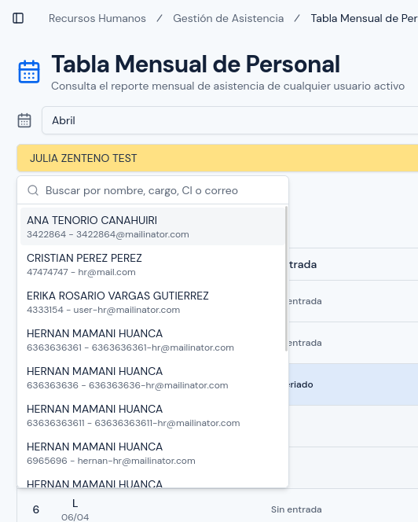
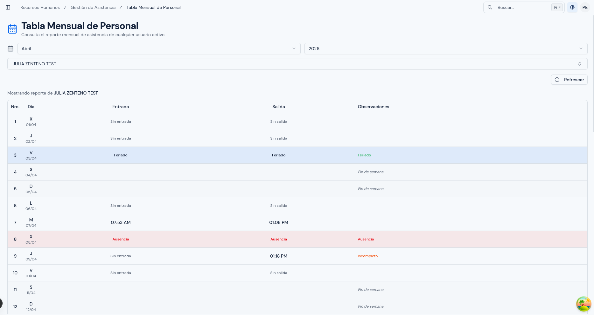
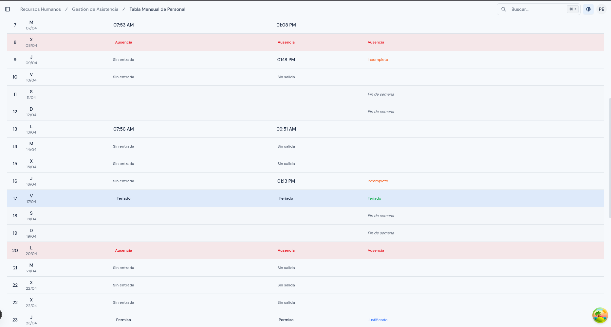
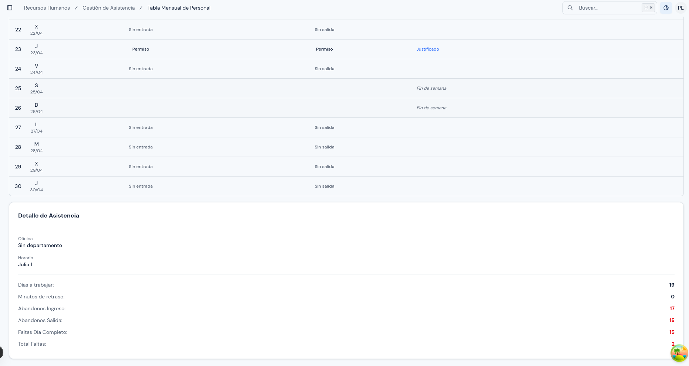

# Tabla Mensual de Personal

---

## Objetivo

Explicar cómo revisar la asistencia mensual consolidada de una persona, día por día y período por período.

---

## A quién aplica

Este manual aplica al personal con rol `Administrador` y `RRHH`.

---

## Ruta de acceso

1. Ingresa al sistema.
2. En el menú lateral, abre `Gestión de Asistencia`.
3. Haz clic en `Tabla Mensual de Personal`.

Ruta habitual: `/hr/attendance/monthly-table`

---

## Qué verás en esta pantalla

Esta pantalla está pensada para revisar un mes completo por persona.

Normalmente encontrarás:

- selector de año;
- selector de mes;
- selector de usuario;
- botón `Refrescar`;
- tabla detallada del período;
- resumen del mes.

La consulta no se muestra hasta que seleccionas una persona activa.

Importante: la tabla es plana. Si un día tiene dos períodos, verás dos filas para ese mismo día.

  

---

## Cómo consultar una tabla mensual

1. Abre la pantalla.
2. Selecciona el año.
3. Selecciona el mes.
4. Busca y selecciona a la persona que deseas revisar.
5. Espera a que cargue la información.
6. Revisa el detalle día por día.
7. Si necesitas actualizar la información, usa `Refrescar`.

---

## Cómo leer la tabla

La tabla muestra estas columnas:

- `Nro.`: número del período dentro del día;
- `Día`: día de la semana y fecha;
- `Entrada`: hora o estado de entrada;
- `Salida`: hora o estado de salida;
- `Observaciones`: resumen del estado del día.

En `Entrada` y `Salida` pueden aparecer textos como:

- `Feriado`;
- `Permiso`;
- `Ausencia`;
- `Sin entrada`;
- `Sin salida`.

Si hay hora registrada, también se muestra si hubo retraso o salida anticipada.

En `Observaciones` puedes ver mensajes como:

- `Pendiente`;
- `Fin de semana`;
- `Ausencia`;
- `Justificado`;
- `Incompleto`;
- `Atraso`;
- `Salida anticipada`;
- `Atraso / Salida anticipada`.

Además, la fila puede cambiar de color para ayudarte a identificar:

- fines de semana;
- feriados;
- ausencias;
- fechas futuras.

  

## Qué revisar en la tabla

Durante la revisión, presta atención a:

- días con asistencia correcta;
- ausencias;
- tardanzas;
- permisos;
- feriados;
- días sin entrada o sin salida;
- períodos repetidos dentro del mismo día;
- diferencias entre lo planificado y lo registrado.

  

---

## Cuándo usar esta pantalla

Usa esta pantalla cuando:

- necesites revisar a una persona durante todo un mes;
- debas validar observaciones de asistencia;
- quieras revisar un período antes de emitir un reporte o atender una incidencia.

---

## Errores o situaciones frecuentes

### El mes parece incompleto

Revisa:

1. si estás en el mes correcto;
2. si el horario estaba asignado durante todo el período;
3. si hubo cambios de asignación en el mes;
4. si faltan registros de dispositivo.

### Un día muestra un resultado inesperado

Revisa:

1. si existió feriado;
2. si existió solicitud de permiso;
3. si el horario del día era distinto;
4. si hay marcaciones en el dispositivo.

### No aparece información

Revisa:

1. si seleccionaste una persona activa;
2. si el mes y el año son correctos;
3. si la persona tiene horario asignado en ese período;
4. si existen registros de asistencia para ese mes.

---

## Resultado esperado

Al finalizar, debes poder comprender el comportamiento mensual de asistencia de una persona con una sola consulta, sin interpretar datos aislados fila por fila.

  

