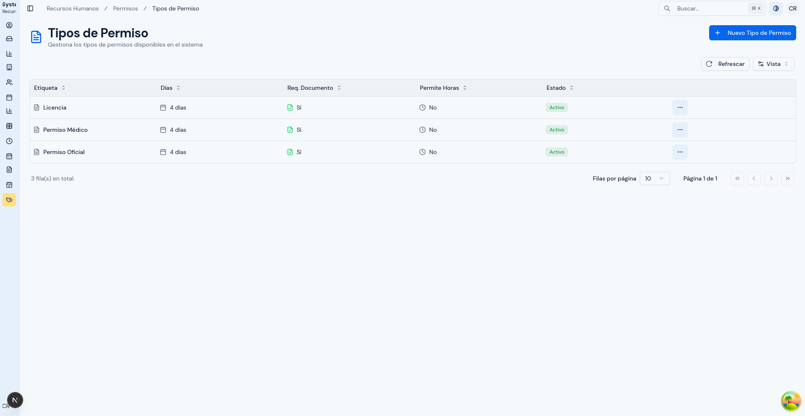
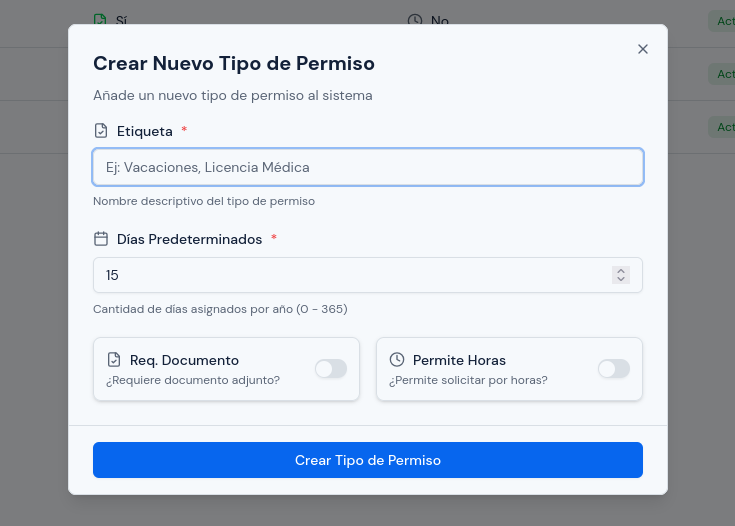
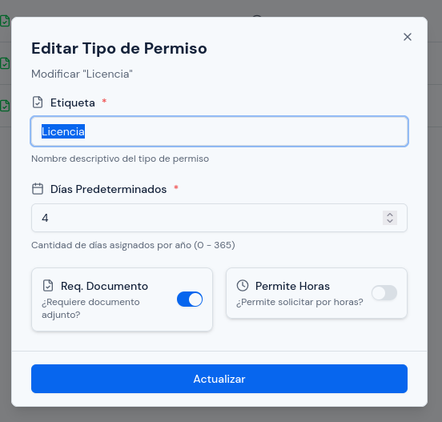
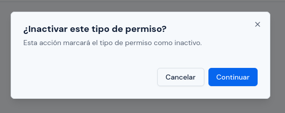
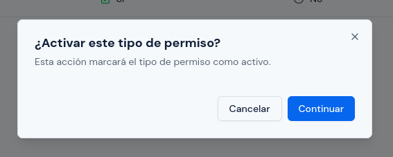

# Tipos de Permiso

---

## Objetivo

Explicar cómo crear, revisar, editar, activar e inactivar los tipos de permiso disponibles en el sistema.

Este módulo es importante porque define reglas que luego se aplican al momento de registrar solicitudes de permiso.

---

## A quién aplica

Este manual aplica principalmente al personal con rol `RRHH`.

---

## Ruta de acceso

1. Ingresa al sistema.
2. En el menú lateral, abre `Permisos`.
3. Haz clic en `Tipos de Permiso`.

Ruta habitual: `/hr/leave-types`

---

## Para qué sirve este módulo

Este módulo permite configurar los tipos de permiso que el sistema pondrá a disposición al momento de registrar solicitudes.

Desde aquí puedes definir:

- el nombre del tipo de permiso;
- la cantidad de días predeterminados;
- si requiere documento adjunto;
- si permite solicitudes por horas;
- si el tipo permanecerá activo o no.

---

## Qué verás en esta pantalla

En esta pantalla normalmente encontrarás un catálogo de tipos de permiso.

La tabla suele mostrar:

- `Etiqueta`
- `Días`
- `Req. Documento`
- `Permite Horas`
- `Estado`
- `Acciones`

Cada fila representa una regla disponible para las solicitudes de permiso.

  

---

## Qué significa cada campo

### `Etiqueta`

Es el nombre con el que el tipo de permiso aparecerá en el sistema.

Debe ser claro y fácil de reconocer, por ejemplo:

- `Vacaciones`
- `Licencia Médica`
- `Permiso Personal`

### `Días`

Es la cantidad de días predeterminados que el sistema asociará a ese tipo de permiso.

Este valor debe revisarse con cuidado, porque sirve como referencia operativa para el uso del tipo.

### `Req. Documento`

Indica si la persona deberá adjuntar un respaldo al registrar la solicitud.

Si esta opción está activada, el sistema exigirá documento cuando se use ese tipo de permiso.

### `Permite Horas`

Indica si el permiso puede solicitarse por horas y no solo por días.

Esta opción debe activarse únicamente cuando la política interna permita solicitudes parciales por horas.

### `Estado`

Indica si el tipo de permiso está disponible para ser utilizado.

- `Activo`: puede usarse en nuevas solicitudes.
- `Inactivo`: ya no debe aparecer como opción operativa.

---

## Cómo crear un tipo de permiso

### Paso 1. Abrir el formulario

1. Haz clic en `Crear Nuevo Tipo de Permiso`.
2. Espera a que se abra la ventana de registro.

  

### Paso 2. Completar la información

1. En `Etiqueta`, escribe el nombre del tipo de permiso.
2. En `Días Predeterminados`, registra la cantidad correspondiente.
3. Revisa si debes activar `Req. Documento`.
4. Revisa si debes activar `Permite Horas`.

### Paso 3. Revisar antes de guardar

Antes de confirmar, revisa:

1. que la etiqueta sea clara;
2. que la cantidad de días sea correcta;
3. que el requerimiento de documento coincida con la política interna;
4. que la opción de horas solo esté activa cuando realmente corresponda.

### Paso 4. Guardar

1. Haz clic en `Crear Tipo de Permiso`.
2. Verifica que el nuevo registro aparezca en la tabla.

---

## Cómo editar un tipo de permiso

Usa esta opción cuando necesites corregir el nombre o ajustar las reglas del tipo.

1. Busca el registro en la tabla.
2. Abre `Acciones`.
3. Haz clic en `Editar`.
4. Corrige los campos necesarios.
5. Revisa nuevamente días, documento y horas.
6. Guarda los cambios.

Antes de modificar un tipo ya usado, revisa si el cambio puede afectar la forma en que RRHH quiere seguir gestionando nuevas solicitudes.

  

---

## Cómo inactivar un tipo de permiso

Usa esta opción cuando un tipo ya no deba seguir utilizándose, pero quieras conservar su registro.

1. Busca el tipo en la tabla.
2. Abre `Acciones`.
3. Haz clic en `Inactivar`.
4. Lee el mensaje de confirmación.
5. Confirma la acción.

Un tipo inactivo deja de ser una opción disponible para nuevas solicitudes.

  

---

## Cómo activar un tipo de permiso

Usa esta opción cuando un tipo inactivo deba volver a estar disponible.

1. Ubica el tipo de permiso inactivo.
2. Abre `Acciones`.
3. Haz clic en `Activar`.
4. Confirma la acción.

  

---

## Qué revisar antes de guardar o actualizar

Antes de guardar un registro nuevo o editar uno existente, revisa:

1. que el nombre sea entendible para las personas usuarias;
2. que los días predeterminados sean correctos;
3. que `Req. Documento` refleje la exigencia real;
4. que `Permite Horas` solo se use en permisos que realmente admiten solicitudes por horas;
5. que el tipo quede activo solo si ya está listo para uso operativo.

---

## Cómo impacta este módulo en las solicitudes

Recuerda estas reglas prácticas:

- si un tipo tiene `Req. Documento` activado, la solicitud deberá incluir respaldo;
- si un tipo tiene `Permite Horas` desactivado, no debe usarse para permisos parciales por horas;
- si un tipo está inactivo, no debería seguir utilizándose en nuevas solicitudes.

Por eso, cualquier cambio en este módulo debe hacerse con cuidado.

---

## Errores o situaciones frecuentes

### Se creó un tipo con reglas equivocadas

Si detectas el error:

1. edita el registro;
2. corrige los días o las opciones de documento y horas;
3. guarda nuevamente;
4. revisa si el tipo ya fue usado por otras personas.

### El personal no puede seleccionar un tipo de permiso

Revisa:

1. si el tipo está activo;
2. si fue inactivado por error;
3. si el cambio fue guardado correctamente.

### Se habilitó `Permite Horas` cuando no correspondía

Corrige el tipo cuanto antes para evitar que se registren solicitudes incorrectas.

Antes de cambiarlo, revisa si ya existen solicitudes recientes que hayan usado esa configuración.

### Se marcó `Req. Documento` por error

Si no debía exigirse documento:

1. edita el tipo;
2. desactiva esa opción;
3. guarda los cambios;
4. confirma luego que el comportamiento esperado sea el correcto en nuevas solicitudes.

---

## Resultado esperado

Al finalizar, los tipos de permiso deben reflejar correctamente las reglas que RRHH desea aplicar en el registro de solicitudes.
