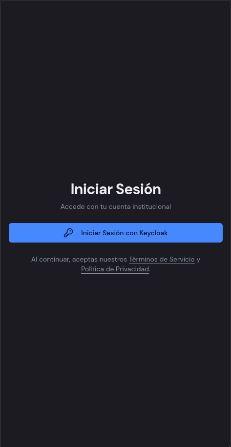
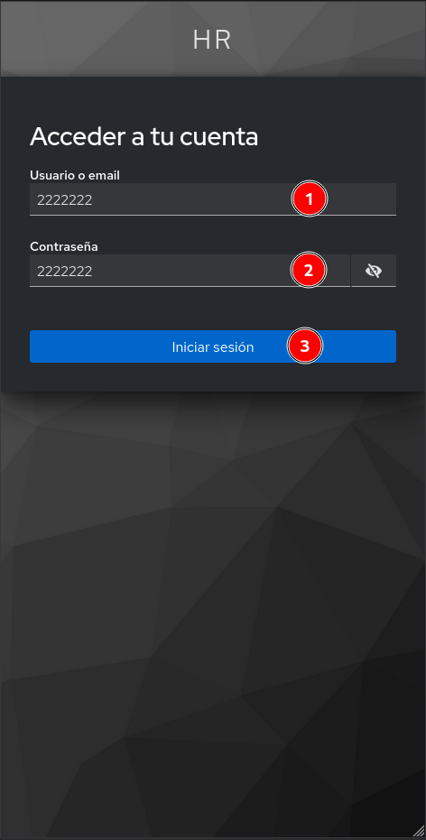
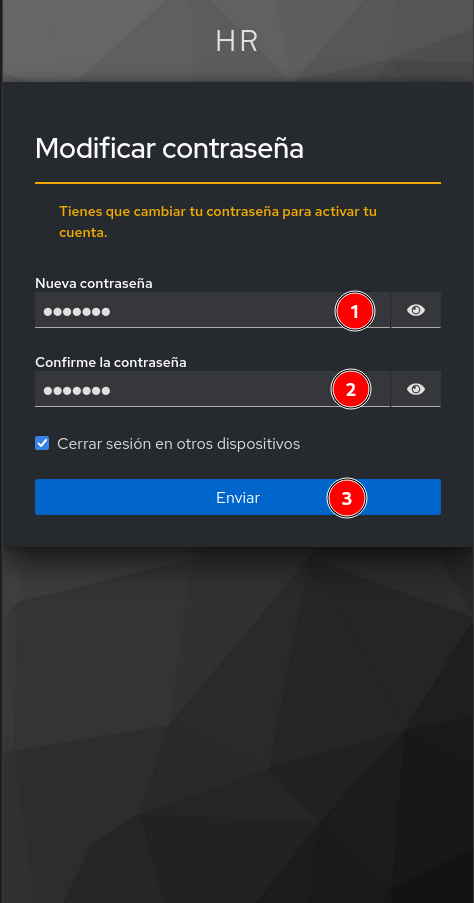
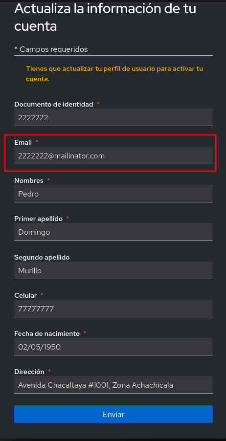
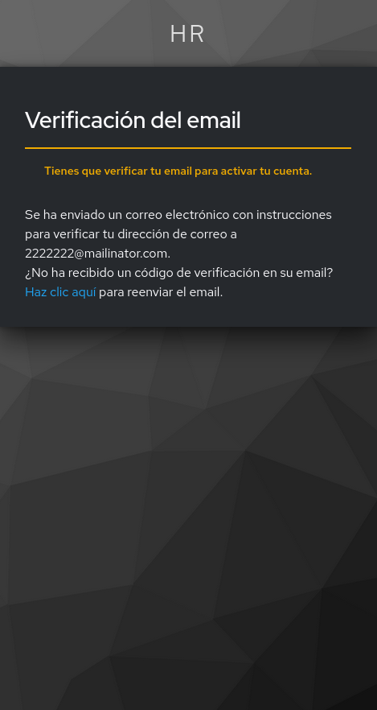
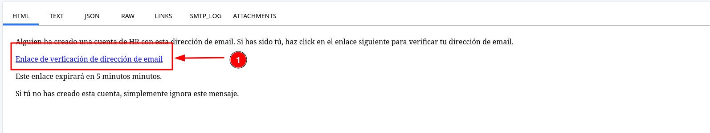

---
pdf_options:
  format: Letter
  margin: 18mm
  printBackground: true
---

# Guía de Uso del Sistema

---

## 1. Primer acceso

Este proceso se realiza solo la primera vez que ingresas al sistema.

### Paso 1. Abrir la pantalla de acceso

1. Ingresa a la pantalla principal del sistema.
2. Espera a que cargue la página de acceso.
3. Ubica el botón `Iniciar Sesión con Keycloak`.
4. Haz clic en ese botón para continuar.

En esta pantalla todavía no debes escribir tu usuario ni tu contraseña. Primero debes pulsar el botón de inicio de sesión.

  

### Paso 2. Ingresar tus credenciales

1. En el campo `Usuario` (Documento de identidad), escribe el dato que te hayan proporcionado.
2. En el campo `Contraseña` (Documento de identidad), escribe la contraseña temporal.
3. Revisa que ambos datos estén bien escritos.
4. Haz clic en `Iniciar sesión`.

Si la contraseña no ingresa, revisa mayúsculas, minúsculas y espacios.

  

### Paso 3. Cambiar tu contraseña

Después del primer ingreso, el sistema te pedirá cambiar tu contraseña para activar tu cuenta.

1. En el campo `Nueva contraseña`, escribe la nueva contraseña que usarás a partir de ahora.
2. En el campo `Confirme la contraseña`, vuelve a escribir la misma contraseña.
3. Verifica que ambas contraseñas sean iguales.
4. Haz clic en `Enviar`.

Guarda esta contraseña en un lugar seguro. La necesitarás en tus siguientes ingresos.

  

### Paso 4. Actualizar tus datos

Luego de cambiar la contraseña, el sistema te llevará a una pantalla para completar o revisar tu información.

1. Revisa tu número de documento.
2. Revisa tu correo electrónico.
3. Completa tus nombres y apellidos si corresponde.
4. Revisa o completa tu número de celular.
5. Revisa o completa tu fecha de nacimiento.
6. Revisa o completa tu dirección.
7. Cuando todos los datos estén correctos, haz clic en `Enviar`.

Antes de continuar, verifica con atención que el correo esté bien escrito. Ese correo se usará para la verificación de la cuenta.

  

### Paso 5. Verificar tu correo

Después de guardar tus datos, el sistema mostrará un mensaje indicando que debes verificar tu correo.

1. Lee el mensaje en pantalla.
2. Revisa el correo electrónico que registraste.
3. Busca el mensaje de verificación enviado por el sistema.
4. Abre ese correo para continuar.

Si no ves el correo en tu bandeja principal, revisa también spam, promociones o correo no deseado.

  

### Paso 6. Confirmar desde el correo

1. Dentro del correo, ubica el enlace de verificación.
2. Haz clic en ese enlace.
3. Espera a que el sistema confirme la verificación.
4. Cuando el proceso termine, vuelve al sistema si es necesario.

  

Cuando completes estos pasos, tu cuenta quedará activada y podrás ingresar normalmente.

---

## 2. Inicio de sesión

Después de activar tu cuenta, el ingreso normal será más sencillo.

1. Ingresa a la pantalla principal del sistema.
2. Haz clic en `Iniciar Sesión con Keycloak`.
3. Escribe tu usuario o correo.
4. Escribe la contraseña que definiste en tu primer acceso.
5. Haz clic en `Iniciar sesión`.
6. Espera a que el sistema te lleve a la pantalla principal.

Si no puedes ingresar:

1. Revisa que el usuario esté bien escrito.
2. Revisa que la contraseña esté correcta.
3. Verifica que no haya espacios al inicio o al final.
4. Intenta nuevamente.
5. Si el problema continúa, solicita apoyo.

---

## 3. Qué verás al entrar

Cuando ingreses, verás un menú con las opciones principales del sistema. Estas opciones te ayudan a consultar tu información y realizar tus gestiones.

- `Dashboard`
- `Tabla Mensual`
- `Mi Asistencia`
- `Mis Marcaciones`
- `Mis Horarios`
- `Mis Solicitudes`

En la parte inferior del menú también podrás ver tu perfil y la opción para cerrar sesión.

---

## 4. Dónde revisar tu información

- `Dashboard`: muestra un resumen general de tu día y de tu estado actual.
- `Tabla Mensual`: permite revisar tu asistencia de todo el mes en una sola vista.
- `Mi Asistencia`: permite consultar tu asistencia por fechas específicas.
- `Mis Marcaciones`: muestra los registros que fueron capturados por el dispositivo biométrico.
- `Mis Horarios`: permite revisar el horario que tienes asignado.
- `Mis Solicitudes`: permite registrar y revisar permisos o ausencias.

---

## 5. Cierre de sesión

Cuando termines de usar el sistema:

1. Busca tu usuario en la parte inferior del menú.
2. Abre ese menú.
3. Haz clic en `Cerrar sesión`.

---

## 6. Soporte

Si tienes problemas con el acceso, tus datos, tus marcaciones o tus horarios, comunícate con RRHH o con el responsable del sistema.
