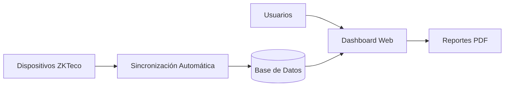
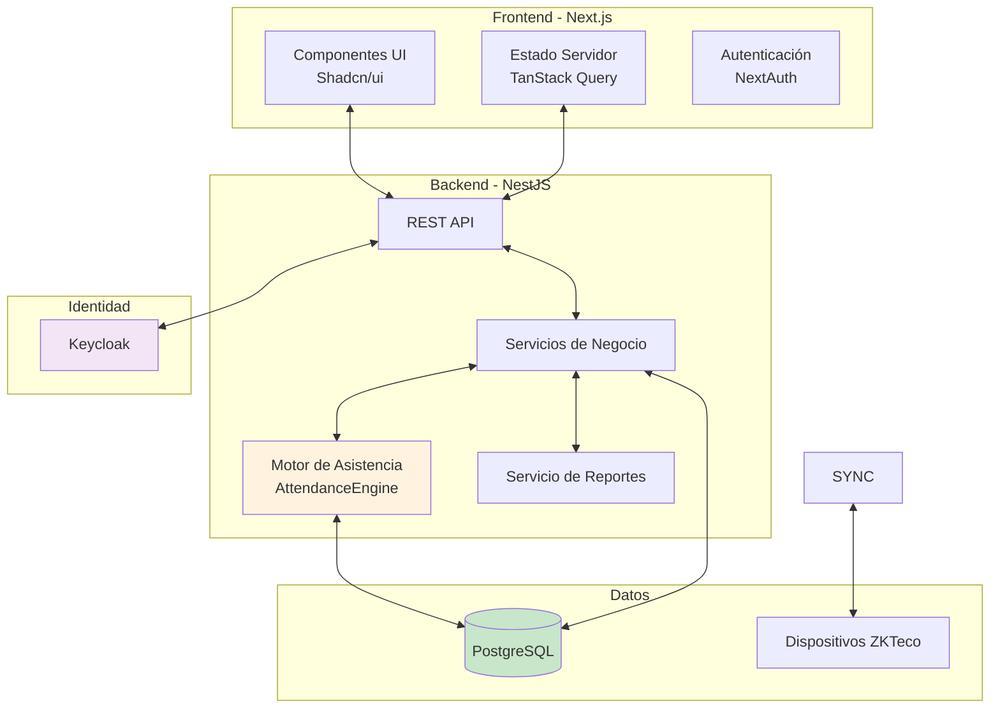
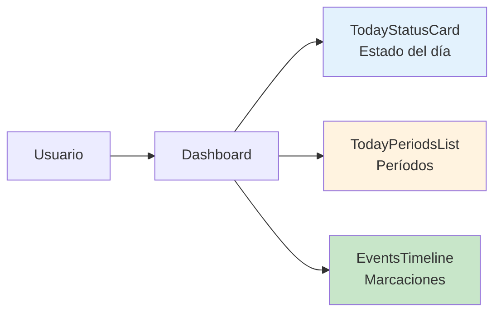
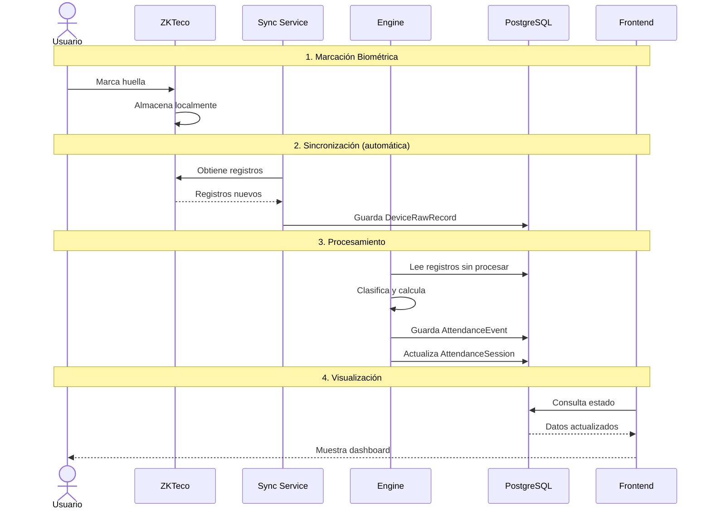
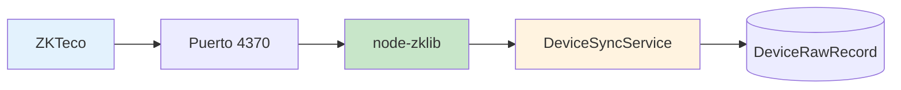

# Resumen Técnico del Sistema

## Sistema Web de Gestión de Recursos Humanos con Integración Biométrica

---

## Visión General

El sistema es una aplicación web completa que automatizó el control de asistencia del personal administrativo y docente mediante dispositivos biométricos, proporcionando información en tiempo real y reportes confiables para la toma de decisiones.



---

## Arquitectura General

### Stack Tecnológico

| Capa | Tecnología |
|------|------------|
| **Frontend** | Next.js 15 + React 19 + Tailwind CSS |
| **Backend** | NestJS 11 + TypeScript |
| **Base de Datos** | PostgreSQL + TypeORM |
| **Autenticación** | Keycloak + NextAuth |
| **Dispositivos** | ZKTeco (node-zklib) |

### Arquitectura de Componentes



---

## Módulos Principales

### 1. Módulo de Asistencia en Tiempo Real

**Objetivo:** Brindar retroalimentación inmediata al personal sobre sus marcaciones.

**Características clave:**
- Dashboard con estado actual del día
- Actualización automática cada 2 minutos
- Visualización de entradas, salidas y tardanzas
- Alertas de próxima acción requerida



**Detalles:** → [Documentación completa](./03-modulo-asistencia-en-tiempo-real/01-descripcion-general.md)

---

### 2. Módulo de Procesamiento Biométrico

**Objetivo:** Procesar automáticamente los registros biométricos sin intervención manual.

**Motor de procesamiento (AttendanceEngineService):**

```mermaid
flowchart LR
    RAW[Registros Crudos<br/>DeviceRawRecord] --> P1[1. LoadData<br/>Cargar configuraciones]
    P1 --> P2[2. FilterEvents<br/>Validar ventanas]
    P2 --> P3[3. ClassifyEvents<br/>ENTRY vs EXIT]
    P3 --> P4[4. PersistEvents<br/>Guardar eventos]
    P4 --> P5[5. CalculateSessions<br/>Calcular estados]
    P5 --> P6[6. MarkProcessed<br/>Marcar procesados]
    P6 --> SESSION[Sesiones Normalizadas<br/>AttendanceSession]

    style RAW fill:#ffcdd2
    style SESSION fill:#c8e6c9
```



**Estados de sesión (3 independientes):**
- **Estado de asistencia:** COMPLETE, INCOMPLETE, ABSENCE
- **Estado de entrada:** ON_TIME, LATE, EARLY, NO_ENTRY
- **Estado de salida:** ON_TIME, EARLY_EXIT, OVERTIME, NO_EXIT

**Detalles:** → [Documentación completa](./04-modulo-procesamiento-biometrico/01-descripcion-general.md)

---

### 3. Módulo de Reportes

**Objetivo:** Generar reportes confiables para aplicación de descuentos y decisiones de RR.HH.

**Tipos de reporte:**
- Diario (por fecha)
- Mensual (consolidado)
- Por período (rango personalizado)
- Departamental (agregado)

**Cálculos principales:**
```
Minutos trabajados    = Σ(Salida - Entrada) por par válido
Minutos de tardanza    = max(0, Entrada - (Inicio + Tolerancia))
Minutos salida temprana = max(0, (Fin - Tolerancia) - Salida)
Minutos horas extras    = max(0, Salida - (Fin + Tolerancia))
```

**Detalles:** → [Documentación completa](./05-modulo-reportes/01-descripcion-general.md)

---

## Flujo de Datos Completo



---

## Integración con Dispositivos Biométricos

**Dispositivos soportados:** ZKTeco (K40, iFace, TF1600)

**Protocolo:** TCP/IP puerto 4370

**Librería:** node-zklib



**Detalles:** → [Documentación completa](./06-integracion-dispositivos/01-integracion-zkteco.md)

---

## Patrones de Diseño Implementados

| Patrón | Descripción | Beneficio |
|--------|-------------|-----------|
| **DDD** | Organización por dominios de negocio | Límites claros entre módulos |
| **Repository** | Abstracción de acceso a datos | Desacoplamiento de BD |
| **Service Layer** | Lógica de negocio aislada | Código testeable |
| **Pipeline** | Procesamiento secuencial | Pasos independientes |
| **Single Source of Truth** | Cálculos centralizados | Consistencia de datos |

**Detalles:** → [Documentación completa](./08-tecnologias-utilizadas.md)

---

## Seguridad

**Autenticación:** Keycloak (OAuth 2.0 / OpenID Connect)

**Roles implementados:**
- DOCENTE - Acceso a su reporte personal
- ADMINISTRATIVO - Acceso a su reporte personal
- RRHH - Acceso a todos los reportes y gestión
- ADMIN - Configuración completa

**Detalles:** → [Documentación completa](./07-seguridad-y-autenticacion.md)

---

## Estructura de Archivos

```
documentacion/
├── 00-portada.md                           # Objetivos del proyecto
├── 01-introduccion.md                       # Planteamiento y justificación
├── 02-arquitectura-del-sistema/            # Arquitectura completa
│   ├── 01-vision-general.md                  # Diagramas C4
│   ├── 02-arquitectura-backend.md            # NestJS structure
│   ├── 03-arquitectura-frontend.md           # Next.js structure
│   └── 04-modelo-de-datos.md                # Entidades y relaciones
├── 03-modulo-asistencia-en-tiempo-real/     # Dashboard en tiempo real
│   ├── 01-descripcion-general.md
│   ├── 02-casos-de-uso.md
│   ├── 03-flujo-de-datos.md
│   └── 04-procedimiento-aplicativo.md
├── 04-modulo-procesamiento-biometrico/      # Motor de procesamiento
│   ├── 01-descripcion-general.md
│   ├── 02-pipeline-de-procesamiento.md
│   ├── 03-clasificacion-eventos.md
│   └── 04-ventanas-de-tiempo.md
├── 05-modulo-reportes/                       # Sistema de reportes
│   ├── 01-descripcion-general.md
│   ├── 02-calculos-asistencia.md
│   ├── 03-casos-de-uso.md
│   └── 04-generacion-de-pdf.md
├── 06-integracion-dispositivos/              # ZKTeco integration
│   ├── 01-integracion-zkteco.md
│   └── 02-sincronizacion-de-datos.md
├── 07-seguridad-y-autenticacion.md           # Keycloak + NextAuth
├── 08-tecnologias-utilizadas.md              # Stack y patrones
└── 09-conclusiones.md                         # Logros y métricas
```

---

## Métricas de Éxito

| Métrica | Antes | Después | Mejora |
|---------|-------|---------|--------|
| Tiempo de procesamiento | 2-3 horas | ~5 minutos | **96%** |
| Tiempo para reportes | 1 día | ~10 segundos | **99%** |
| Errores en cálculos | ~15% | <1% | **93%** |
| Consulta de asistencia | 24-48 horas | Tiempo real | **100%** |

---

## Navegación

Para más detalles técnicos sobre cada módulo, navegue a través de:

- [Índice General](./README.md)
- [Portada](./00-portada.md)
- [Introducción](./01-introduccion.md)
- [Arquitectura](./02-arquitectura-del-sistema/01-vision-general.md)
- [Módulo de Asistencia](./03-modulo-asistencia-en-tiempo-real/01-descripcion-general.md)
- [Procesamiento Biométrico](./04-modulo-procesamiento-biometrico/01-descripcion-general.md)
- [Reportes](./05-modulo-reportes/01-descripcion-general.md)
- [Integración Dispositivos](./06-integracion-dispositivos/01-integracion-zkteco.md)
- [Seguridad](./07-seguridad-y-autenticacion.md)
- [Tecnologías](./08-tecnologias-utilizadas.md)
- [Conclusiones](./09-conclusiones.md)

---

*Última actualización: Febrero 2026*
